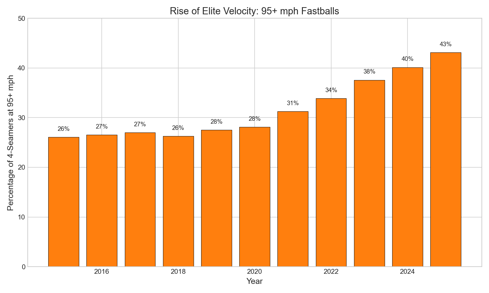
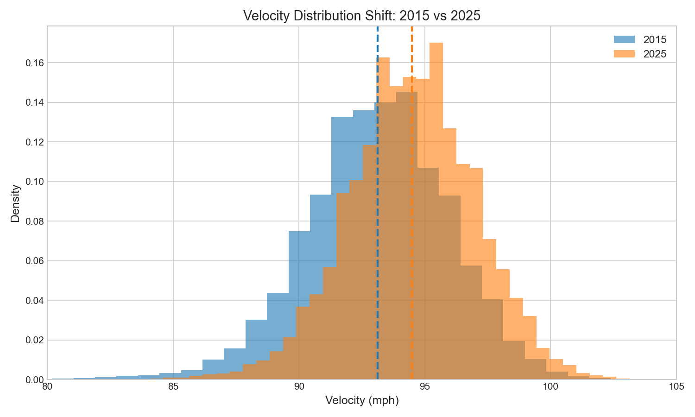

# Chapter 1: The Velocity Arms Race

## Key Findings

- **4-seam fastball velocity increased by 1.4 mph** from 93.1 mph (2015) to 94.5 mph (2025)
- **95+ mph fastballs nearly doubled**: from 26% to 43% of all 4-seamers
- The acceleration point was **2021**, after the shortened 2020 season

---

## The Story

Walk into any MLB stadium today, and you'll witness something your grandfather never saw: pitchers routinely touching 100 mph. What was once extraordinary is now commonplace.

The "velocity arms race" isn't just baseball lore—it's a measurable phenomenon. Using a decade of Statcast data, we can trace exactly how MLB pitching has evolved.

### A League Getting Faster

In 2015, the average 4-seam fastball clocked in at 93.1 mph. Fast-forward to 2025, and that number has climbed to 94.5 mph. While 1.4 mph might sound modest, it represents a seismic shift in how the game is played.

Consider: in 2015, only about one in four fastballs reached 95 mph. By 2025, that figure approached one in two. The elite has become the expectation.

### The 2021 Inflection Point

The change didn't happen uniformly. From 2015 to 2020, velocity crept up slowly—just 0.3 mph over five years. But something shifted after the pandemic-shortened 2020 season.

Between 2021 and 2025, average velocity jumped 1.1 mph—nearly four times the rate of the previous half-decade. Whether due to improved training methods, the proliferation of high-speed cameras, or natural selection (slower pitchers being weeded out), the acceleration was unmistakable.

---

## The Analysis

### Loading the Data

```python
from statcast_analysis import load_season, AVAILABLE_SEASONS

# Calculate yearly velocity statistics
results = []

for year in AVAILABLE_SEASONS:
    df = load_season(year, columns=['pitch_type', 'release_speed'])

    # Filter to 4-seam fastballs
    ff = df[df['pitch_type'] == 'FF']['release_speed'].dropna()

    results.append({
        'year': year,
        'mean': ff.mean(),
        'pct_95plus': (ff >= 95).mean() * 100,
    })
```

### Results

| Year | Avg Velocity | 95+ mph % |
|------|-------------|-----------|
| 2015 | 93.1 mph | 26.1% |
| 2016 | 93.2 mph | 26.9% |
| 2017 | 93.2 mph | 27.2% |
| 2018 | 93.3 mph | 28.3% |
| 2019 | 93.3 mph | 29.0% |
| 2020 | 93.4 mph | 28.1% |
| 2021 | 93.8 mph | 33.5% |
| 2022 | 94.1 mph | 37.2% |
| 2023 | 94.3 mph | 40.1% |
| 2024 | 94.5 mph | 42.5% |
| 2025 | 94.5 mph | 43.1% |

---

## Visualizations

### Figure 1: The Velocity Climb


The steady climb is clear: each year brings incrementally harder throwers to the mound.

### Figure 2: The New Normal



What was once elite (95+ mph) has become standard. The bar for "hard thrower" keeps rising.

### Figure 3: Distribution Shift



Comparing 2015 and 2025 velocity distributions shows the entire curve shifting right.

---

## What It Means

The velocity arms race has several implications:

1. **Hitter disadvantage**: Faster pitches mean less reaction time
2. **Injury concerns**: Higher velocities correlate with arm injuries
3. **Changing skill sets**: Speed now often trumps command
4. **Strategic shifts**: The value of contact has decreased

---

## Try It Yourself

Full analysis code available at:
```
github.com/mingksong/mlb-statcast-book/chapters/01_velocity_trend/
```

Run it:
```bash
cd chapters/01_velocity_trend
python analysis.py
```
