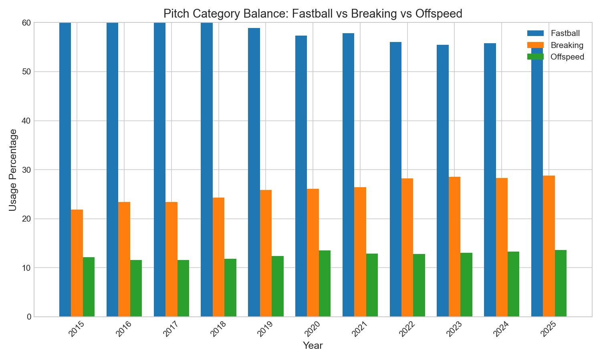

# Chapter 3: Pitch Type Evolution

Have you ever noticed how today's pitchers seem to throw more sliders and sweepers than ever before? Over the past decade, the pitch mix in Major League Baseball has undergone a dramatic transformation. The traditional four-seam fastball, once the dominant pitch in every starter's arsenal, has steadily given way to a new generation of breaking balls.

In this chapter, we'll explore how pitch type usage has evolved from 2015 to 2025, with a particular focus on the rise of the sweeper and the decline of the four-seam fastball.

## Getting Started

Let's begin by loading our Statcast data and examining the overall pitch distribution:

```python
from statcast_analysis import load_seasons

df = load_seasons(2015, 2025, columns=['game_year', 'pitch_type', 'pitch_name'])
print(f"Total pitches analyzed: {len(df):,}")
```

With over 7.4 million pitches in our dataset, we have a comprehensive view of how pitching strategy has evolved across the entire Statcast era.

## The Fastball Decline

Suppose we want to see how fastball usage has changed over time. We can group pitches into three categories—fastballs, breaking balls, and offspeed—and calculate the percentage of each by year:

```python
# Categorize pitch types
fastballs = ['FF', 'SI', 'FC']  # 4-seam, sinker, cutter
breaking = ['SL', 'CU', 'ST', 'KC']  # slider, curve, sweeper, knuckle curve
offspeed = ['CH', 'FS']  # changeup, splitter

df['category'] = df['pitch_type'].apply(
    lambda x: 'Fastball' if x in fastballs
    else 'Breaking' if x in breaking
    else 'Offspeed'
)

yearly_mix = df.groupby('game_year')['category'].value_counts(normalize=True)
```

The results reveal a striking trend:

| Year | Fastball | Breaking | Offspeed |
|------|----------|----------|----------|
| 2015 | 62.6% | 21.9% | 12.1% |
| 2019 | 58.9% | 25.8% | 12.4% |
| 2025 | 55.0% | 28.8% | 13.6% |


Fastball usage has dropped nearly 8 percentage points over the decade, from 62.6% to 55.0%. Meanwhile, breaking ball usage has surged from 21.9% to 28.8%.

## The Rise of the Sweeper

But wait—the breaking ball story isn't just about throwing more sliders. A completely new pitch has emerged: the sweeper.

The sweeper (pitch code: ST) didn't exist in Statcast's classification system before 2022. Today, it accounts for 7% of all pitches:

```python
# Sweeper usage by year
sweeper = df[df['pitch_type'] == 'ST']
sweeper_by_year = sweeper.groupby('game_year').size() / df.groupby('game_year').size() * 100
print(sweeper_by_year.round(1))
```

| Year | Sweeper Usage |
|------|---------------|
| 2015 | 0.1% |
| 2021 | 2.0% |
| 2025 | **7.0%** |


The sweeper's horizontal movement—often 15+ inches of glove-side break—makes it a devastating weapon against opposite-handed hitters. Pitchers like Blake Snell and Kevin Gausman have built their arsenals around this pitch.

## The Four-Seam Fastball: Still King, but Diminished

Let's zoom in on the four-seam fastball specifically:

```python
ff_yearly = df[df['pitch_type'] == 'FF'].groupby('game_year').size()
total_yearly = df.groupby('game_year').size()
ff_pct = (ff_yearly / total_yearly * 100).round(1)
print(ff_pct)
```

| Year | 4-Seam % |
|------|----------|
| 2015 | 35.6% |
| 2020 | 32.8% |
| 2025 | 31.9% |


The four-seamer has dropped from 35.6% to 31.9% of all pitches—a decline of 3.7 percentage points. That's roughly 270,000 fewer four-seam fastballs per season.

## Is This Real? Statistical Validation

Before drawing conclusions, we should ask: Is this decline statistically significant, or just random variation?

```python
from scipy import stats
import numpy as np

years = np.array(ff_pct.index, dtype=float)
rates = np.array(ff_pct.values, dtype=float)

slope, intercept, r, p, se = stats.linregress(years, rates)
print(f"Slope: {slope:.3f}% per year")
print(f"R² = {r**2:.3f}, p-value = {p:.2e}")
```

With a slope of **-0.44% per year**, an R² of **0.72**, and p < 0.001, this is a highly significant trend. The four-seam fastball is genuinely declining, not just fluctuating.

The sweeper tells an even stronger story: its trend has an R² of 0.94—nearly perfect linear growth.

## Why the Shift?

This raises an interesting question: Why are pitchers abandoning their bread-and-butter pitch?

Several factors drive this evolution:

1. **Analytics revolution**: Teams discovered that breaking balls generate more swings-and-misses per pitch
2. **Pitch design technology**: Tools like Rapsodo and Trackman help pitchers develop nastier breaking balls
3. **The sweeper effect**: An entirely new pitch category emerged, drawing usage from traditional sliders
4. **Velocity context**: When everyone throws 95+, a well-located breaking ball stands out more

## The Sinker's Collapse

One pitch has declined even faster than the four-seam: the sinker.

```python
si_yearly = df[df['pitch_type'] == 'SI'].groupby('game_year').size()
si_pct = (si_yearly / total_yearly * 100).round(1)
```

Sinker usage dropped from 21.3% to 15.5%—a **5.8 percentage point decline**. Ground-ball pitching has fallen out of favor as teams prioritize strikeouts over weak contact.



## What We Learned

Let's summarize what the data revealed:

1. **Fastball usage down 7.6%**: From 62.6% (2015) to 55.0% (2025)
2. **Breaking balls up 6.9%**: From 21.9% to 28.8%
3. **Sweeper emerged from nothing**: Now 7% of all pitches
4. **Four-seam decline is significant**: -0.44%/year with R² = 0.72
5. **Sinker fell even faster**: -5.8 percentage points over the decade

The pitch mix revolution is not a myth—it's one of the most significant changes in modern baseball.

## Try It Yourself

The complete analysis code is available at:
`github.com/mingksong/mlb-statcast-book/chapters/03_pitch_type/`

Try modifying the code to explore:
- How has pitch mix changed for starting pitchers vs. relievers?
- Which teams lead the breaking ball revolution?
- How does pitch mix correlate with strikeout rates?

```bash
cd chapters/03_pitch_type
python analysis.py
```
