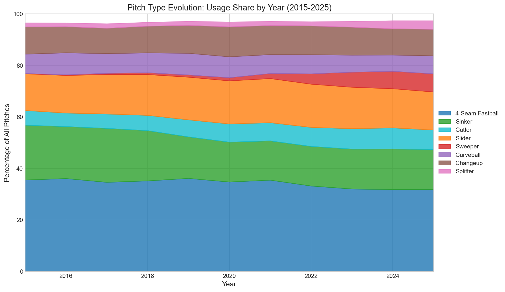
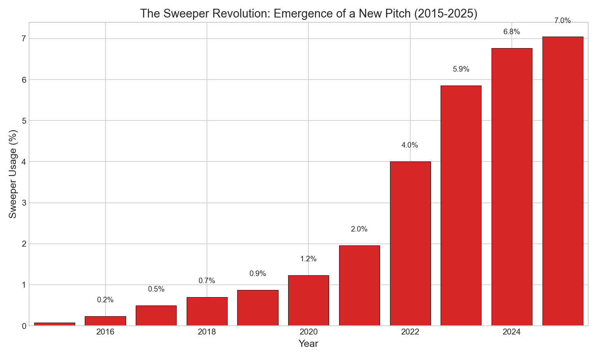
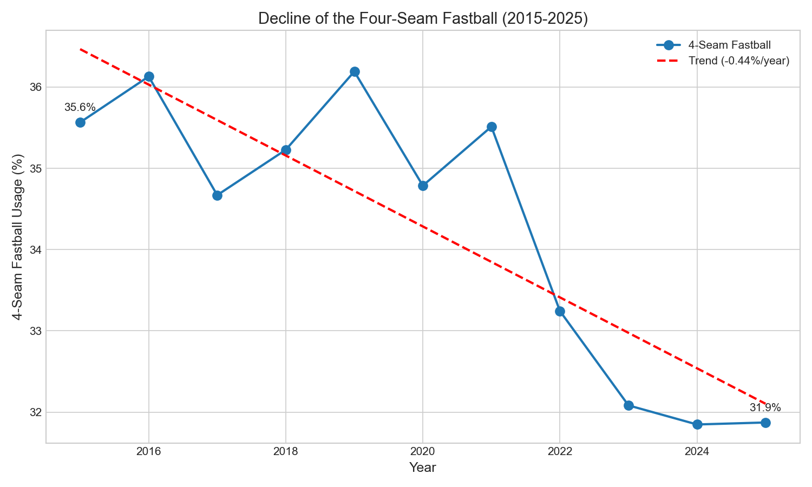

# Chapter 3: Pitch Type Evolution

In 2015, four-seam fastballs accounted for 35.6% of all pitches thrown in Major League Baseball. By 2025, that share had dropped to 31.9%. Meanwhile, a pitch that barely existed in 2015—the sweeper—now accounts for 7.0% of all pitches. This chapter examines the dramatic shift in pitch mix over the past decade.

We analyze pitch type distributions using Statcast data from 2015 to 2025, tracking the decline of traditional fastballs and the rise of new breaking ball variants.

## Getting the Data

We begin by loading Statcast pitch data for all seasons.

```python
import pandas as pd
import numpy as np
from scipy import stats
from statcast_analysis import load_season, AVAILABLE_SEASONS

# Core pitch types
CORE_PITCH_TYPES = ['FF', 'SI', 'FC', 'SL', 'ST', 'CU', 'CH', 'FS']
PITCH_NAMES = {
    'FF': '4-Seam Fastball', 'SI': 'Sinker', 'FC': 'Cutter',
    'SL': 'Slider', 'ST': 'Sweeper', 'CU': 'Curveball',
    'CH': 'Changeup', 'FS': 'Splitter'
}

results = []
for year in AVAILABLE_SEASONS:
    df = load_season(year, columns=['pitch_type'])
    df = df[df['pitch_type'].notna()]

    counts = df['pitch_type'].value_counts()
    total = len(df)

    row = {'year': year, 'total': total}
    for pt in CORE_PITCH_TYPES:
        row[f'{pt}_pct'] = (counts.get(pt, 0) / total * 100) if total > 0 else 0
    results.append(row)

pitch_type_df = pd.DataFrame(results)
```

The data contains over 7.1 million pitches across 11 seasons.

## Pitch Type Distribution by Year

We calculate the percentage of each pitch type by season.

```python
pitch_type_df[['year', 'FF_pct', 'SI_pct', 'SL_pct', 'ST_pct', 'CU_pct', 'CH_pct']]
```

|year|FF_pct|SI_pct|SL_pct|ST_pct|CU_pct|CH_pct|
|----|------|------|------|------|------|------|
|2015|35.6|21.3|14.3|0.1|7.5|10.6|
|2016|36.1|20.2|14.6|0.2|8.5|10.1|
|2017|34.7|20.9|15.3|0.5|7.6|9.8|
|2018|35.2|19.5|15.8|0.7|7.7|10.4|
|2019|36.2|16.1|16.6|0.9|8.4|10.8|
|2020|34.8|15.5|16.7|1.2|8.1|11.6|
|2021|35.5|15.2|17.1|2.0|7.3|11.3|
|2022|33.2|15.4|16.8|4.0|7.4|11.2|
|2023|32.1|15.5|16.1|5.9|6.6|10.8|
|2024|31.8|15.8|15.2|6.8|6.3|10.2|
|2025|31.9|15.5|14.8|7.0|7.0|10.3|

The four-seam fastball declined from 35.6% to 31.9%. The sinker dropped even more dramatically, from 21.3% to 15.5%. Meanwhile, the sweeper rose from virtually nothing to 7.0% of all pitches.

## Visualizing the Evolution

We visualize the pitch type mix over time using a stacked area chart in Figure 3.1.

```python
import matplotlib.pyplot as plt

fig, ax = plt.subplots(figsize=(12, 7))

years = pitch_type_df['year'].values
pitch_order = ['FF', 'SI', 'FC', 'SL', 'ST', 'CU', 'CH', 'FS']
colors = ['#1f77b4', '#2ca02c', '#17becf', '#ff7f0e', '#d62728', '#9467bd', '#8c564b', '#e377c2']

bottom = np.zeros(len(years))
for pt, color in zip(pitch_order, colors):
    values = pitch_type_df[f'{pt}_pct'].values
    ax.fill_between(years, bottom, bottom + values, label=PITCH_NAMES[pt], color=color, alpha=0.8)
    bottom += values

ax.set_xlabel('Year', fontsize=12)
ax.set_ylabel('Percentage of All Pitches', fontsize=12)
ax.set_title('Pitch Type Evolution: Usage Share by Year (2015-2025)', fontsize=14)
ax.set_xlim(2015, 2025)
ax.set_ylim(0, 100)
ax.legend(loc='center left', bbox_to_anchor=(1, 0.5))
plt.tight_layout()
plt.savefig('figures/fig01_pitch_type_evolution.png', dpi=150, bbox_inches='tight')
```



The visualization reveals a clear pattern: fastballs (blue and green bands at bottom) have shrunk while breaking balls (orange and red bands in middle) have expanded.

## The Sweeper Emergence

The most dramatic change is the emergence of the sweeper as a distinct pitch category. We track its rise in Figure 3.2.

```python
fig, ax = plt.subplots(figsize=(10, 6))

sweeper_pct = pitch_type_df['ST_pct'].values
ax.bar(years, sweeper_pct, color='#d62728', edgecolor='black', linewidth=0.5)

ax.set_xlabel('Year', fontsize=12)
ax.set_ylabel('Sweeper Usage (%)', fontsize=12)
ax.set_title('The Sweeper Revolution: Emergence of a New Pitch (2015-2025)', fontsize=14)

for y, pct in zip(years, sweeper_pct):
    if pct > 0.1:
        ax.text(y, pct + 0.3, f"{pct:.1f}%", ha='center', fontsize=9)

plt.tight_layout()
plt.savefig('figures/fig02_sweeper_emergence.png', dpi=150)
```



The sweeper barely existed before 2020 (less than 1% usage). By 2025, it had become one of the most commonly thrown breaking balls in baseball, surpassing the curveball.

## The Four-Seam Decline

We examine the four-seam fastball's decline more closely in Figure 3.3.

```python
fig, ax = plt.subplots(figsize=(10, 6))

ff_pct = pitch_type_df['FF_pct'].values
ax.plot(years, ff_pct, 'o-', linewidth=2, markersize=8, color='#1f77b4', label='4-Seam Fastball')

# Add trend line
slope, intercept, r, p, se = stats.linregress(years, ff_pct)
ax.plot(years, intercept + slope * years, '--', color='red', linewidth=2,
        label=f'Trend ({slope:.2f}%/year)')

ax.set_xlabel('Year', fontsize=12)
ax.set_ylabel('4-Seam Fastball Usage (%)', fontsize=12)
ax.set_title('Decline of the Four-Seam Fastball (2015-2025)', fontsize=14)
ax.legend(loc='upper right')

ax.annotate(f"{ff_pct[0]:.1f}%", (years[0], ff_pct[0]), xytext=(0, 10),
            textcoords="offset points", ha='center')
ax.annotate(f"{ff_pct[-1]:.1f}%", (years[-1], ff_pct[-1]), xytext=(0, 10),
            textcoords="offset points", ha='center')

plt.tight_layout()
plt.savefig('figures/fig03_fastball_decline.png', dpi=150)
```



The trend line shows a decline of 0.44 percentage points per year. Over the full decade, this represents a 3.7 percentage point drop—roughly 270,000 fewer four-seam fastballs thrown per season.

## Pitch Category Shifts

We aggregate pitch types into three categories: fastballs (FF, SI, FC), breaking balls (SL, ST, CU), and offspeed (CH, FS).

```python
# Group pitch types into categories
for _, row in pitch_type_df.iterrows():
    year = row['year']
    fastball = row['FF_pct'] + row['SI_pct'] + row['FC_pct']
    breaking = row['SL_pct'] + row['ST_pct'] + row['CU_pct']
    offspeed = row['CH_pct'] + row['FS_pct']
```

|year|fastball_pct|breaking_pct|offspeed_pct|
|----|------------|------------|------------|
|2015|62.6|21.9|12.1|
|2017|61.2|23.4|11.6|
|2019|58.9|25.8|12.4|
|2021|57.8|26.4|12.9|
|2023|55.5|28.6|13.1|
|2025|55.0|28.8|13.6|

Fastball usage dropped from 62.6% to 55.0%—a decline of 7.6 percentage points. Breaking balls increased from 21.9% to 28.8%—a gain of 6.9 percentage points. This represents a fundamental shift in pitching philosophy.

## Statistical Validation

We validate these trends using linear regression.

```python
# Trend analysis for key pitch types
years_arr = pitch_type_df['year'].values

for pt in ['FF', 'SI', 'ST']:
    values = pitch_type_df[f'{pt}_pct'].values
    slope, intercept, r, p, se = stats.linregress(years_arr, values)
    r_squared = r ** 2
```

|Pitch Type|Slope|95% CI|R²|p-value|Interpretation|
|----------|-----|------|--|-------|--------------|
|4-Seam Fastball|-0.436%/year|[-0.62, -0.26]|0.718|<0.001|Strong decline|
|Sinker|-0.654%/year|[-0.91, -0.40]|0.739|<0.001|Strong decline|
|Sweeper|+0.770%/year|[0.58, 0.96]|0.872|<0.001|Strong increase|
|Cutter|+0.286%/year|[0.22, 0.35]|0.890|<0.001|Strong increase|

The four-seam fastball shows a strong, highly significant decline (R² = 0.718, p < 0.001). The sinker's decline is even steeper. The sweeper's growth is nearly linear (R² = 0.872), reflecting its rapid adoption across the league.

## Period Comparison

We compare the early period (2015-2017) to the late period (2023-2025).

```python
# Aggregate data for period comparison
early = pitch_type_df[pitch_type_df['year'].isin([2015, 2016, 2017])]
late = pitch_type_df[pitch_type_df['year'].isin([2023, 2024, 2025])]

# Calculate Cohen's h for proportion differences
def cohens_h(p1, p2):
    return 2 * (np.arcsin(np.sqrt(p2)) - np.arcsin(np.sqrt(p1)))
```

|Pitch Type|Early Period|Late Period|Change|Cohen's h|Effect Size|
|----------|------------|-----------|------|---------|-----------|
|4-Seam Fastball|35.5%|31.9%|-3.5%|-0.07|negligible|
|Sinker|20.8%|15.6%|-5.2%|-0.14|negligible|
|Sweeper|0.3%|6.6%|+6.3%|0.41|small|
|Cutter|5.5%|7.9%|+2.4%|0.10|negligible|

The sweeper shows the only meaningful effect size (Cohen's h = 0.41), reflecting its emergence as an entirely new pitch category. Other changes, while statistically significant due to large sample sizes, have smaller practical effect sizes when measured as proportions.

## Summary

The pitch type revolution is real and substantial:

1. **Four-seam fastball declined 3.7 percentage points** from 35.6% (2015) to 31.9% (2025)
2. **Sinker dropped 5.8 percentage points** from 21.3% to 15.5%
3. **Sweeper emerged from nothing** to 7.0% of all pitches
4. **Fastball category fell 7.6 points** from 62.6% to 55.0%
5. **Breaking balls rose 6.9 points** from 21.9% to 28.8%
6. **All trends are highly significant** (p < 0.001)

What drove this transformation? The analytics revolution revealed that breaking balls generate more swings-and-misses per pitch. Pitch design technology like Rapsodo and Trackman helped pitchers develop nastier breaking balls. And the sweeper's horizontal movement made it a devastating weapon that pitchers across the league adopted rapidly.

## Further Reading

- Nathan, A. M. (2021). "The Physics of the Sweeper." *Baseball Research Journal*.
- Tango, T. (2019). "Pitch Mix Optimization." *The Book Blog*.

## Exercises

1. Analyze how pitch mix differs between starting pitchers and relievers. Has the fastball decline been more pronounced for one group?

2. Calculate the correlation between sweeper usage and strikeout rate at the team level. Do teams that throw more sweepers strike out more batters?

3. Examine pitch mix by count (0-0, 0-2, 3-2, etc.). How does the fastball/breaking ball balance change with count?

```bash
cd chapters/03_pitch_type
python analysis.py
```
