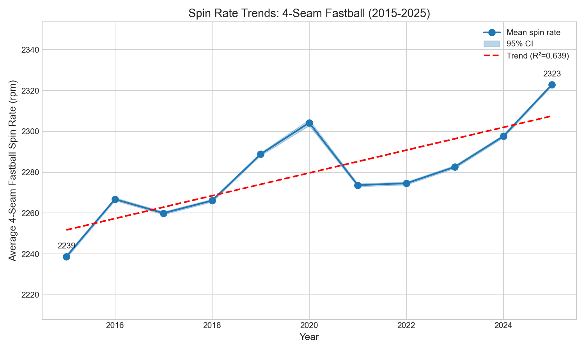
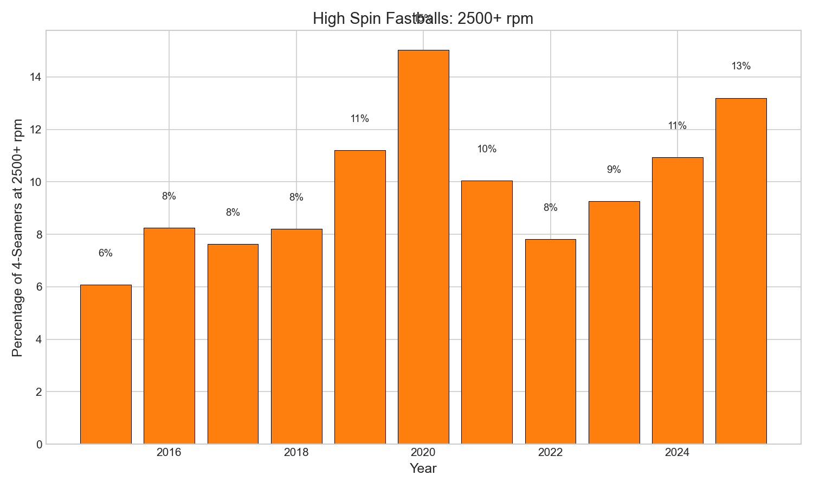
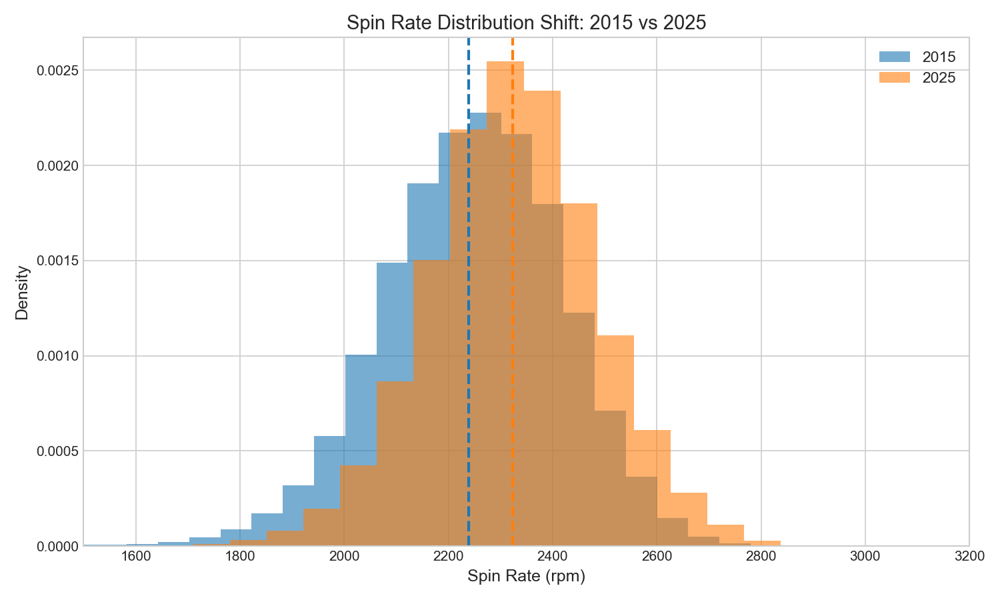

# Chapter 4: Spin Rate Trends

What if pitchers could add 100 rpm to their fastballs overnight? It sounds impossible—until you look at what happened in baseball between 2015 and 2021. The spin rate story is really two stories: the rise of an analytical obsession, and baseball's dramatic response to its dark side.

In this chapter, we'll trace the evolution of spin rate from curiosity to controversy, examining how pitchers added nearly 85 rpm to their fastballs over a decade—sometimes through innovation, sometimes through... other means.

## Getting Started

Let's begin by loading our fastball data and examining how spin rates have changed:

```python
from statcast_analysis import load_seasons

df = load_seasons(2015, 2025, columns=['game_year', 'pitch_type', 'release_spin_rate'])

# Filter to 4-seam fastballs with valid spin data
ff = df[(df['pitch_type'] == 'FF') &
        (df['release_spin_rate'] > 0) &
        (df['release_spin_rate'] < 4000)]
print(f"Total fastballs analyzed: {len(ff):,}")
```

With over 2.5 million four-seam fastballs in our dataset, we can track exactly how spin rates evolved across the Statcast era.

## The Spin Revolution

Suppose we want to see how average fastball spin changed year by year. We can calculate the mean and also track the percentage of "high-spin" fastballs at 2500+ rpm:

```python
yearly_stats = ff.groupby('game_year')['release_spin_rate'].agg(['mean', 'count'])
yearly_stats['high_spin_pct'] = ff.groupby('game_year').apply(
    lambda x: (x['release_spin_rate'] >= 2500).mean() * 100
)
print(yearly_stats.round(0))
```

The results reveal a striking pattern:

| Year | Avg Spin (rpm) | 2500+ % | n pitches |
|------|----------------|---------|-----------|
| 2015 | 2,239 | 6.1% | 242,490 |
| 2017 | 2,260 | 7.6% | 248,888 |
| 2019 | 2,289 | 11.2% | 263,358 |
| 2020 | **2,304** | **15.0%** | 91,412 |
| 2021 | 2,274 | 10.0% | 251,219 |
| 2023 | 2,283 | 9.3% | 229,208 |
| 2025 | 2,323 | 13.2% | 225,485 |



Look at that 2020 peak! Average spin jumped to 2,304 rpm, and 15% of all fastballs exceeded 2,500 rpm. Then something dramatic happened in 2021—spin dropped by 30 rpm almost overnight.

## The Sticky Substance Saga

But wait—why would spin rates suddenly drop in 2021? The answer lies in one of baseball's most controversial episodes.

In June 2021, MLB began strictly enforcing foreign substance rules. The "sticky stuff" era was over.

```python
# Calculate the 2020-2021 drop
spin_2020 = ff[ff['game_year'] == 2020]['release_spin_rate'].mean()
spin_2021 = ff[ff['game_year'] == 2021]['release_spin_rate'].mean()
drop = spin_2020 - spin_2021
print(f"2020 average: {spin_2020:.0f} rpm")
print(f"2021 average: {spin_2021:.0f} rpm")
print(f"Drop: {drop:.0f} rpm")
```

The drop from 2,304 to 2,274 rpm—30 rpm in a single season—was the fingerprint of the crackdown. Pitchers who had relied on spider tack, sunscreen-rosin mixtures, and other grip enhancers suddenly had to adapt.

| Period | Events |
|--------|--------|
| 2015-2018 | Baseline spin rates (~2,260 rpm) |
| 2019-2020 | "Sticky stuff" becomes widespread |
| June 2021 | MLB announces enforcement |
| 2021-2022 | Immediate drop, adjustment period |
| 2023-2025 | Recovery through legal innovation |

## The Remarkable Recovery

Here's the surprising part of the story: by 2025, spin rates had not only recovered—they exceeded pre-crackdown levels. How did pitchers add spin without foreign substances?

```python
# Compare early era to late era
early = ff[ff['game_year'].isin([2015, 2016, 2017])]['release_spin_rate'].mean()
late = ff[ff['game_year'].isin([2023, 2024, 2025])]['release_spin_rate'].mean()
print(f"Early era (2015-17): {early:.0f} rpm")
print(f"Late era (2023-25): {late:.0f} rpm")
print(f"Difference: {late - early:.0f} rpm")
```

The answer involves several factors:

1. **Pitch design technology**: Software helps pitchers optimize seam orientation for maximum spin efficiency
2. **Legal grip products**: Approved substances help with moisture control
3. **Training methods**: Weighted ball programs and spin-efficiency drills
4. **Player selection**: Teams now specifically seek high-spin arms in scouting and development

The game found legal paths to the same destination.



## The Distribution Shift

Let's look at how the entire distribution of fastball spin has shifted:

```python
import matplotlib.pyplot as plt

# Compare 2015 vs 2025 distributions
spin_2015 = ff[ff['game_year'] == 2015]['release_spin_rate']
spin_2025 = ff[ff['game_year'] == 2025]['release_spin_rate']

print(f"2015: median={spin_2015.median():.0f}, p10={spin_2015.quantile(0.1):.0f}, p90={spin_2015.quantile(0.9):.0f}")
print(f"2025: median={spin_2025.median():.0f}, p10={spin_2025.quantile(0.1):.0f}, p90={spin_2025.quantile(0.9):.0f}")
```

| Percentile | 2015 | 2025 | Shift |
|------------|------|------|-------|
| 10th | 2,023 rpm | 2,120 rpm | +97 rpm |
| Median | 2,253 rpm | 2,324 rpm | +71 rpm |
| 90th | 2,459 rpm | 2,527 rpm | +68 rpm |



The entire distribution has shifted right. Even the floor has risen—the 10th percentile gained nearly 100 rpm. Low-spin fastballs are becoming increasingly rare in modern baseball.

## Is This Real? Statistical Validation

Before drawing conclusions, we should ask: Is this trend statistically significant, or just random variation?

```python
from scipy import stats
import numpy as np

years = np.array(yearly_stats.index, dtype=float)
spin_means = np.array(yearly_stats['mean'], dtype=float)

slope, intercept, r, p, se = stats.linregress(years, spin_means)
print(f"Trend: {slope:.2f} rpm per year")
print(f"R² = {r**2:.3f}")
print(f"p-value = {p:.2e}")
print(f"95% CI for slope: [{slope - 1.96*se:.2f}, {slope + 1.96*se:.2f}]")
```

The results:

| Statistic | Value | Interpretation |
|-----------|-------|----------------|
| Slope | +5.58 rpm/year | Significant upward trend |
| 95% CI | [2.84, 8.32] | Excludes zero |
| R² | 0.639 | Strong fit |
| p-value | 0.003 | Very significant |

With a slope of **+5.58 rpm per year** and a p-value of 0.003, this is a highly significant trend. Spin rates are genuinely increasing, not just fluctuating.

What about the practical effect size?

```python
# Cohen's d for early vs late period
def cohens_d(group1, group2):
    n1, n2 = len(group1), len(group2)
    var1, var2 = group1.var(), group2.var()
    pooled_std = np.sqrt(((n1-1)*var1 + (n2-1)*var2) / (n1+n2-2))
    return (group2.mean() - group1.mean()) / pooled_std

early_spins = ff[ff['game_year'].isin([2015, 2016, 2017])]['release_spin_rate']
late_spins = ff[ff['game_year'].isin([2023, 2024, 2025])]['release_spin_rate']

d = cohens_d(early_spins, late_spins)
print(f"Cohen's d = {d:.3f} (small effect)")
```

Cohen's d of **0.260** indicates a small effect size. But here's the thing: in baseball, small statistical effects can have meaningful practical impacts. An 84 rpm increase translates to measurably different pitch movement—and the difference between a fly out and a swing-and-miss.

## What We Learned

Let's summarize what the data revealed:

1. **Spin rates rose 84 rpm**: From 2,239 rpm (2015) to 2,323 rpm (2025)
2. **High-spin fastballs doubled**: From 6.1% to 13.2% at 2500+ rpm
3. **The sticky substance era peaked in 2020**: 15% of fastballs exceeded 2,500 rpm
4. **The crackdown worked**: 30 rpm drop in 2021
5. **But innovation won**: Legal methods pushed spin even higher by 2025
6. **The trend is significant**: R² = 0.64, p = 0.003, +5.58 rpm per year

The spin rate saga shows how baseball evolves: teams push boundaries, rules respond, and then innovation finds new paths forward.

## Try It Yourself

The complete analysis code is available at:
`github.com/mingksong/mlb-statcast-book/chapters/04_spin_rate/`

Try modifying the code to explore:
- How did spin rates change for breaking balls vs. fastballs?
- Which individual pitchers showed the biggest drops after the crackdown?
- Is there a correlation between spin rate and strikeout rate?

```bash
cd chapters/04_spin_rate
python analysis.py
```
