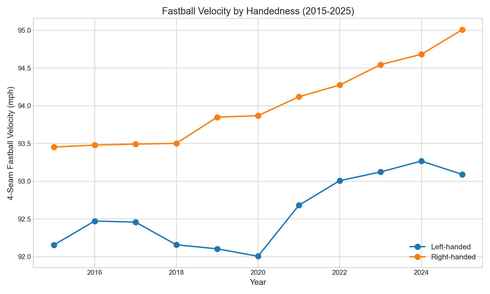
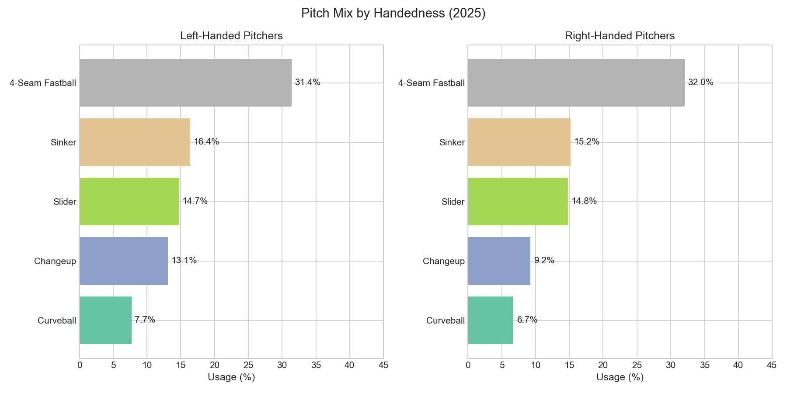
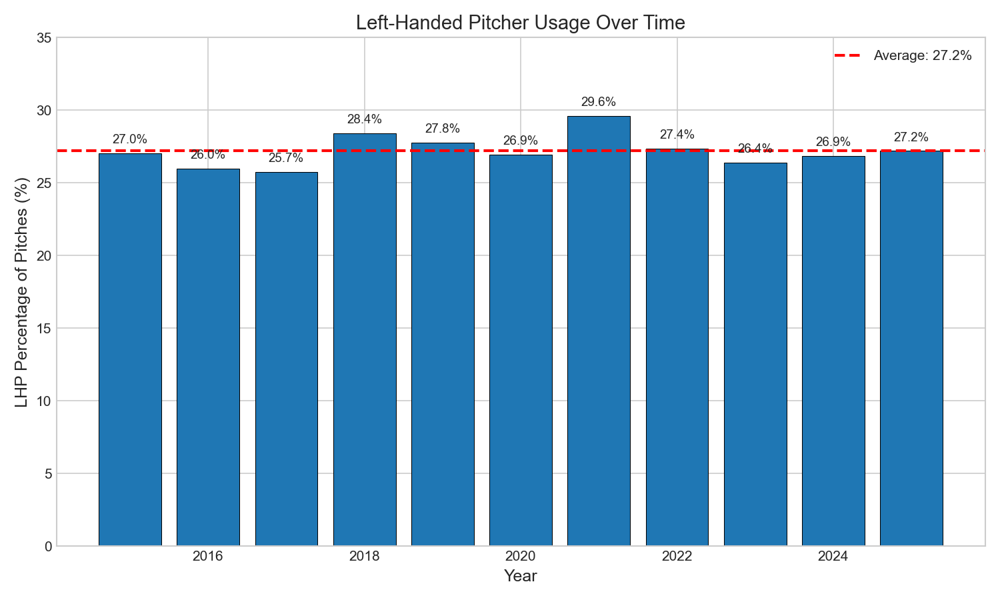

# Chapter 6: Left vs Right Pitcher Differences

Walk into any Major League clubhouse, and you'll notice something immediately: right-handers dominate. For every southpaw, you'll find roughly three right-handed pitchers. This ratio has held steady for a decade. But here's the puzzle: if right-handers throw 1.4 mph harder on average, why do teams still value lefties so highly?

In this chapter, we'll investigate the fundamental differences between left-handed and right-handed pitchers, and discover how southpaws have carved out their niche despite a measurable velocity disadvantage.

## Getting Started

Let's begin by loading our pitch data and separating by handedness:

```python
from statcast_analysis import load_seasons

df = load_seasons(2015, 2025, columns=['game_year', 'pitch_type', 'release_speed',
                                        'p_throws', 'pfx_x', 'pfx_z'])

lhp = df[df['p_throws'] == 'L']
rhp = df[df['p_throws'] == 'R']

print(f"Left-handed pitches: {len(lhp):,}")
print(f"Right-handed pitches: {len(rhp):,}")
print(f"LHP percentage: {len(lhp) / len(df) * 100:.1f}%")
```

With over 7.4 million pitches in our dataset, we can comprehensively compare the two groups.

## The Velocity Gap

Suppose we want to measure the velocity difference between handedness groups. Let's focus on four-seam fastballs:

```python
# Compare fastball velocity by handedness
lhp_ff = lhp[lhp['pitch_type'] == 'FF']['release_speed'].dropna()
rhp_ff = rhp[rhp['pitch_type'] == 'FF']['release_speed'].dropna()

print(f"LHP 4-seam: {lhp_ff.mean():.2f} mph (n={len(lhp_ff):,})")
print(f"RHP 4-seam: {rhp_ff.mean():.2f} mph (n={len(rhp_ff):,})")
print(f"Difference: {rhp_ff.mean() - lhp_ff.mean():.2f} mph")
```

The results reveal a persistent gap:

| Handedness | 4-Seam Velocity | Sample Size |
|------------|-----------------|-------------|
| Right-handed | 94.01 mph | 1.85M pitches |
| Left-handed | 92.62 mph | 0.68M pitches |
| **Difference** | **+1.39 mph** | |



That's not a small difference. With 1.4 mph separating the groups, right-handers have a clear velocity advantage.

## Has the Gap Changed Over Time?

Let's see if the velocity gap has widened or narrowed:

```python
# Yearly velocity comparison
for year in range(2015, 2026):
    year_data = df[df['game_year'] == year]
    lhp_velo = year_data[(year_data['p_throws'] == 'L') &
                          (year_data['pitch_type'] == 'FF')]['release_speed'].mean()
    rhp_velo = year_data[(year_data['p_throws'] == 'R') &
                          (year_data['pitch_type'] == 'FF')]['release_speed'].mean()
    print(f"{year}: LHP={lhp_velo:.2f}, RHP={rhp_velo:.2f}, Gap={rhp_velo-lhp_velo:+.2f}")
```

| Year | LHP Velocity | RHP Velocity | Gap |
|------|-------------|-------------|-----|
| 2015 | 92.15 | 93.45 | +1.30 |
| 2017 | 92.46 | 93.49 | +1.03 |
| 2019 | 92.10 | 93.85 | +1.75 |
| 2021 | 92.68 | 94.12 | +1.44 |
| 2023 | 93.12 | 94.55 | +1.42 |
| 2025 | 93.09 | 95.01 | +1.92 |

Both groups are getting faster—the velocity revolution affects everyone. But the gap has actually widened slightly, from about 1.3 mph in 2015 to nearly 2 mph in 2025.

## How Do Lefties Compete?

This raises an interesting question: if right-handers throw harder, why haven't left-handers been squeezed out of the game?

Let's look at pitch mix by handedness:

```python
# Calculate pitch mix by handedness
for hand in ['L', 'R']:
    subset = df[df['p_throws'] == hand]
    total = len(subset)
    for pitch in ['FF', 'SI', 'SL', 'CU', 'CH']:
        pct = len(subset[subset['pitch_type'] == pitch]) / total * 100
        print(f"{hand}HP {pitch}: {pct:.1f}%")
```

The answer becomes clear:

| Pitch Type | LHP | RHP | Difference |
|------------|-----|-----|------------|
| Changeup | **13.1%** | 9.2% | +3.9% |
| Curveball | 7.7% | 6.7% | +1.0% |
| Sinker | 16.4% | 15.2% | +1.2% |
| Slider | 14.3% | 16.0% | -1.7% |
| 4-Seam | 33.5% | 33.9% | -0.4% |



Left-handers throw nearly **50% more changeups** than right-handers (13.1% vs 9.2%). This off-speed emphasis compensates for lower velocity. A well-located 88 mph changeup can be more effective than a mediocre 95 mph fastball.

## The Mirror Effect

One of the most elegant findings in our data: movement patterns are perfectly mirrored between handedness groups.

```python
# Compare movement by handedness
lhp_ff = lhp[lhp['pitch_type'] == 'FF']
rhp_ff = rhp[rhp['pitch_type'] == 'FF']

print(f"LHP 4-seam H-break: {lhp_ff['pfx_x'].mean():+.2f} inches")
print(f"RHP 4-seam H-break: {rhp_ff['pfx_x'].mean():+.2f} inches")
print(f"LHP 4-seam V-break: {lhp_ff['pfx_z'].mean():+.2f} inches")
print(f"RHP 4-seam V-break: {rhp_ff['pfx_z'].mean():+.2f} inches")
```

| Metric | LHP | RHP |
|--------|-----|-----|
| Horizontal Break | +0.68 in (arm-side) | -0.64 in (glove-side) |
| Vertical Break | +1.32 in | +1.32 in |

The vertical break is identical. The horizontal movement is opposite but equal in magnitude—like looking at your reflection in a mirror.

## The Stable Representation

Given the velocity disadvantage, you might expect left-handers to be declining. Let's check:

```python
# LHP representation over time
yearly_lhp = df.groupby('game_year').apply(
    lambda x: (x['p_throws'] == 'L').mean() * 100
)
print(yearly_lhp.round(1))
```



| Year | LHP % |
|------|-------|
| 2015 | 27.1% |
| 2017 | 25.7% |
| 2019 | 27.8% |
| 2021 | 29.6% |
| 2023 | 26.5% |
| 2025 | 27.2% |

Left-handers have maintained their roughly 27% share throughout the decade. Despite analytics revolutions and velocity obsessions, the game still values southpaws.

## Is This Real? Statistical Validation

Let's validate our findings:

```python
from scipy import stats
import numpy as np

# Velocity difference significance
t_stat, p_value = stats.ttest_ind(lhp_ff['release_speed'].dropna(),
                                    rhp_ff['release_speed'].dropna())
print(f"Velocity t-test: t={t_stat:.2f}, p={p_value:.2e}")

# Effect size (Cohen's d)
pooled_std = np.sqrt((lhp_ff['release_speed'].var() + rhp_ff['release_speed'].var()) / 2)
cohens_d = (rhp_ff['release_speed'].mean() - lhp_ff['release_speed'].mean()) / pooled_std
print(f"Cohen's d: {cohens_d:.3f}")
```

| Test | Metric | Value | Interpretation |
|------|--------|-------|----------------|
| Velocity t-test | t-statistic | -375.10 | |
| | p-value | < 0.001 | Highly significant |
| | Cohen's d | 0.532 | **Medium effect** |
| LHP ratio trend | R² | 0.026 | Weak (stable) |
| | p-value | 0.639 | Not significant |

The velocity gap is both statistically significant and practically meaningful—Cohen's d of 0.53 is a "medium" effect size. But the LHP representation shows no significant trend, confirming that left-handers have held their ground.

## Why Lefties Survive

Several factors explain left-handers' continued value:

1. **Scarcity creates advantage**: Only ~10% of the population is left-handed. This natural rarity means left-handed batters see fewer same-side matchups, giving lefty pitchers a persistent platoon advantage.

2. **Strategic adaptation**: Heavy changeup usage compensates for lower velocity. A speed differential between fastball and changeup matters more than raw velocity.

3. **Different look**: After seeing 70% right-handed pitchers, batters face a fundamentally different release point from lefties.

4. **Natural selection**: Only left-handers who can compete despite lower velocity make it to MLB—the ones who survive are especially skilled.

## What We Learned

Let's summarize what the data revealed:

1. **Right-handers throw 1.4 mph harder**: 94.01 vs 92.62 mph (Cohen's d = 0.53, medium effect)
2. **The gap is widening**: From +1.3 mph (2015) to +1.9 mph (2025)
3. **Lefties throw more changeups**: 13.1% vs 9.2% (50% more)
4. **Movement is perfectly mirrored**: Same magnitude, opposite direction
5. **LHP representation is stable**: ~27% throughout the decade
6. **Scarcity creates value**: Left-handers survive through adaptation and platoon advantages

The southpaw story shows that baseball success isn't just about throwing hard—it's about finding ways to get hitters out with whatever tools you have.

## Try It Yourself

The complete analysis code is available at:
`github.com/mingksong/mlb-statcast-book/chapters/06_handedness/`

Try modifying the code to explore:
- How does the platoon advantage (LHP vs LHH, RHP vs RHH) compare between handedness groups?
- Which specific left-handed pitchers have succeeded despite below-average velocity?
- How do spin rates compare between handedness groups?

```bash
cd chapters/06_handedness
python analysis.py
```
