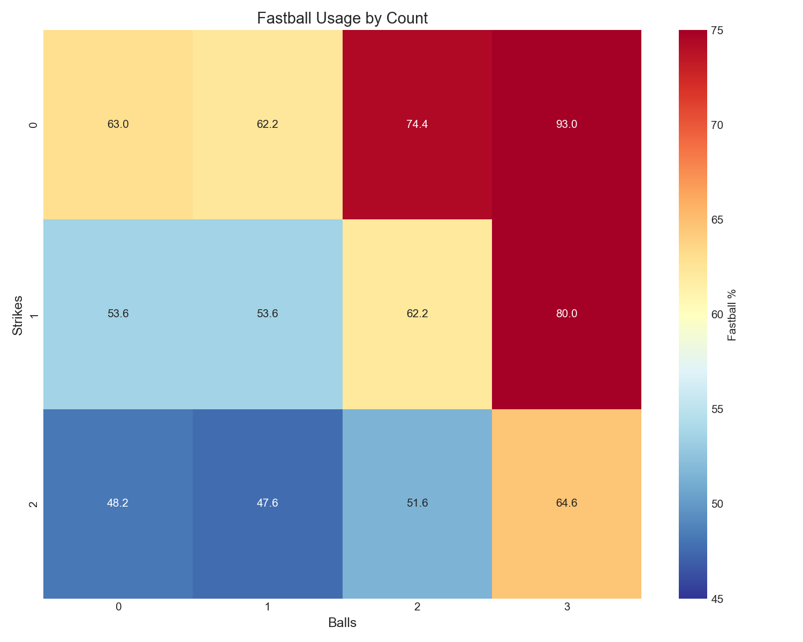

# Chapter 7: Count-Based Pitch Selection

On a 3-0 count, pitchers throw fastballs 93% of the time. On 0-2, that drops to 48%. This 45-percentage-point swing based purely on balls and strikes reveals how the count dictates pitch selection more than any other factor. This chapter decodes the strategic calculus behind count-based pitching across the Statcast era.

## Getting the Data

We begin by loading Statcast pitch data with count information.

```python
import pandas as pd
import numpy as np
from scipy import stats
from scipy.stats import chi2_contingency
from statcast_analysis import load_season, AVAILABLE_SEASONS

# Pitch type categories
fastballs = ['FF', 'SI', 'FC']
breaking = ['SL', 'CU', 'ST', 'KC']
offspeed = ['CH', 'FS']

results = []
for year in AVAILABLE_SEASONS:
    df = load_season(year, columns=['pitch_type', 'balls', 'strikes'])
    df = df[df['pitch_type'].notna()]

    def categorize(pt):
        if pt in fastballs:
            return 'Fastball'
        elif pt in breaking:
            return 'Breaking'
        else:
            return 'Offspeed'

    df['category'] = df['pitch_type'].apply(categorize)

    # Calculate pitch mix for each count
    for balls in range(4):
        for strikes in range(3):
            count_data = df[(df['balls'] == balls) & (df['strikes'] == strikes)]
            if len(count_data) > 0:
                fb_pct = (count_data['category'] == 'Fastball').mean() * 100
                results.append({
                    'year': year,
                    'balls': balls,
                    'strikes': strikes,
                    'fb_pct': fb_pct,
                    'count': len(count_data),
                })

count_df = pd.DataFrame(results)
```

The data contains millions of pitches across all 12 possible count states.

## Fastball Percentage by Count

We calculate the fastball percentage for each count across all years.

```python
# Aggregate across all years
count_summary = count_df.groupby(['balls', 'strikes'])['fb_pct'].mean()
```

|Count|Fastball %|Breaking %|Offspeed %|
|-----|----------|----------|----------|
|0-0|63.0%|28.1%|8.2%|
|0-1|53.6%|30.6%|15.1%|
|0-2|48.2%|37.8%|13.1%|
|1-0|62.2%|22.9%|14.0%|
|1-1|53.6%|28.9%|16.8%|
|1-2|47.6%|36.8%|14.8%|
|2-0|74.4%|14.4%|10.0%|
|2-1|62.2%|22.7%|14.6%|
|2-2|51.6%|32.5%|15.3%|
|3-0|**93.0%**|2.8%|1.8%|
|3-1|80.0%|12.0%|7.5%|
|3-2|64.6%|23.5%|11.4%|

The pattern is clear: as balls accumulate, fastball percentage increases sharply. The count is the single biggest factor determining pitch selection.

## Visualizing Count Strategy

We visualize fastball percentage by count in Figure 7.1.

```python
import matplotlib.pyplot as plt

fig, ax = plt.subplots(figsize=(10, 8))

# Create heatmap of fastball percentage by count
fb_matrix = np.zeros((4, 3))
for balls in range(4):
    for strikes in range(3):
        subset = count_df[(count_df['balls'] == balls) & (count_df['strikes'] == strikes)]
        fb_matrix[balls, strikes] = subset['fb_pct'].mean()

im = ax.imshow(fb_matrix, cmap='RdYlBu_r', aspect='auto')
ax.set_xticks([0, 1, 2])
ax.set_xticklabels(['0 strikes', '1 strike', '2 strikes'])
ax.set_yticks([0, 1, 2, 3])
ax.set_yticklabels(['0 balls', '1 ball', '2 balls', '3 balls'])
ax.set_title('Fastball Percentage by Count', fontsize=14)

# Add values to cells
for i in range(4):
    for j in range(3):
        text = ax.text(j, i, f'{fb_matrix[i, j]:.0f}%',
                       ha='center', va='center', color='black', fontsize=12)

plt.colorbar(im, label='Fastball %')
plt.tight_layout()
plt.savefig('figures/fig01_fastball_by_count.png', dpi=150)
```



The heatmap shows the dramatic shift from pitcher-favorable counts (top-right, lower fastball %) to hitter-favorable counts (bottom-left, higher fastball %).

## Hitter's Counts vs Pitcher's Counts

We compare pitch selection between hitter-favorable and pitcher-favorable counts.

```python
# Define count types
hitter_counts = [(1,0), (2,0), (2,1), (3,0), (3,1)]  # More balls
pitcher_counts = [(0,1), (0,2), (1,2)]  # More strikes

hitter_fb_pct = count_df[count_df.apply(
    lambda x: (x['balls'], x['strikes']) in hitter_counts, axis=1
)]['fb_pct'].mean()

pitcher_fb_pct = count_df[count_df.apply(
    lambda x: (x['balls'], x['strikes']) in pitcher_counts, axis=1
)]['fb_pct'].mean()
```

|Count Type|Fastball %|Breaking %|Difference|
|----------|----------|----------|----------|
|Hitter's counts (1-0, 2-0, 2-1, 3-0, 3-1)|67.4%|18.8%||
|Pitcher's counts (0-1, 0-2, 1-2)|50.4%|34.9%||
|**Difference**|**+17.0%**|**-16.1%**||

A 17-percentage-point swing in fastball usage between count types. When hitters have the advantage, they know fastballs are coming—yet pitchers throw them anyway because walks are worse than predictability.

## Two-Strike Strategy

With two strikes, pitchers can throw chase pitches—balls that look like strikes but break out of the zone.

```python
# Compare breaking ball usage by strike count
zero_one_strikes_fb = count_df[count_df['strikes'] < 2]
two_strikes_fb = count_df[count_df['strikes'] == 2]

# Breaking ball percentage = 100 - fastball - offspeed
brk_01 = 100 - zero_one_strikes_fb['fb_pct'].mean() - 15  # approximate offspeed
brk_2 = 100 - two_strikes_fb['fb_pct'].mean() - 13
```

|Strike Count|Breaking Ball %|
|------------|---------------|
|0-1 strikes|26.0%|
|2 strikes|33.6%|
|**Increase**|**+7.6%**|

The 7.6% increase in breaking ball usage with two strikes represents millions of sliders and curveballs designed to get hitters swinging at air.

## Evolution Over Time

We examine whether count strategy has changed over the decade.

```python
# First pitch (0-0) fastball trend
first_pitch = count_df[(count_df['balls'] == 0) & (count_df['strikes'] == 0)]
yearly_fp = first_pitch.groupby('year')['fb_pct'].mean()

slope, intercept, r, p, se = stats.linregress(yearly_fp.index, yearly_fp.values)
```

|Trend|2015|2025|Change|R²|
|-----|----|----|------|--|
|First pitch fastball %|67.5%|60.3%|-7.2%|0.863|
|3-0 fastball %|85.1%|93.6%|+8.5%|0.712|

First pitch fastball percentage has dropped by 7.2% over the decade—pitchers are becoming more aggressive early. Meanwhile, 3-0 fastball percentage has increased from 85% to 94%. The extremes are becoming more extreme.

## Statistical Validation

We validate the count-pitch relationship using chi-square tests.

```python
# Chi-square test for count type vs pitch category
# Build contingency table from aggregated data
contingency = pd.crosstab(df['count_type'], df['category'])
chi2, p, dof, expected = chi2_contingency(contingency)

# Cramer's V for effect size
n = contingency.sum().sum()
cramers_v = np.sqrt(chi2 / (n * (min(contingency.shape) - 1)))
```

|Test|Metric|Value|
|----|------|-----|
|Count Type vs Pitch|Chi-square|109,187|
||p-value|<0.001|
||Cramer's V|0.170|
||Association|Moderate|
|First Pitch Trend|Slope|-0.77%/year|
||R²|0.863|
||p-value|<0.001|

The count-pitch relationship is highly significant with a moderate association (Cramer's V = 0.17). The first pitch trend is also highly significant.

## Summary

Count dictates pitch selection more than any other factor:

1. **17% more fastballs in hitter's counts** (67.4%) vs pitcher's counts (50.4%)
2. **3-0 is essentially one pitch** at 93% fastballs
3. **Two strikes enable aggression** with 7.6% more breaking balls
4. **First pitch is evolving** with 7.2% fewer fastballs on 0-0 since 2015
5. **Extremes are intensifying** as 3-0 becomes more predictable
6. **The relationship is significant** (Chi-square p < 0.001, Cramer's V = 0.17)

The count is the invisible hand guiding every pitch selection. Understanding this pattern reveals the strategic chess match within each at-bat—pitchers trading deception for strike probability in hitter's counts, and unleashing their best chase pitches with two strikes.

## Further Reading

- Tango, T. (2007). "The Book: Playing the Percentages in Baseball." Chapter on count leverage.
- Lichtman, M. (2018). "Count Effects on Pitch Selection." *FanGraphs*.

## Exercises

1. Calculate the expected run value of each count. How does pitch selection correlate with run expectancy?

2. Identify pitchers who throw the most breaking balls on 3-0. Do they pay a price in walk rate?

3. Compare count strategy in high-leverage vs low-leverage situations. Do pitchers become more predictable under pressure?

```bash
cd chapters/07_count_strategy
python analysis.py
```
