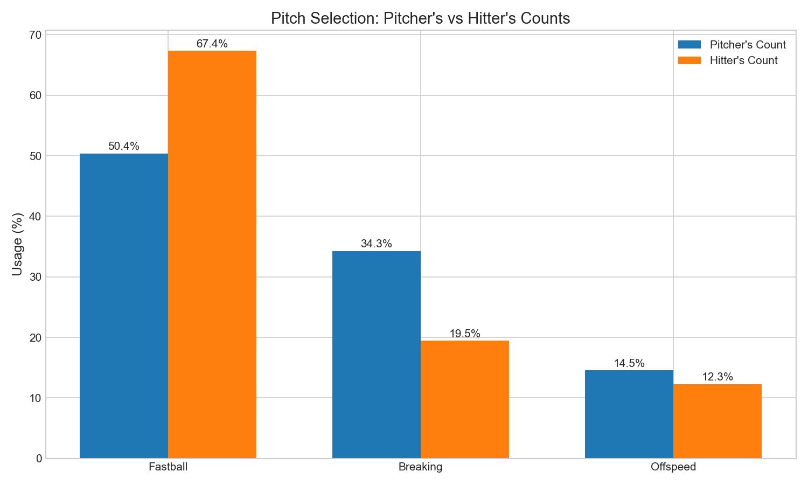
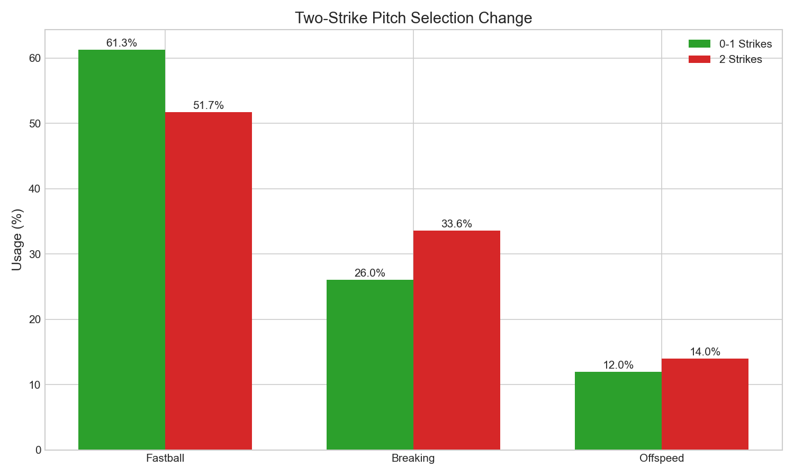
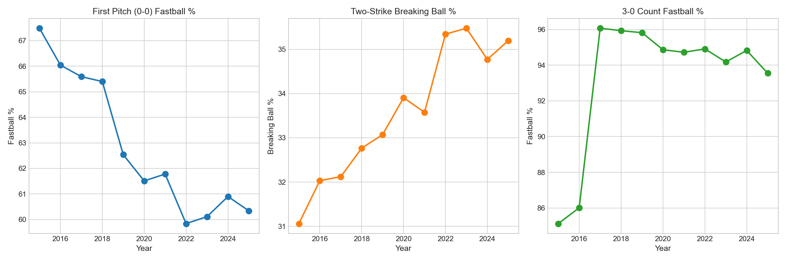

# Chapter 7: Count-Based Pitch Selection

## Key Findings

- **17% more fastballs in hitter's counts** vs pitcher's counts
- **3-0 count is 93% fastballs** - pitchers prioritize strikes over deception
- **Two-strike breaking ball usage up 7.6%** - chase pitches with 2 strikes
- **First pitch fastball% dropped 7.2%** (2015-2025) - more aggressive early

---

## The Story

Baseball is a game of situations. And no situation matters more to pitch selection than the count.

### The Count Hierarchy

Every count tells a story about who has the advantage:

| Count | Fastball % | Who's Winning? |
|-------|-----------|----------------|
| 3-0 | **93.0%** | Hitter dominant |
| 2-0 | 74.4% | Hitter advantage |
| 0-2 | 48.2% | Pitcher dominant |
| 0-0 | 63.0% | Neutral |

The pattern is unmistakable: the more behind a pitcher falls, the more they rely on their fastball.

### Why Fastballs in Hitter's Counts?

When a pitcher is behind in the count, they face a simple calculation:
- **Walk** = Guaranteed baserunner
- **Off-speed ball** = Higher chance of missing the zone

So in hitter's counts (1-0, 2-0, 2-1, 3-0, 3-1), pitchers throw 67.4% fastballs compared to just 50.4% in pitcher's counts. That's a **17 percentage point swing**.

### The 3-0 Exception

The 3-0 count is baseball's most extreme situation. At 93% fastballs, it's essentially a one-pitch count. Pitchers are telling hitters: "Here's a fastball. Try to hit it."

And remarkably, this has become *more* extreme over time:
- 2015: 85.1% fastballs on 3-0
- 2025: 93.6% fastballs on 3-0

The game has decided that on 3-0, the risk of walking is so high that deception isn't worth attempting.

### Two-Strike Aggression

With two strikes, the calculus flips. Now the pitcher can afford to throw chase pitches—balls that look like strikes but break out of the zone.

Breaking ball usage jumps from 26.0% (0-1 strikes) to 33.6% (2 strikes). That 7.6% increase represents millions of sliders and curveballs designed to get hitters swinging at air.

---

## The Analysis

### Pitch Mix by Count

```python
# Calculate fastball% for each count
for balls in range(4):
    for strikes in range(3):
        count_data = df[(df['balls'] == balls) & (df['strikes'] == strikes)]
        fb_pct = (count_data['pitch_category'] == 'Fastball').mean() * 100
        print(f"{balls}-{strikes}: {fb_pct:.1f}% fastballs")
```

### Complete Count Matrix

| Count | Fastball % | Breaking % | Offspeed % |
|-------|-----------|------------|------------|
| 0-0 | 63.0% | 28.1% | 8.2% |
| 0-1 | 53.6% | 30.6% | 15.1% |
| 0-2 | 48.2% | 37.8% | 13.1% |
| 1-0 | 62.2% | 22.9% | 14.0% |
| 1-1 | 53.6% | 28.9% | 16.8% |
| 1-2 | 47.6% | 36.8% | 14.8% |
| 2-0 | 74.4% | 14.4% | 10.0% |
| 2-1 | 62.2% | 22.7% | 14.6% |
| 2-2 | 51.6% | 32.5% | 15.3% |
| 3-0 | 93.0% | 2.8% | 1.8% |
| 3-1 | 80.0% | 12.0% | 7.5% |
| 3-2 | 64.6% | 23.5% | 11.4% |

---

## Visualizations

### Figure 1: Fastball Heatmap


The color gradient tells the story: more balls = more fastballs.

### Figure 2: Pitcher's vs Hitter's Counts



A 17% swing in fastball usage between count types.

### Figure 3: Two-Strike Strategy



Breaking balls spike when pitchers can afford to chase.

### Figure 4: Evolution Over Time



First pitch fastballs declining, 3-0 fastballs increasing.

---

## What It Means

1. **Counts determine strategy**: The count is the single biggest factor in pitch selection
2. **Walks are feared**: The extreme 3-0 fastball rate shows how much pitchers fear free passes
3. **Two strikes enable aggression**: Pitchers save their best chase pitches for 2-strike counts
4. **The game is evolving**: First pitch aggression is up, 3-0 predictability is up

---

## Try It Yourself

```bash
cd chapters/07_count_strategy
python analysis.py
```
