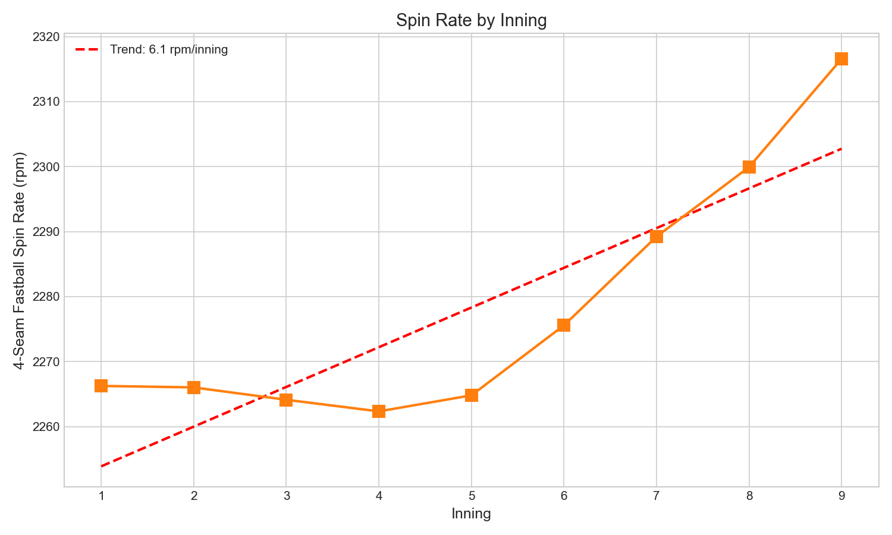
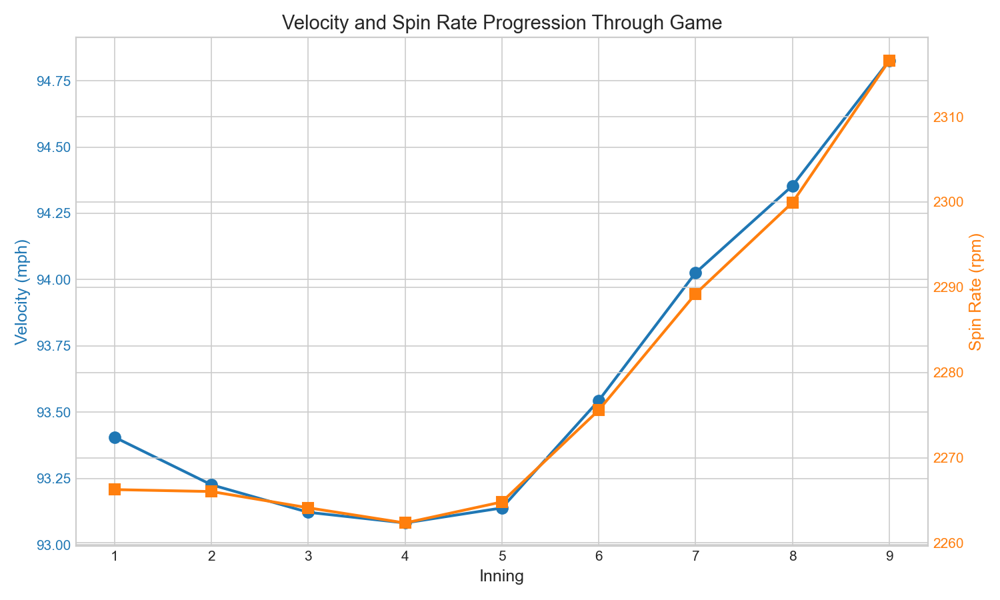

# Chapter 8: Velocity/Spin by Inning

## Key Findings

- **Late-inning velocity is HIGHER** than early innings (94.8 vs 93.4 mph)
- **The paradox**: Relievers replacing starters mask individual fatigue
- **Spin rate also increases** in late innings (+50 rpm from inning 1 to 9)
- **The bullpen effect**: Modern roster construction drives late-game velocity

---

## The Story

You'd expect pitchers to tire as games progress. Less velocity in the 7th than the 1st. Lower spin. Diminishing stuff.

The data says otherwise.

### The Surprising Pattern

| Inning | Velocity | What's Happening |
|--------|----------|------------------|
| 1 | 93.41 mph | Starters begin fresh |
| 4 | 93.08 mph | Starters showing fatigue |
| 6 | 93.54 mph | Some relievers entering |
| 9 | **94.83 mph** | Closers throwing heat |

Velocity doesn't decline—it **increases** by 1.4 mph from the first inning to the ninth.

### The Hidden Story: Bullpen Strategy

This isn't about fatigue disappearing. It's about roster management.

Modern baseball has evolved to a simple principle: **when starters tire, bring in fresh arms that throw harder**.

The numbers prove it:
- **Early innings (1-3)**: 93.26 mph average
- **Late innings (7-9)**: 94.37 mph average
- **Difference**: +1.11 mph

This 1+ mph jump reflects the compositional shift from starters to relievers.

### Within-Starter Fatigue Still Exists

The analysis also tracked velocity changes from inning 1 to inning 6 (when most starters are still in games):

| Year | Inning 1 | Inning 6 | Change |
|------|----------|----------|--------|
| 2015 | 92.76 | 92.95 | +0.19 |
| 2020 | 93.29 | 93.34 | +0.05 |
| 2025 | 94.38 | 94.36 | -0.01 |

The changes are minimal—modern pitcher management pulls starters before significant fatigue shows.

---

## The Analysis

### Measuring 2.5 Million Fastballs

```python
from statcast_analysis import load_seasons, AVAILABLE_SEASONS

# Load all 4-seam fastballs with inning data
df = load_seasons(AVAILABLE_SEASONS,
                  columns=['pitch_type', 'release_speed', 'inning'])
df = df[df['pitch_type'] == 'FF']

# Calculate velocity by inning
for inning in range(1, 10):
    velo = df[df['inning'] == inning]['release_speed'].mean()
    print(f"Inning {inning}: {velo:.2f} mph")
```

### Results by Inning

| Inning | Velocity | Spin Rate | n |
|--------|----------|-----------|---|
| 1 | 93.41 mph | 2,266 rpm | 332,153 |
| 2 | 93.23 mph | 2,266 rpm | 290,921 |
| 3 | 93.12 mph | 2,264 rpm | 272,505 |
| 4 | 93.08 mph | 2,262 rpm | 259,797 |
| 5 | 93.14 mph | 2,265 rpm | 261,072 |
| 6 | 93.54 mph | 2,276 rpm | 268,196 |
| 7 | 94.03 mph | 2,289 rpm | 283,932 |
| 8 | 94.35 mph | 2,300 rpm | 292,083 |
| 9 | 94.83 mph | 2,317 rpm | 232,935 |

---

## Statistical Validation

| Test | Metric | Value |
|------|--------|-------|
| Velocity Trend | Slope | +0.189 mph/inning |
| Velocity Trend | R² | 0.684 |
| Velocity Trend | p-value | 0.006 |
| Spin Trend | Slope | +6.1 rpm/inning |
| Spin Trend | R² | 0.748 |
| Early vs Late | Cohen's d | 0.421 |

---

## Visualizations

### Figure 1: Velocity by Inning


The counterintuitive rise: velocity increases as innings progress.

### Figure 2: Spin Rate by Inning



Spin follows the same pattern—higher in late innings.

### Figure 3: Combined View



Both metrics rise together as relievers take over.

---

## What It Means

1. **The bullpen era**: Late-game velocity gains show how rosters are constructed
2. **Hidden fatigue**: Individual pitcher fatigue exists but is masked by substitution
3. **Strategic evolution**: Teams pull starters before visible decline
4. **Reliever specialization**: High-leverage arms throw harder than ever

---

## Try It Yourself

```bash
cd chapters/08_fatigue
python analysis.py
```
