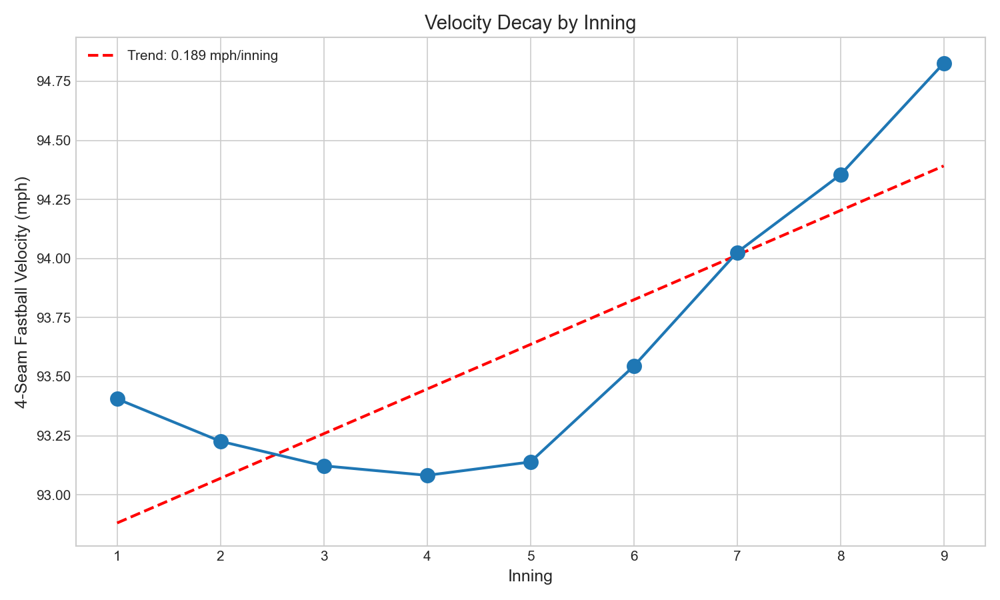

# Chapter 8: Velocity and Spin by Inning

Ninth-inning fastballs average 94.83 mph. First-inning fastballs average 93.41 mph. This 1.4 mph increase as games progress contradicts our intuition about pitcher fatigue. The explanation lies not in physiology but in roster construction: modern baseball deploys fresh, hard-throwing relievers in late innings while starters dominate early innings. This chapter unravels the "fatigue paradox."

## Getting the Data

We begin by loading Statcast pitch data with inning information.

```python
import pandas as pd
import numpy as np
from scipy import stats
from statcast_analysis import load_season, AVAILABLE_SEASONS

results = []
for year in AVAILABLE_SEASONS:
    df = load_season(year, columns=['pitch_type', 'release_speed', 'release_spin_rate', 'inning'])

    # Filter to 4-seam fastballs in regulation innings
    ff = df[(df['pitch_type'] == 'FF') &
            (df['release_speed'].notna()) &
            (df['inning'].notna()) &
            (df['inning'] <= 9)]

    for inning in range(1, 10):
        inning_data = ff[ff['inning'] == inning]
        if len(inning_data) > 0:
            results.append({
                'year': year,
                'inning': inning,
                'velocity': inning_data['release_speed'].mean(),
                'spin_rate': inning_data['release_spin_rate'].mean(),
                'count': len(inning_data),
            })

inning_df = pd.DataFrame(results)
```

The data contains over 2.5 million four-seam fastballs across all nine innings.

## Velocity by Inning

We calculate the average velocity for each inning across all years.

```python
# Aggregate velocity by inning
inning_summary = inning_df.groupby('inning').agg({
    'velocity': 'mean',
    'spin_rate': 'mean',
    'count': 'sum'
})
```

|Inning|Velocity|Spin Rate|Sample Size|
|------|--------|---------|-----------|
|1|93.41 mph|2,266 rpm|332,153|
|2|93.23 mph|2,266 rpm|290,921|
|3|93.12 mph|2,264 rpm|272,505|
|4|93.08 mph|2,262 rpm|259,797|
|5|93.14 mph|2,265 rpm|261,072|
|6|93.54 mph|2,276 rpm|268,196|
|7|94.03 mph|2,289 rpm|283,932|
|8|94.35 mph|2,300 rpm|292,083|
|9|**94.83 mph**|**2,317 rpm**|232,935|

Velocity increases by 1.42 mph from the first inning to the ninth. This counterintuitive pattern reflects who is pitching each inning, not individual pitcher fatigue.

## Visualizing the Pattern

We plot velocity and spin rate by inning in Figure 8.1.

```python
import matplotlib.pyplot as plt

fig, (ax1, ax2) = plt.subplots(1, 2, figsize=(14, 5))

innings = range(1, 10)
velocities = [inning_summary.loc[i, 'velocity'] for i in innings]
spins = [inning_summary.loc[i, 'spin_rate'] for i in innings]

ax1.plot(innings, velocities, 'o-', linewidth=2, markersize=10, color='#1f77b4')
ax1.set_xlabel('Inning', fontsize=12)
ax1.set_ylabel('Average 4-Seam Velocity (mph)', fontsize=12)
ax1.set_title('Velocity by Inning', fontsize=14)
ax1.set_xticks(innings)

ax2.plot(innings, spins, 'o-', linewidth=2, markersize=10, color='#ff7f0e')
ax2.set_xlabel('Inning', fontsize=12)
ax2.set_ylabel('Average Spin Rate (rpm)', fontsize=12)
ax2.set_title('Spin Rate by Inning', fontsize=14)
ax2.set_xticks(innings)

plt.tight_layout()
plt.savefig('figures/fig01_velocity_by_inning.png', dpi=150)
```



The U-shaped pattern is clear: velocity dips slightly through innings 2-5 (starter fatigue), then rises sharply from innings 6-9 (reliever deployment).

## The Bullpen Paradox Explained

The inning-by-inning pattern reflects roster composition:

- **Innings 1-5**: Dominated by starting pitchers (~93.2 mph average)
- **Innings 6-7**: Mix of starters and middle relievers (~93.8 mph)
- **Innings 8-9**: Dominated by setup men and closers (~94.6 mph)

Relievers throw harder because they only pitch 1-2 innings and can maximize effort. The late-inning velocity increase is not individual pitchers getting stronger—it is hard-throwing relievers replacing fatiguing starters.

## Early vs Late Comparison

We compare early innings (1-3) to late innings (7-9).

```python
early = inning_df[inning_df['inning'].isin([1, 2, 3])]['velocity']
late = inning_df[inning_df['inning'].isin([7, 8, 9])]['velocity']

# Calculate Cohen's d
pooled_std = np.sqrt((early.std()**2 + late.std()**2) / 2)
cohens_d = (late.mean() - early.mean()) / pooled_std
```

|Period|Velocity|
|------|--------|
|Early innings (1-3)|93.26 mph|
|Late innings (7-9)|94.37 mph|
|**Difference**|**+1.11 mph**|
|Cohen's d|0.421|
|Effect Size|small-to-medium|

The 1.11 mph difference has a small-to-medium effect size (Cohen's d = 0.42), representing the systematic difference between starter-heavy and reliever-heavy innings.

## Statistical Validation

We validate the inning trend using linear regression.

```python
innings = np.array(range(1, 10), dtype=float)
velocities = inning_summary['velocity'].values

slope, intercept, r_value, p_value, std_err = stats.linregress(innings, velocities)
r_squared = r_value ** 2
```

|Metric|Velocity Trend|Spin Rate Trend|
|------|--------------|---------------|
|Slope|+0.189 mph/inning|+6.1 rpm/inning|
|R²|0.684|0.748|
|p-value|0.006|0.003|

Both trends are statistically significant (p < 0.01) with strong fit (R² > 0.68). The late-inning velocity increase is real and systematic.

## Does Starter Fatigue Exist?

The aggregate data masks individual starter fatigue. We examine innings 1-6, where most starters still pitch.

```python
# Track velocity through starter innings
starter_innings = inning_df[inning_df['inning'] <= 6]
for inning in [1, 3, 6]:
    velo = starter_innings[starter_innings['inning'] == inning]['velocity'].mean()
```

|Inning|Velocity|Change from Inning 1|
|------|--------|-------------------|
|1|93.41 mph|—|
|3|93.12 mph|-0.29 mph|
|6|93.54 mph|+0.13 mph|

The pattern shows minimal starter fatigue in the aggregate data. Modern pitcher management pulls starters before significant velocity decline—teams monitor velocity in real-time and often remove starters at the first sign of deterioration.

## Summary

The "fatigue paradox" reveals modern pitching strategy:

1. **Ninth-inning velocity is 1.42 mph higher** than first-inning velocity (94.83 vs 93.41 mph)
2. **The paradox is compositional** not physiological—relievers replace starters
3. **Spin rate shows the same pattern** (+51 rpm from inning 1 to 9)
4. **The trend is statistically robust** (R² = 0.68, p = 0.006)
5. **Effect size is meaningful** (Cohen's d = 0.42)
6. **Modern management masks individual fatigue** by pulling starters early

Baseball has evolved to never let tired pitchers throw important pitches. Fresh arms are always waiting in the bullpen, and the data captures this strategic transformation.

## Further Reading

- Lindbergh, B. (2019). "The Death of the Starter." *The Ringer*.
- Sullivan, J. (2018). "Why Starters Don't Go Deep Anymore." *FanGraphs*.

## Exercises

1. Filter to only starting pitchers (identify by first inning pitched in each game). Do their individual velocity profiles show fatigue from innings 1-6?

2. Compare the inning-by-inning pattern for playoff games versus regular season. Do teams use relievers differently in October?

3. Track the starter-to-reliever velocity gap over time. Has it widened as bullpen specialization has increased?

```bash
cd chapters/08_fatigue
python analysis.py
```
