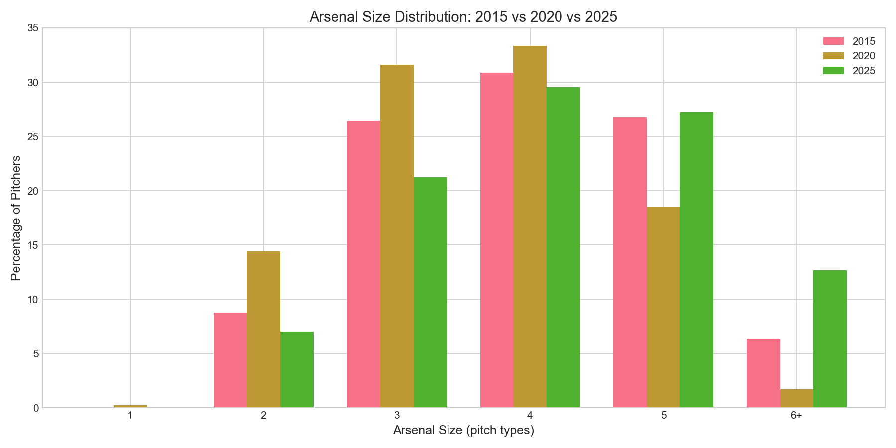
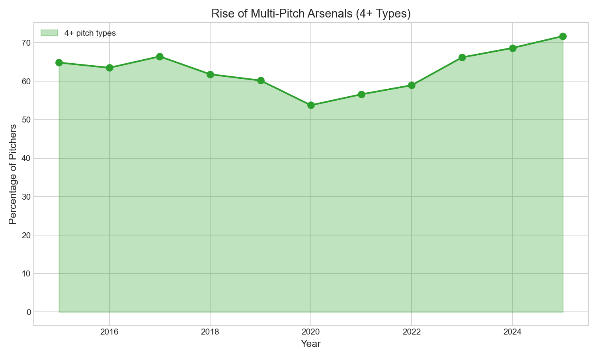
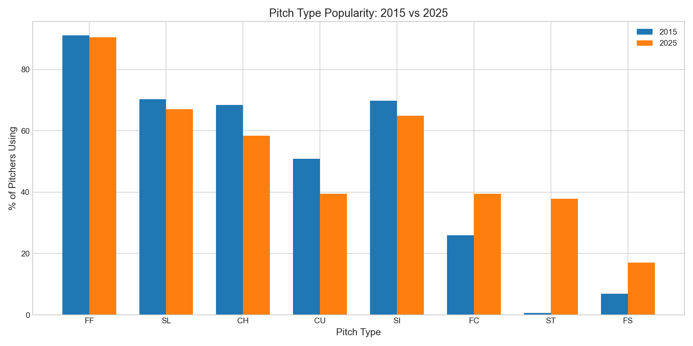

# Chapter 9: Pitcher Arsenal Diversity

## Key Findings

- **Arsenal size increased modestly**: 3.98 → 4.25 pitch types per pitcher
- **Sweeper emerged as major weapon**: 0% → 38% of pitchers use it
- **Cutter gained popularity**: 26% → 40% of pitchers
- **Curveball and changeup declined** as sweeper replaced traditional breaking balls

---

## The Story

The modern pitcher's toolkit has evolved. A decade ago, the typical arsenal was a fastball, slider, changeup, and maybe a curveball. Today, sweepers, cutters, and splitters have joined the mix.

### The Numbers

| Metric | 2015 | 2025 |
|--------|------|------|
| Average arsenal | 3.98 | 4.25 |
| 4+ pitch pitchers | 64.8% | 71.7% |
| 5+ pitch pitchers | 30.5% | 37.2% |

### Winners and Losers

**Rising Pitches:**
| Pitch | 2015 → 2025 |
|-------|-------------|
| Sweeper | 0% → **38%** |
| Cutter | 26% → 40% |
| Splitter | 7% → 17% |

**Declining Pitches:**
| Pitch | 2015 → 2025 |
|-------|-------------|
| Curveball | 51% → 40% |
| Changeup | 68% → 58% |

The sweeper's rise is the story of the decade. It didn't exist as a tracked pitch in 2015. By 2025, more than one-third of pitchers throw it regularly.

---

## The Analysis

### Counting Arsenal Size

```python
# For each pitcher, count qualifying pitch types (20+ thrown)
for pitcher in pitchers:
    pitch_counts = df[df['pitcher'] == pitcher]['pitch_type'].value_counts()
    qualifying = pitch_counts[pitch_counts >= 20]
    arsenal_size = len(qualifying)
```

### Arsenal Distribution

| Size | Count | % |
|------|-------|---|
| 2 pitches | 623 | 9.4% |
| 3 pitches | 1,830 | 27.5% |
| 4 pitches | 2,179 | **32.7%** |
| 5 pitches | 1,569 | 23.5% |
| 6+ pitches | 460 | 6.9% |

The most common arsenal is 4 pitches, and the trend is toward more diversity.

---

## Visualizations

### Figure 1: Arsenal Size Trend


A gradual but modest increase in arsenal diversity.

### Figure 2: Distribution Comparison



The shift toward larger arsenals is visible.

### Figure 3: Multi-Pitch Rise



More pitchers now carry 4+ pitch types.

### Figure 4: Pitch Popularity Shift



The sweeper's emergence and curveball's decline.

---

## What It Means

1. **Pitch design creates new weapons**: The sweeper is a manufactured pitch type
2. **Old pitches are replaced**: Curveballs giving way to sweepers
3. **Specialization continues**: Even with more pitches, usage is concentrated
4. **The trend is modest**: Not every pitcher is developing 6-pitch arsenals

---

## Try It Yourself

```bash
cd chapters/09_arsenal
python analysis.py
```
