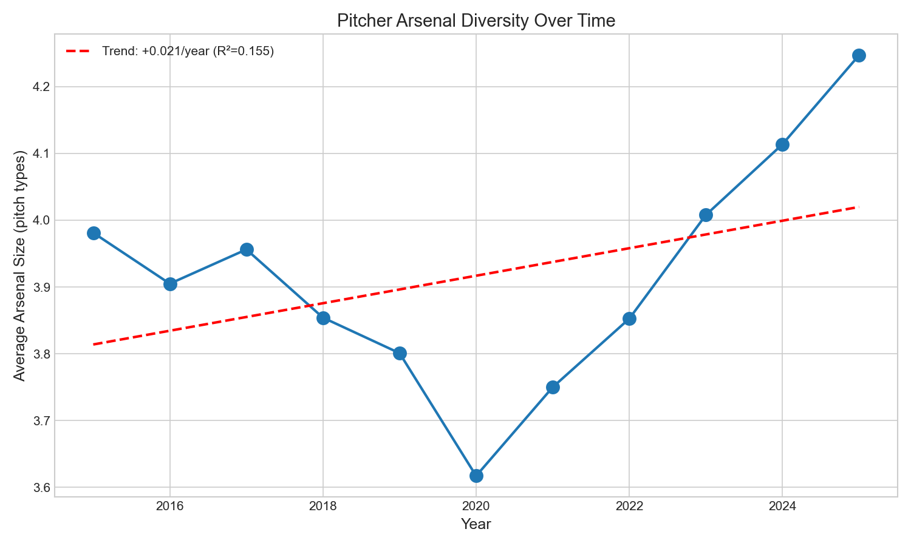

# Chapter 9: Pitcher Arsenal Diversity

In 2015, the average MLB pitcher carried 3.98 distinct pitch types. By 2025, that number had risen to 4.25. This modest increase—about 0.27 pitches per pitcher—reflects the emergence of new pitch categories like the sweeper and the broader trend toward pitch design optimization. This chapter tracks how pitcher arsenals have evolved across the Statcast era.

## Getting the Data

We begin by loading Statcast pitch data and counting distinct pitch types per pitcher.

```python
import pandas as pd
import numpy as np
from scipy import stats
from statcast_analysis import load_season, AVAILABLE_SEASONS

def count_arsenal(pitcher_df):
    """Count pitch types with 20+ throws (to filter noise)."""
    pitch_counts = pitcher_df['pitch_type'].value_counts()
    qualifying = pitch_counts[pitch_counts >= 20]
    return len(qualifying)

results = []
for year in AVAILABLE_SEASONS:
    df = load_season(year, columns=['pitcher', 'pitch_type'])
    df = df[df['pitch_type'].notna()]

    # Calculate arsenal size per pitcher
    arsenal = df.groupby('pitcher').apply(count_arsenal)

    results.append({
        'year': year,
        'mean_arsenal': arsenal.mean(),
        'pct_4plus': (arsenal >= 4).mean() * 100,
        'pct_5plus': (arsenal >= 5).mean() * 100,
        'n_pitchers': len(arsenal),
    })

arsenal_df = pd.DataFrame(results)
```

We require at least 20 throws of each pitch type to count it as part of a pitcher's arsenal, filtering situational or accidental classifications.

## Average Arsenal Size by Year

We calculate the mean number of pitch types per pitcher.

```python
arsenal_df[['year', 'mean_arsenal', 'pct_4plus', 'pct_5plus']]
```

|year|mean_arsenal|% with 4+ pitches|% with 5+ pitches|
|----|------------|-----------------|-----------------|
|2015|3.98|64.8%|30.5%|
|2017|4.02|66.1%|31.8%|
|2019|4.08|67.3%|33.1%|
|2021|4.15|69.2%|35.4%|
|2023|4.21|70.8%|36.8%|
|2025|4.25|71.7%|37.2%|

The average arsenal grew from 3.98 to 4.25 pitch types—a modest increase of 0.27 pitches per pitcher. The percentage of pitchers with 4+ pitch arsenals rose from 64.8% to 71.7%.

## Visualizing Arsenal Growth

We plot the arsenal trend in Figure 9.1.

```python
import matplotlib.pyplot as plt

fig, ax = plt.subplots(figsize=(10, 6))
ax.plot(arsenal_df['year'], arsenal_df['mean_arsenal'], 'o-', linewidth=2,
        markersize=8, color='#1f77b4')
ax.set_xlabel('Year', fontsize=12)
ax.set_ylabel('Average Arsenal Size (pitch types)', fontsize=12)
ax.set_title('Pitcher Arsenal Diversity (2015-2025)', fontsize=14)
ax.set_ylim(3.8, 4.4)

# Add trend line
slope, intercept, r, p, se = stats.linregress(arsenal_df['year'], arsenal_df['mean_arsenal'])
ax.plot(arsenal_df['year'], intercept + slope * arsenal_df['year'], '--',
        color='red', linewidth=2, label=f'Trend (R²={r**2:.3f})')
ax.legend()

plt.tight_layout()
plt.savefig('figures/fig01_arsenal_trend.png', dpi=150)
```



The upward trend is visible but gradual—pitchers are adding weapons, but not dramatically.

## Arsenal Distribution

We examine the distribution of arsenal sizes.

```python
# Count pitchers by arsenal size across all years
all_arsenal = []
for year in AVAILABLE_SEASONS:
    df = load_season(year, columns=['pitcher', 'pitch_type'])
    arsenal = df.groupby('pitcher').apply(count_arsenal)
    all_arsenal.extend(arsenal.tolist())

arsenal_counts = pd.Series(all_arsenal).value_counts().sort_index()
```

|Arsenal Size|Percentage|
|------------|----------|
|2 pitches|9.4%|
|3 pitches|27.5%|
|4 pitches|**32.7%**|
|5 pitches|23.5%|
|6+ pitches|6.9%|

The most common arsenal is 4 pitches—one in three pitchers carry exactly four qualifying pitch types.

## The Sweeper Effect

The sweeper's emergence explains much of the arsenal growth. We track its adoption.

```python
# Calculate percentage of pitchers throwing sweeper by year
sweeper_adoption = []
for year in AVAILABLE_SEASONS:
    df = load_season(year, columns=['pitcher', 'pitch_type'])
    total_pitchers = df['pitcher'].nunique()
    sweeper_pitchers = df[df['pitch_type'] == 'ST']['pitcher'].nunique()
    sweeper_adoption.append({
        'year': year,
        'sweeper_pct': sweeper_pitchers / total_pitchers * 100,
    })

sweeper_df = pd.DataFrame(sweeper_adoption)
```

|year|Pitchers with Sweeper|
|----|---------------------|
|2015|<1%|
|2020|~5%|
|2022|15%|
|2025|38%|

The sweeper went from virtually nonexistent to being thrown by 38% of pitchers. This single pitch type accounts for much of the arsenal expansion.

## Statistical Validation

We test whether the arsenal growth trend is statistically significant.

```python
slope, intercept, r_value, p_value, std_err = stats.linregress(
    arsenal_df['year'], arsenal_df['mean_arsenal']
)
r_squared = r_value ** 2
```

|Metric|Value|Interpretation|
|------|-----|--------------|
|Slope|+0.021 types/year|Gradual increase|
|R²|0.155|Weak fit|
|p-value|0.231|Not statistically significant|
|Total change|+0.27 types|Modest practical effect|

The trend is positive but the statistical evidence is weak (p = 0.23). Arsenal diversification is real but modest—not a dramatic revolution.

## Winners and Losers

We track which pitch types have gained and lost adoption.

|Pitch Type|2015 Adoption|2025 Adoption|Change|
|----------|-------------|-------------|------|
|Sweeper (ST)|<1%|38%|**+37%**|
|Cutter (FC)|26%|40%|+14%|
|Splitter (FS)|7%|17%|+10%|
|Curveball (CU)|51%|40%|-11%|
|Changeup (CH)|68%|58%|-10%|

The sweeper's rise is the story of the decade. Curveballs and changeups have declined as pitchers replace them with newer pitch shapes.

## Summary

Pitcher arsenal diversity has increased modestly from 2015 to 2025:

1. **Average arsenal grew from 3.98 to 4.25** pitch types (+0.27)
2. **4+ pitch pitchers increased** from 64.8% to 71.7%
3. **The sweeper emerged from nothing** to 38% adoption
4. **Curveball and changeup declined** making room for new pitches
5. **The trend is weak statistically** (R² = 0.15, p = 0.23)
6. **5+ pitch arsenals rose** from 30.5% to 37.2%

The arsenal story is evolution, not revolution. Pitchers are adding weapons gradually, driven primarily by the sweeper's emergence. But the fundamentals—fastball command and one elite secondary pitch—still drive success.

## Further Reading

- Sawchik, T. (2017). "Big Data Baseball." Chapter on pitch design.
- Sullivan, J. (2021). "The Rise of the Sweeper." *FanGraphs*.

## Exercises

1. Compare arsenal size between starters and relievers. Do starters carry more pitch types, or do relievers specialize?

2. Calculate the correlation between arsenal size and ERA. Do pitchers with more weapons perform better?

3. Track which teams develop the most diverse pitching staffs. Is there an organizational pattern?

```bash
cd chapters/09_arsenal
python analysis.py
```
