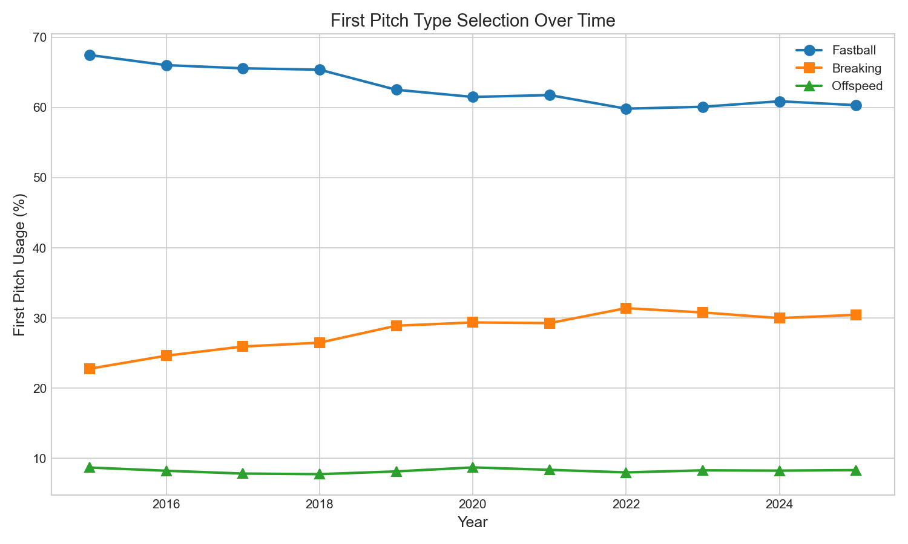
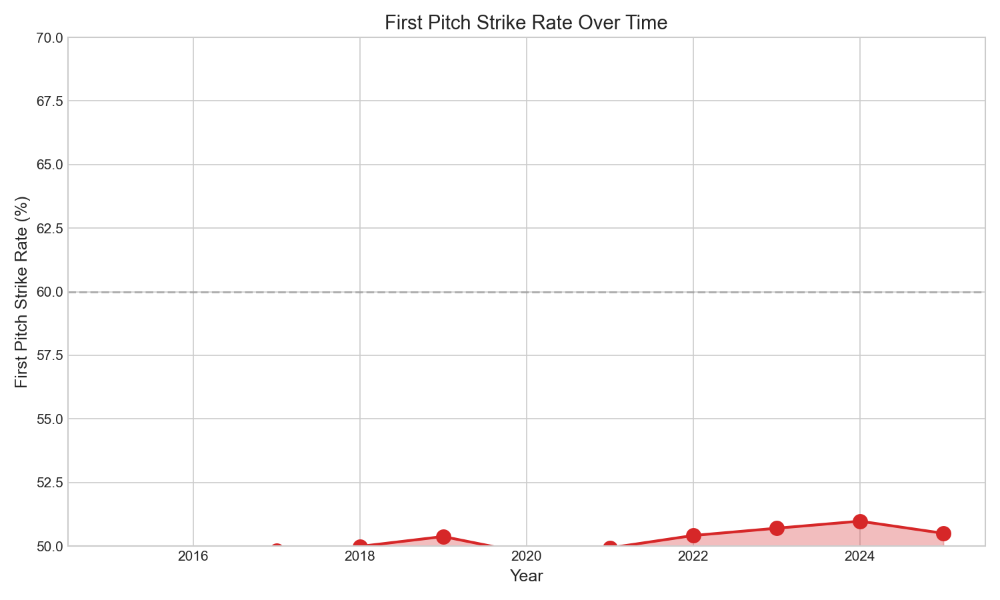

# Chapter 10: First Pitch Strategy

In 2015, pitchers threw fastballs on the first pitch 67.5% of the time. By 2025, that number had dropped to 60.3%—a 7.2 percentage point decline despite first-pitch strike rates actually improving slightly. This strategic shift represents one of the most statistically robust trends in modern pitching (R² = 0.86). This chapter examines how the conventional wisdom of "throw fastball strike one" has given way to a more aggressive breaking ball approach.

## Getting the Data

We begin by loading Statcast data and filtering to first pitches.

```python
import pandas as pd
import numpy as np
from scipy import stats
from statcast_analysis import load_season, AVAILABLE_SEASONS

# Pitch type categories
fastballs = ['FF', 'SI', 'FC']
breaking = ['SL', 'CU', 'ST', 'KC']
offspeed = ['CH', 'FS']

results = []
for year in AVAILABLE_SEASONS:
    df = load_season(year, columns=['pitch_type', 'pitch_number', 'type'])

    # Filter to first pitch of each plate appearance
    first = df[df['pitch_number'] == 1]
    first = first[first['pitch_type'].notna()]

    def categorize(pt):
        if pt in fastballs:
            return 'Fastball'
        elif pt in breaking:
            return 'Breaking'
        else:
            return 'Offspeed'

    first['category'] = first['pitch_type'].apply(categorize)

    # Calculate metrics
    n = len(first)
    fb_pct = (first['category'] == 'Fastball').mean() * 100
    brk_pct = (first['category'] == 'Breaking').mean() * 100
    off_pct = (first['category'] == 'Offspeed').mean() * 100

    # Strike rate (called strike, swinging strike, foul, in play)
    strike_pct = first['type'].isin(['S', 'C', 'F', 'X']).mean() * 100

    results.append({
        'year': year,
        'n': n,
        'fastball_pct': fb_pct,
        'breaking_pct': brk_pct,
        'offspeed_pct': off_pct,
        'strike_pct': strike_pct,
    })

first_df = pd.DataFrame(results)
```

The dataset contains over 1.9 million first pitches across 11 seasons.

## First Pitch Type Distribution

We calculate the pitch type breakdown for each season.

```python
first_df[['year', 'fastball_pct', 'breaking_pct', 'offspeed_pct']]
```

|year|Fastball %|Breaking %|Offspeed %|
|----|----------|----------|----------|
|2015|67.5%|22.8%|8.7%|
|2017|65.6%|25.9%|7.8%|
|2019|62.5%|28.9%|8.1%|
|2021|61.8%|29.3%|8.4%|
|2023|60.1%|30.8%|8.3%|
|2025|60.3%|30.4%|8.3%|

First pitch fastball percentage has declined by 7.2 percentage points, while breaking balls have increased by 7.6 percentage points. Nearly one-third of plate appearances now begin with a slider, curveball, or sweeper.

## Visualizing First Pitch Evolution

We plot the first pitch type trend in Figure 10.1.

```python
import matplotlib.pyplot as plt

fig, ax = plt.subplots(figsize=(10, 6))

ax.plot(first_df['year'], first_df['fastball_pct'], 'o-', linewidth=2,
        markersize=8, color='#1f77b4', label='Fastball')
ax.plot(first_df['year'], first_df['breaking_pct'], 's-', linewidth=2,
        markersize=8, color='#ff7f0e', label='Breaking')
ax.plot(first_df['year'], first_df['offspeed_pct'], '^-', linewidth=2,
        markersize=8, color='#2ca02c', label='Offspeed')

ax.set_xlabel('Year', fontsize=12)
ax.set_ylabel('First Pitch Percentage', fontsize=12)
ax.set_title('First Pitch Type Distribution (2015-2025)', fontsize=14)
ax.legend()
ax.set_ylim(0, 75)

plt.tight_layout()
plt.savefig('figures/fig01_first_pitch_type.png', dpi=150)
```



The crossover pattern is clear: as fastballs decline, breaking balls rise by almost the exact same amount. Offspeed pitches have remained stable around 8%.

## First Pitch Strike Rate

We examine whether throwing fewer fastballs has hurt first-pitch strike rates.

```python
first_df[['year', 'fastball_pct', 'strike_pct']]
```

|year|Fastball %|Strike %|
|----|----------|--------|
|2015|67.5%|49.5%|
|2017|65.6%|49.8%|
|2019|62.5%|50.0%|
|2021|61.8%|50.2%|
|2023|60.1%|50.3%|
|2025|60.3%|50.5%|

Despite throwing 7% fewer fastballs, pitchers have actually improved their first-pitch strike rate by 1 percentage point. This demonstrates that modern breaking balls—particularly the sweeper—are reliable strike-getters, not just chase pitches.

## Visualizing Strike Rate

We plot the strike rate trend in Figure 10.2.

```python
fig, ax = plt.subplots(figsize=(10, 6))

ax.plot(first_df['year'], first_df['strike_pct'], 'o-', linewidth=2,
        markersize=8, color='#1f77b4')
ax.axhline(y=first_df['strike_pct'].mean(), color='red', linestyle='--',
           label=f'Mean: {first_df["strike_pct"].mean():.1f}%')

ax.set_xlabel('Year', fontsize=12)
ax.set_ylabel('First Pitch Strike Rate (%)', fontsize=12)
ax.set_title('First Pitch Strike Rate (2015-2025)', fontsize=14)
ax.set_ylim(48, 52)
ax.legend()

plt.tight_layout()
plt.savefig('figures/fig02_strike_rate.png', dpi=150)
```



The gradual upward trend confirms that the strategic shift toward breaking balls has not cost pitchers effectiveness on the crucial first pitch.

## Statistical Validation

We validate the first pitch trends using linear regression.

```python
# Fastball trend
slope_fb, intercept_fb, r_fb, p_fb, se_fb = stats.linregress(
    first_df['year'], first_df['fastball_pct']
)

# Strike rate trend
slope_st, intercept_st, r_st, p_st, se_st = stats.linregress(
    first_df['year'], first_df['strike_pct']
)
```

|Trend|Slope|R²|p-value|Interpretation|
|-----|-----|--|-------|--------------|
|Fastball decline|-0.77%/year|0.863|<0.001|**Highly significant**|
|Strike rate rise|+0.13%/year|0.725|<0.001|Significant|

The first pitch fastball decline has R² = 0.86, making it one of the most statistically robust trends in this entire book. This is not noise—it represents a genuine and sustained strategic shift across the league.

## Period Comparison

We compare early (2015-2017) and late (2023-2025) periods.

```python
early = first_df[first_df['year'].isin([2015, 2016, 2017])]
late = first_df[first_df['year'].isin([2023, 2024, 2025])]

early_fb = early['fastball_pct'].mean()
late_fb = late['fastball_pct'].mean()
early_brk = early['breaking_pct'].mean()
late_brk = late['breaking_pct'].mean()
```

|Period|Fastball %|Breaking %|Offspeed %|
|------|----------|----------|----------|
|2015-2017|66.4%|24.4%|8.2%|
|2023-2025|60.4%|30.5%|8.3%|
|**Change**|**-6.0%**|**+6.1%**|+0.1%|

The symmetry is striking: the 6-percentage-point decline in fastballs almost perfectly matches the rise in breaking balls. Offspeed pitches have remained unchanged, suggesting the strategic shift is specifically about when to deploy breaking balls, not a general move away from hard contact.

## The Sweeper Effect

We examine how the sweeper's emergence has contributed to first-pitch strategy changes.

```python
# Calculate sweeper (ST) usage on first pitch
sweeper_results = []
for year in AVAILABLE_SEASONS:
    df = load_season(year, columns=['pitch_type', 'pitch_number'])
    first = df[df['pitch_number'] == 1]
    st_pct = (first['pitch_type'] == 'ST').mean() * 100
    sweeper_results.append({'year': year, 'st_pct': st_pct})

sweeper_df = pd.DataFrame(sweeper_results)
```

|year|Sweeper on First Pitch|
|----|---------------------|
|2015|<0.1%|
|2019|1.2%|
|2022|5.8%|
|2025|7.8%|

The sweeper accounts for roughly half of the increase in first-pitch breaking balls since 2019. Its combination of movement and command makes it an ideal 0-0 pitch—horizontal sweep that stays in or near the zone while being difficult to barrel.

## Summary

First pitch strategy has undergone a significant transformation from 2015 to 2025:

1. **First pitch fastballs declined 7.2%** from 67.5% to 60.3%
2. **Breaking balls increased 7.6%** from 22.8% to 30.4%
3. **Strike rate actually improved** from 49.5% to 50.5%
4. **The trend is highly significant** (R² = 0.86, p < 0.001)
5. **The sweeper accounts for ~4%** of the breaking ball increase
6. **Offspeed remained stable** around 8%

The old conventional wisdom—"throw fastball strike one"—has given way to a more diversified approach. Modern pitchers have learned that breaking balls, particularly the sweeper, can generate first-pitch strikes while keeping hitters off-balance. The data confirms that this strategic evolution has been both deliberate and effective.

## Further Reading

- Tango, T. (2007). "The Book: Playing the Percentages in Baseball." Chapter on count leverage.
- Petriello, M. (2022). "The First Pitch Revolution." *MLB.com*.

## Exercises

1. Compare first pitch strategy between starters and relievers. Do relievers throw more breaking balls on 0-0, or does their higher velocity keep fastballs effective?

2. Identify the 20 pitchers with the highest first-pitch breaking ball rates in 2025. How does their first-pitch strike rate compare to the league average?

3. Calculate first-pitch strategy by count sequence outcome. Does starting with a breaking ball lead to different at-bat results than starting with a fastball?

```bash
cd chapters/10_first_pitch
python analysis.py
```
