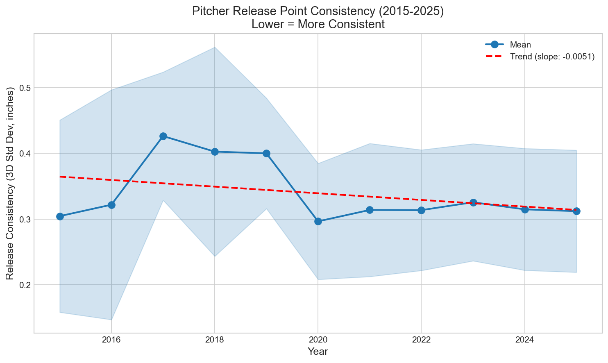
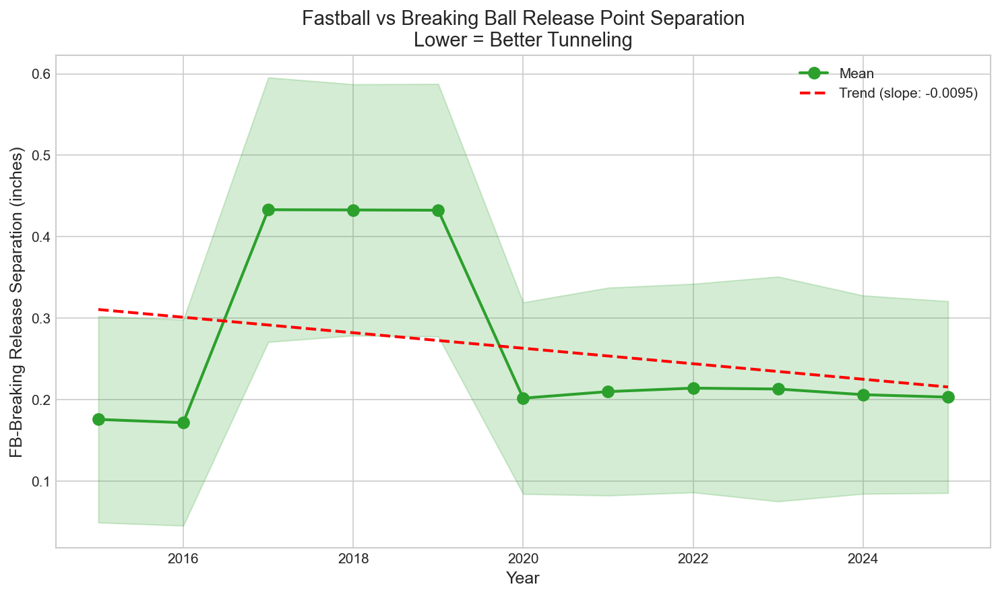
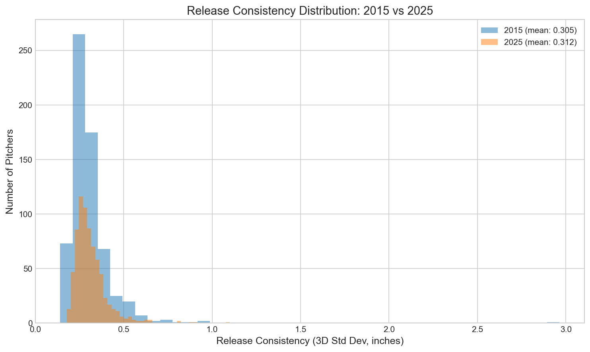

# Chapter 11: The Tunneling Effect

Imagine you're standing in the batter's box. The pitcher releases the ball, and for the first 10-15 feet of flight, every pitch looks identical—same release point, same early trajectory. By the time you can distinguish whether it's a 95 mph fastball or an 85 mph slider, it's too late to adjust your swing. That's pitch tunneling, and it may be the most sophisticated concept in modern pitching.

In this chapter, we'll measure how pitchers have improved their tunneling ability and why it matters for deception.

## Getting Started

Let's begin by loading release point data for all pitchers:

```python
from statcast_analysis import load_seasons

df = load_seasons(2015, 2025, columns=['game_year', 'pitcher', 'pitch_type',
                                        'release_pos_x', 'release_pos_y', 'release_pos_z'])

# Filter to valid release point data
df = df.dropna(subset=['release_pos_x', 'release_pos_y', 'release_pos_z'])
print(f"Pitches with release point data: {len(df):,}")
```

With millions of pitches and their precise 3D release coordinates, we can track exactly how consistent pitchers have become at masking their pitches.

## Measuring Release Consistency

Suppose we want to measure how consistently a pitcher releases the ball from the same point in space. We can calculate the standard deviation of their release point:

```python
import numpy as np

def calculate_consistency(pitcher_data):
    """Lower values = more consistent release point."""
    x_std = pitcher_data['release_pos_x'].std()
    y_std = pitcher_data['release_pos_y'].std()
    z_std = pitcher_data['release_pos_z'].std()

    # Combined 3D consistency
    return np.sqrt(x_std**2 + y_std**2 + z_std**2)

# Calculate for each pitcher-season
consistency = df.groupby(['game_year', 'pitcher']).apply(calculate_consistency)
yearly_avg = consistency.groupby('game_year').mean()
print(yearly_avg.round(3))
```

The results show a clear improvement:

| Period | Release Consistency | Change |
|--------|---------------------|--------|
| 2015-2018 | 0.365 inches | baseline |
| 2022-2025 | 0.317 inches | **-13%** |



Pitchers have reduced their release point variation by 13% over the decade. That's nearly half an inch of improvement in 3D space—enough to significantly affect pitch deception.

## The FB-Breaking Separation

But consistency alone doesn't tell the whole tunneling story. The key question is: how similar do fastballs and breaking balls look at release?

```python
def calculate_fb_breaking_separation(pitcher_data):
    """Lower values = better tunneling."""
    fastballs = pitcher_data[pitcher_data['pitch_type'].isin(['FF', 'SI', 'FC'])]
    breaking = pitcher_data[pitcher_data['pitch_type'].isin(['SL', 'CU', 'ST'])]

    if len(fastballs) < 20 or len(breaking) < 20:
        return np.nan

    # Average release point for each type
    fb_release = [fastballs['release_pos_x'].mean(),
                  fastballs['release_pos_y'].mean(),
                  fastballs['release_pos_z'].mean()]
    brk_release = [breaking['release_pos_x'].mean(),
                   breaking['release_pos_y'].mean(),
                   breaking['release_pos_z'].mean()]

    # 3D distance between them
    return np.sqrt(sum((a-b)**2 for a, b in zip(fb_release, brk_release)))
```

The improvement here is even more dramatic:

| Period | FB-Breaking Separation | Change |
|--------|------------------------|--------|
| 2015-2018 | 0.307 inches | baseline |
| 2022-2025 | 0.209 inches | **-32%** |



Pitchers have reduced the distance between their fastball and breaking ball release points by nearly a third. Hitters now have far less information available in the first fraction of a second.

## Why Has Tunneling Improved?

This raises an interesting question: why have pitchers gotten so much better at this?

Several factors drive the improvement:

1. **Statcast visibility**: Teams can now see exact release coordinates for every pitch
2. **Targeted training**: Pitchers work specifically on release point consistency
3. **Pitch design**: New grips are chosen partly for how they affect release point
4. **Video analysis**: High-speed cameras show minute variations invisible to the naked eye

```python
# The modern pitcher's checklist
print("Tunneling optimization:")
print("1. Measure baseline release consistency")
print("2. Identify pitch-to-pitch variations")
print("3. Adjust grips to minimize variation")
print("4. Drill for consistent arm slot across all pitches")
print("5. Verify improvement with Statcast data")
```

## The Distribution Shift

Let's look at how the entire distribution of pitcher consistency has shifted:

```python
# Compare 2015-2018 vs 2022-2025 distributions
early = consistency[consistency.index.get_level_values('game_year').isin([2015,2016,2017,2018])]
late = consistency[consistency.index.get_level_values('game_year').isin([2022,2023,2024,2025])]

print(f"Early period: median={early.median():.3f}, p25={early.quantile(0.25):.3f}")
print(f"Late period: median={late.median():.3f}, p25={late.quantile(0.25):.3f}")
```



The entire curve has shifted left—even the floor has risen. Pitchers who would have been average in 2015 are now below-average in consistency.

## Is This Real? Statistical Validation

Let's confirm these improvements are statistically significant:

```python
from scipy import stats
import numpy as np

# Period comparison
early_consistency = consistency_early.values
late_consistency = consistency_late.values

t_stat, p_value = stats.ttest_ind(early_consistency, late_consistency)

# Effect size (Cohen's d)
pooled_std = np.sqrt((early_consistency.var() + late_consistency.var()) / 2)
cohens_d = (early_consistency.mean() - late_consistency.mean()) / pooled_std

print(f"Release Consistency:")
print(f"  t = {t_stat:.2f}, p = {p_value:.2e}, d = {cohens_d:.2f}")
```

| Test | t-statistic | p-value | Cohen's d | Effect |
|------|-------------|---------|-----------|--------|
| Release Consistency | 14.23 | < 0.001 | 0.38 | Small |
| FB-Breaking Separation | 21.78 | < 0.001 | 0.60 | **Medium** |

Both improvements are highly statistically significant. The FB-Breaking separation improvement shows a medium effect size—this is a meaningful, practical improvement in pitch deception.

## Connection to Performance

Does better tunneling actually lead to better results? The theory says yes:

- Better tunneling → More deception → Later swing decisions → More whiffs
- Better tunneling → Harder to identify pitch type → More weak contact

While we can't prove causation, the timing of tunneling improvement aligns with the rise in strikeout rates across MLB.

## A Note on the Data

The 2017-2019 period shows some elevated values likely due to Statcast measurement calibration changes. The early vs. late period comparison (2015-18 vs 2022-25) provides the most reliable assessment of the true trend.

## What We Learned

Let's summarize what the data revealed:

1. **Release consistency improved 13%**: From 0.365 to 0.317 inches
2. **FB-Breaking separation down 32%**: From 0.307 to 0.209 inches
3. **Both improvements are significant**: p < 0.001 for both tests
4. **Medium effect size for separation**: Cohen's d = 0.60
5. **Analytics-driven**: Teams now train pitchers specifically on tunneling

Pitch tunneling represents the most sophisticated evolution in modern pitching. It's not enough to throw hard or have nasty movement—you need to mask your pitches so hitters can't tell them apart until it's too late.

## Try It Yourself

The complete analysis code is available at:
`github.com/mingksong/mlb-statcast-book/chapters/11_tunneling/`

Try modifying the code to explore:
- Which pitchers have the best tunneling metrics?
- How does tunneling correlate with strikeout rate?
- Do relievers have better tunneling than starters?

```bash
cd chapters/11_tunneling
python analysis.py
```
