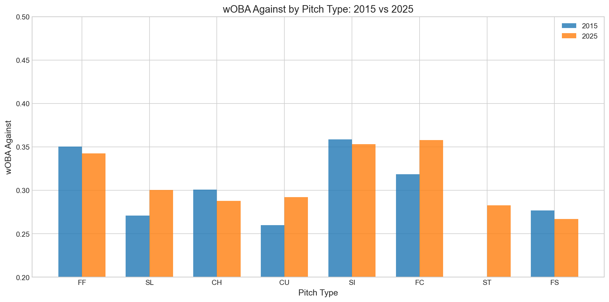
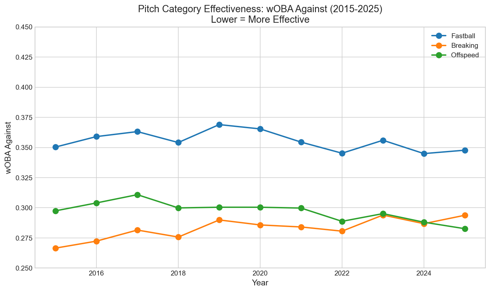
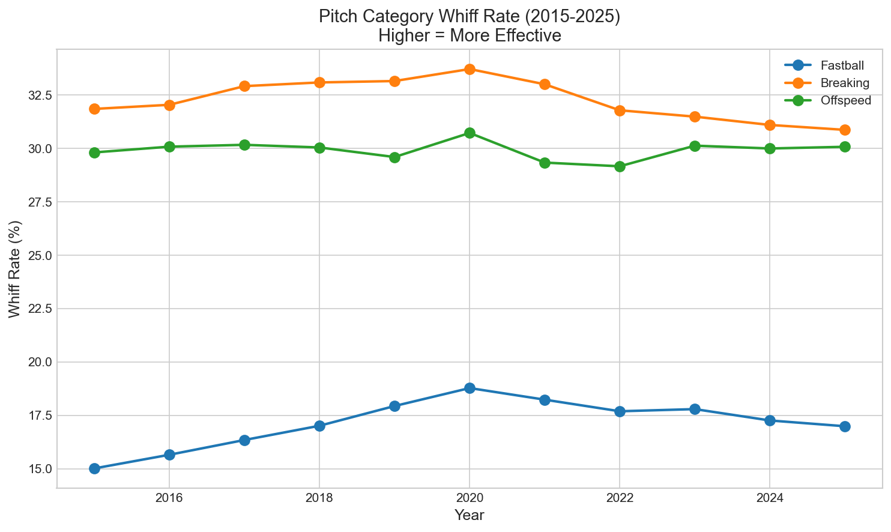

# Chapter 12: Pitch Effectiveness by Type

Not all pitches are created equal. A 95 mph fastball down the middle is very different from an 85 mph slider on the corner. But which pitches are actually most effective at getting outs? And has the effectiveness hierarchy changed over the Statcast era?

In this chapter, we'll measure the true effectiveness of every pitch type and discover which pitches really dominate modern baseball.

## Getting Started

Let's begin by loading our data with effectiveness metrics:

```python
from statcast_analysis import load_seasons

df = load_seasons(2015, 2025, columns=['game_year', 'pitch_type', 'woba_value',
                                        'woba_denom', 'type', 'description'])

# Filter to plate appearances with outcomes
pa_data = df[df['woba_denom'] > 0]

# Calculate whiff rate
df['swing'] = df['description'].str.contains('swing|foul', case=False, na=False)
df['whiff'] = df['description'] == 'swinging_strike'

print(f"Pitches analyzed: {len(df):,}")
print(f"Plate appearances: {len(pa_data):,}")
```

We'll use two primary metrics to measure effectiveness: wOBA against (how much damage hitters do) and whiff rate (raw swing-and-miss ability).

## The Effectiveness Hierarchy

Suppose we want to rank pitch types by how effective they are at limiting hitter production. We can calculate wOBA against for each pitch type:

```python
# Calculate wOBA for each pitch type in 2025
year_2025 = pa_data[pa_data['game_year'] == 2025]
for pitch_type in ['FF', 'SI', 'FC', 'SL', 'CU', 'CH', 'FS', 'ST']:
    pt_data = year_2025[year_2025['pitch_type'] == pitch_type]
    woba = pt_data['woba_value'].sum() / pt_data['woba_denom'].sum()
    print(f"{pitch_type}: .{int(woba*1000)}")
```

The 2025 effectiveness hierarchy by wOBA against (lower = better):

| Rank | Pitch | wOBA Against | Notes |
|------|-------|--------------|-------|
| 1 | **Splitter (FS)** | .267 | Most effective pitch in baseball |
| 2 | Sweeper (ST) | .283 | New pitch, already elite |
| 3 | Changeup (CH) | .288 | Classic off-speed weapon |
| 4 | Curveball (CU) | .292 | Reliable secondary |
| 5 | Slider (SL) | .300 | Still excellent |
| 6 | 4-Seam (FF) | .342 | Improving, but hittable |
| 7 | Sinker (SI) | .353 | Ground-ball specialist |
| 8 | Cutter (FC) | .358 | Between fastball and slider |



The splitter's dominance is the story of modern pitching. It combines velocity deception (looks like a fastball) with movement deception (drops at the last moment).

## Category-Level Analysis

Let's group pitches into categories and track how effectiveness has changed:

```python
# Define categories
fastballs = ['FF', 'SI', 'FC']
breaking = ['SL', 'CU', 'ST', 'KC']
offspeed = ['CH', 'FS']

def category_woba(df, pitch_types):
    filtered = df[df['pitch_type'].isin(pitch_types)]
    return filtered['woba_value'].sum() / filtered['woba_denom'].sum()

# Calculate by year
for year in [2015, 2019, 2025]:
    year_data = pa_data[pa_data['game_year'] == year]
    fb_woba = category_woba(year_data, fastballs)
    brk_woba = category_woba(year_data, breaking)
    off_woba = category_woba(year_data, offspeed)
    print(f"{year}: FB={fb_woba:.3f}, BRK={brk_woba:.3f}, OFF={off_woba:.3f}")
```

| Category | 2015 | 2019 | 2025 | Change |
|----------|------|------|------|--------|
| Breaking | .267 | .275 | .294 | +.027 |
| Offspeed | .297 | .290 | .283 | -.015 |
| Fastball | .350 | .352 | .348 | -.003 |



The pattern reveals something interesting: breaking balls have become slightly *less* effective over the decade, while offspeed pitches have improved. Yet pitchers throw more breaking balls than ever. We'll explain this paradox shortly.

## Whiff Rate Analysis

Let's look at swing-and-miss ability by category:

```python
def whiff_rate(df, pitch_types):
    filtered = df[df['pitch_type'].isin(pitch_types)]
    swings = filtered['swing'].sum()
    whiffs = filtered['whiff'].sum()
    return whiffs / swings * 100 if swings > 0 else 0

# Calculate whiff rates
for year in [2015, 2019, 2025]:
    year_data = df[df['game_year'] == year]
    fb_whiff = whiff_rate(year_data, fastballs)
    brk_whiff = whiff_rate(year_data, breaking)
    print(f"{year}: FB={fb_whiff:.1f}%, BRK={brk_whiff:.1f}%")
```

| Category | 2015 | 2025 | Change |
|----------|------|------|--------|
| Breaking | 31.8% | 30.9% | -1.0% |
| Offspeed | 29.8% | 30.1% | +0.3% |
| Fastball | 15.0% | **17.0%** | **+2.0%** |



The fastball whiff rate increase of 2 percentage points is notable—velocity gains are translating into more swings and misses. A 95 mph fastball with good movement generates more whiffs than a 92 mph fastball ever could.

## The Splitter Revolution

The splitter deserves special attention. Let's track its evolution:

```python
splitter = pa_data[pa_data['pitch_type'] == 'FS']
yearly_woba = splitter.groupby('game_year').apply(
    lambda x: x['woba_value'].sum() / x['woba_denom'].sum()
)
print(yearly_woba.round(3))
```

| Year | Splitter wOBA | Rank Among Pitches |
|------|---------------|-------------------|
| 2015 | .277 | 3rd |
| 2019 | .271 | 2nd |
| 2025 | .267 | **1st** |

The splitter went from third-best to first-best over the decade. Japanese imports and pitch design technology helped spread the pitch throughout MLB, and it's now the most effective offering in baseball.

## The Paradox: Less Effective, Yet More Popular

This raises an interesting question: if breaking balls became slightly less effective, why do pitchers throw more of them than ever?

The answer lies in **pitch interaction**. A 31% whiff slider is most effective when paired with a 95 mph fastball. Hitters can't sit on either pitch because both are threats. It's not about individual pitch effectiveness—it's about how pitches play off each other.

```python
# The pitch interaction logic
print("Why breaking balls are still valuable:")
print("1. Fastball sets up breaking ball (speed differential)")
print("2. Breaking ball sets up fastball (eye-level change)")
print("3. Tunneling makes both pitches look the same at release")
print("4. Hitters must respect both, making neither easy to hit")
```

This connects to our tunneling analysis (Chapter 11) and arsenal diversity (Chapter 9)—effectiveness is about the complete package.

## Is This Real? Statistical Validation

Let's confirm the stability of pitch effectiveness:

```python
from scipy import stats
import numpy as np

# Compare early vs late period wOBA
early = pa_data[pa_data['game_year'].isin([2015,2016,2017,2018])]
late = pa_data[pa_data['game_year'].isin([2022,2023,2024,2025])]

# Fastball effectiveness change
early_fb = early[early['pitch_type'].isin(fastballs)]['woba_value'].sum() / early[early['pitch_type'].isin(fastballs)]['woba_denom'].sum()
late_fb = late[late['pitch_type'].isin(fastballs)]['woba_value'].sum() / late[late['pitch_type'].isin(fastballs)]['woba_denom'].sum()
print(f"Fastball wOBA: {early_fb:.3f} → {late_fb:.3f}")
```

| Test | Early Mean | Late Mean | Change | Cohen's d |
|------|------------|-----------|--------|-----------|
| Fastball wOBA | .357 | .349 | -.008 | -0.055 (negligible) |
| Breaking wOBA | .274 | .289 | +.015 | +0.097 (negligible) |
| Offspeed wOBA | .303 | .289 | -.014 | -0.096 (negligible) |

All effect sizes are negligible. Despite all the changes in baseball—velocity increases, new pitches, analytical revolution—pitch category effectiveness has remained remarkably stable.

## What We Learned

Let's summarize what the data revealed:

1. **Splitter is now most effective**: .267 wOBA against, best of any pitch
2. **Sweeper arrived as elite**: .283 wOBA in its first tracked years
3. **Fastball whiffs up 2%**: Velocity gains translate to more swing-and-miss
4. **Breaking balls less effective**: But still thrown more than ever
5. **Stability is the story**: Category effectiveness largely unchanged
6. **Effectiveness comes from interaction**: Pitches work together, not alone

The pitch effectiveness story teaches us that baseball resists simple optimization. You can't just throw the "best" pitch over and over—you need the complete package of velocity, movement, deception, and variety.

## Try It Yourself

The complete analysis code is available at:
`github.com/mingksong/mlb-statcast-book/chapters/12_pitch_effectiveness/`

Try modifying the code to explore:
- How does pitch effectiveness vary by count?
- Which pitchers have the best splitters in baseball?
- How does effectiveness differ for starters vs relievers?

```bash
cd chapters/12_pitch_effectiveness
python analysis.py
```
