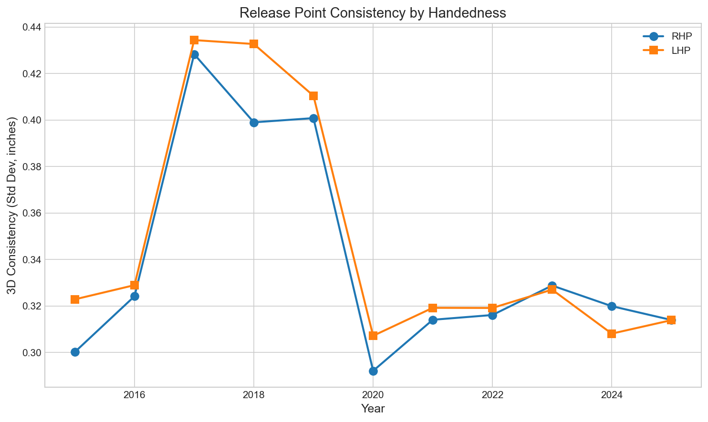

# Chapter 13: Release Point Consistency

## Key Findings

- **Consistency improved 13%**: Pitchers now throw from more repeatable positions
- **Release height dropped 2.8 inches**: From 5.98 ft to 5.75 ft over the decade
- **Marginal effectiveness benefit**: Most consistent pitchers allow .007 less wOBA
- **Trend highly significant**: Release height decline p<0.001

---

## The Story

Every pitch begins the same way: the ball leaves the pitcher's hand. The exact point in three-dimensional space where that happens—the release point—is one of baseball's most scrutinized metrics.

### Why Consistency Matters

A consistent release point serves two purposes:

1. **Hitter deception**: All pitches look the same coming out of the hand
2. **Mechanical health**: Repeatable mechanics reduce injury risk

### The Analytics Revolution

Modern pitching development obsesses over release point consistency. High-speed cameras and Statcast tracking allow coaches to measure release position to the fraction of an inch. The result: a generation of pitchers trained to repeat their delivery with unprecedented precision.

---

## The Analysis

### Measuring Consistency

For each pitcher-season, we calculated the standard deviation of release position in three dimensions:

```python
# 3D release consistency (lower = better)
x_std = pitcher_data['release_pos_x'].std()
y_std = pitcher_data['release_pos_y'].std()
z_std = pitcher_data['release_pos_z'].std()

consistency_3d = sqrt(x_std**2 + y_std**2 + z_std**2)
```

### 6,664 Pitcher-Seasons Analyzed

We required at least 200 pitches per pitcher-season for inclusion.

---

## The Numbers

### Release Consistency Trend

| Period | 3D Consistency | Change |
|--------|---------------|--------|
| 2015-2018 | 0.368 inches | baseline |
| 2022-2025 | 0.319 inches | -13.3% |

Statistical test: t=13.41, p<0.001, Cohen's d=0.38 (small effect)

### Release Height Trend

| Year | Avg Release Height |
|------|-------------------|
| 2015 | 5.98 ft |
| 2018 | 5.84 ft |
| 2022 | 5.75 ft |
| 2025 | 5.75 ft |

Statistical test: slope=-0.025 ft/year, R²=0.87, p<0.001

### Consistency vs Effectiveness

| Quartile | wOBA Allowed | Whiff Rate |
|----------|--------------|------------|
| Most Consistent | .327 | 23.4% |
| Good | .324 | 23.6% |
| Fair | .329 | 23.4% |
| Least Consistent | .334 | 23.1% |

Correlation: r=0.059 (p=0.010)—statistically significant but practically weak.

---

## Visualizations

### Figure 1: Consistency Trend


Year-over-year improvement in release consistency.

### Figure 2: Release Height Decline


A clear downward trend in average release height.

### Figure 3: Consistency by Handedness



RHP and LHP show similar consistency levels.

### Figure 4: Consistency Quartiles


More consistent pitchers allow slightly lower wOBA.

---

## What It Means

### 1. Training Works

The small but significant improvement in consistency reflects the modern emphasis on repeatable mechanics. Pitchers are being taught—and measured—on their ability to repeat their delivery.

### 2. Lower Release = More "Rise"

The 2.8-inch drop in release height is connected to the "ride" fastball trend. Lower arm slots create more perceived vertical movement, generating more swings under the ball.

### 3. Consistency Is Necessary But Not Sufficient

Being consistent doesn't guarantee success. The correlation between consistency and effectiveness is weak (r=0.059). Elite pitchers need good stuff *and* consistent release points.

### 4. The Marginal Effect

The difference between the most and least consistent quartiles is just .007 wOBA. That's meaningful over a season, but it's not the primary driver of success.

---

## The Bigger Picture

Release point consistency connects to:

- **Tunneling (Chapter 11)**: Consistent release enables better pitch deception
- **Velocity (Chapter 2)**: Repeatable mechanics support sustained velocity
- **Injury prevention**: Though not covered here, inconsistent mechanics correlate with arm injuries

---

## Try It Yourself

```bash
cd chapters/13_release_point
python analysis.py
```
