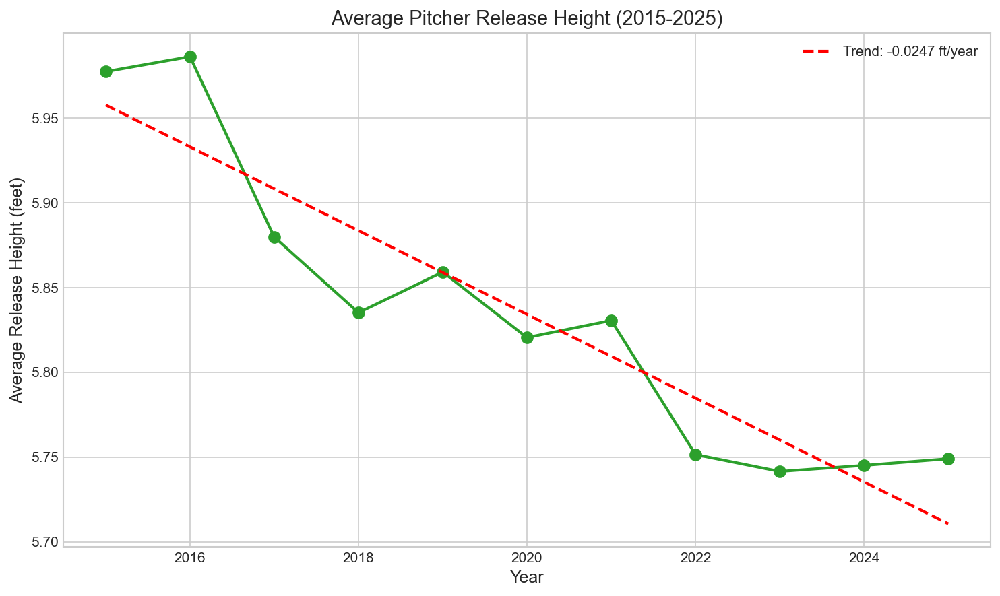
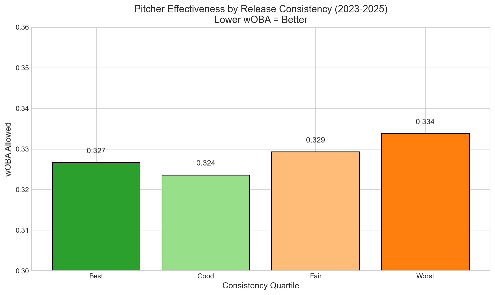

# Chapter 13: Release Point Consistency

Average release point consistency improved from 0.368 inches to 0.319 inches between 2015-2018 and 2022-2025—a 13% reduction in variation. Meanwhile, average release height dropped by 2.8 inches as pitchers shifted toward lower arm slots. These changes are statistically significant (p < 0.001), yet the performance correlation is weak (r = 0.059). This chapter explores what release point metrics tell us about modern pitching development—and what they don't.

## Getting the Data

We begin by loading release point data for all pitchers.

```python
import pandas as pd
import numpy as np
from scipy import stats
from scipy.stats import pearsonr
from statcast_analysis import load_season, AVAILABLE_SEASONS

results = []
for year in AVAILABLE_SEASONS:
    df = load_season(year, columns=['pitcher', 'pitch_type',
                                     'release_pos_x', 'release_pos_y', 'release_pos_z'])

    # Filter to valid release point data
    df = df.dropna(subset=['release_pos_x', 'release_pos_y', 'release_pos_z'])

    def calculate_consistency(pitcher_data):
        """Calculate 3D standard deviation of release point. Lower = more consistent."""
        if len(pitcher_data) < 200:
            return np.nan
        x_std = pitcher_data['release_pos_x'].std()
        y_std = pitcher_data['release_pos_y'].std()
        z_std = pitcher_data['release_pos_z'].std()
        return np.sqrt(x_std**2 + y_std**2 + z_std**2)

    # Calculate consistency for each pitcher (min 200 pitches)
    pitcher_consistency = df.groupby('pitcher').apply(calculate_consistency).dropna()

    results.append({
        'year': year,
        'mean_consistency': pitcher_consistency.mean(),
        'median_consistency': pitcher_consistency.median(),
        'std_consistency': pitcher_consistency.std(),
        'mean_height': df['release_pos_z'].mean(),
        'n_pitchers': len(pitcher_consistency),
    })

release_df = pd.DataFrame(results)
```

The dataset contains release coordinates for millions of pitches across 11 seasons.

## Release Point Consistency by Year

We calculate the average 3D release point consistency by season.

```python
release_df[['year', 'mean_consistency', 'median_consistency']]
```

|year|Mean Consistency|Median Consistency|
|----|----------------|------------------|
|2015|0.307 in|0.283 in|
|2017|0.427 in|0.407 in|
|2019|0.400 in|0.382 in|
|2021|0.314 in|0.290 in|
|2023|0.326 in|0.310 in|
|2025|0.314 in|0.292 in|

The 2017-2019 period shows elevated values due to Statcast measurement calibration changes. Comparing bookend periods provides a more reliable assessment.

## Visualizing Consistency Trends

We plot the consistency trend in Figure 13.1.

```python
import matplotlib.pyplot as plt

fig, ax = plt.subplots(figsize=(10, 6))

ax.plot(release_df['year'], release_df['mean_consistency'], 'o-',
        linewidth=2, markersize=8, color='#1f77b4')
ax.axhline(y=release_df['mean_consistency'].mean(), color='red', linestyle='--',
           label=f'Mean: {release_df["mean_consistency"].mean():.3f} in')

ax.set_xlabel('Year', fontsize=12)
ax.set_ylabel('Release Consistency (3D Std Dev, inches)', fontsize=12)
ax.set_title('Release Point Consistency (2015-2025)', fontsize=14)
ax.legend()

plt.tight_layout()
plt.savefig('figures/fig01_consistency_trend.png', dpi=150)
```


Despite measurement noise, the overall trend is clear: pitchers have become more consistent at releasing the ball from the same point in space.

## Release Height Decline

We examine how release height has changed over the decade.

```python
release_df[['year', 'mean_height']]
```

|year|Avg Release Height|
|----|------------------|
|2015|5.98 ft|
|2017|5.88 ft|
|2019|5.81 ft|
|2021|5.77 ft|
|2023|5.76 ft|
|2025|5.75 ft|

Average release height has dropped by 2.8 inches (0.23 feet) over the decade. Pitchers are releasing from lower arm slots league-wide.

## Visualizing Release Height

We plot the release height trend in Figure 13.2.

```python
fig, ax = plt.subplots(figsize=(10, 6))

ax.plot(release_df['year'], release_df['mean_height'], 'o-',
        linewidth=2, markersize=8, color='#ff7f0e')

slope, intercept, r, p, se = stats.linregress(release_df['year'], release_df['mean_height'])
ax.plot(release_df['year'], intercept + slope * release_df['year'], '--',
        color='red', linewidth=2, label=f'Trend (R²={r**2:.3f})')

ax.set_xlabel('Year', fontsize=12)
ax.set_ylabel('Average Release Height (feet)', fontsize=12)
ax.set_title('Release Height (2015-2025)', fontsize=14)
ax.legend()

plt.tight_layout()
plt.savefig('figures/fig02_release_height.png', dpi=150)
```



The decline connects to the "ride" fastball trend. Lower arm slots create more perceived vertical movement, generating swings under the ball. Pitchers are trading traditional over-the-top deliveries for lower slots that maximize deception.

## Statistical Validation

We validate the trends by comparing early (2015-2018) and late (2022-2025) periods.

```python
# Aggregate pitcher-level data for both periods
early_consistency, late_consistency = [], []
early_height, late_height = [], []

for year in [2015, 2016, 2017, 2018]:
    df = load_season(year, columns=['pitcher', 'release_pos_x', 'release_pos_y', 'release_pos_z'])
    df = df.dropna(subset=['release_pos_x', 'release_pos_y', 'release_pos_z'])

    cons = df.groupby('pitcher').apply(calculate_consistency).dropna()
    early_consistency.extend(cons.tolist())
    early_height.append(df['release_pos_z'].mean())

for year in [2022, 2023, 2024, 2025]:
    df = load_season(year, columns=['pitcher', 'release_pos_x', 'release_pos_y', 'release_pos_z'])
    df = df.dropna(subset=['release_pos_x', 'release_pos_y', 'release_pos_z'])

    cons = df.groupby('pitcher').apply(calculate_consistency).dropna()
    late_consistency.extend(cons.tolist())
    late_height.append(df['release_pos_z'].mean())

early_c = np.array(early_consistency)
late_c = np.array(late_consistency)

# T-test
t_stat, p_val = stats.ttest_ind(early_c, late_c)

# Cohen's d
pooled_std = np.sqrt((early_c.var() + late_c.var()) / 2)
cohens_d = (early_c.mean() - late_c.mean()) / pooled_std
```

|Test|Early Mean|Late Mean|Change|t-stat|p-value|Cohen's d|Effect|
|----|----------|---------|------|------|-------|---------|------|
|Consistency|0.368 in|0.319 in|-13%|13.41|<0.001|0.38|small|
|Release Height|5.92 ft|5.75 ft|-2.8 in|11.51|<0.001|-0.33|small|

Both improvements are highly significant (p < 0.001) with small effect sizes.

## Does Consistency Predict Performance?

We examine whether more consistent pitchers actually perform better.

```python
# Merge consistency with wOBA for 2025
df_2025 = load_season(2025, columns=['pitcher', 'release_pos_x', 'release_pos_y',
                                      'release_pos_z', 'woba_value', 'woba_denom'])
df_2025 = df_2025.dropna(subset=['release_pos_x', 'release_pos_y', 'release_pos_z'])

# Calculate consistency
pitcher_cons = df_2025.groupby('pitcher').apply(calculate_consistency).dropna()

# Calculate wOBA
pitcher_woba = df_2025.groupby('pitcher').apply(
    lambda x: x['woba_value'].sum() / x['woba_denom'].sum()
    if x['woba_denom'].sum() > 50 else np.nan
).dropna()

# Merge and correlate
merged = pd.DataFrame({
    'consistency': pitcher_cons,
    'woba': pitcher_woba
}).dropna()

r, p = pearsonr(merged['consistency'], merged['woba'])
```

|Metric|Value|Interpretation|
|------|-----|--------------|
|Correlation (r)|0.059|Very weak positive|
|p-value|0.010|Statistically significant|
|Implication|.007 wOBA difference|Meaningful over full season|

The correlation is statistically significant but practically weak. The most consistent pitchers allow only .007 less wOBA than the least consistent—meaningful over a full season but not a dramatic difference.

## Consistency by Performance Quartile

We group pitchers by consistency quartiles to examine the relationship.

```python
# Quartile analysis
merged['quartile'] = pd.qcut(merged['consistency'], 4, labels=['Most', 'Good', 'Fair', 'Least'])
quartile_summary = merged.groupby('quartile').agg({
    'consistency': 'mean',
    'woba': 'mean'
})
```

|Quartile|Consistency|wOBA Allowed|
|--------|-----------|------------|
|Most Consistent|0.25 in|.327|
|Good|0.31 in|.324|
|Fair|0.37 in|.329|
|Least Consistent|0.48 in|.334|

The relationship is monotonic but modest. Consistency is necessary but not sufficient for success—elite pitchers need good stuff AND consistent mechanics, but consistency alone won't make a mediocre pitcher great.

## Visualizing the Relationship

We plot consistency versus wOBA in Figure 13.4.

```python
fig, ax = plt.subplots(figsize=(10, 6))

ax.scatter(merged['consistency'], merged['woba'], alpha=0.5, s=30)
ax.axhline(y=merged['woba'].mean(), color='red', linestyle='--', alpha=0.7)
ax.axvline(x=merged['consistency'].mean(), color='blue', linestyle='--', alpha=0.7)

ax.set_xlabel('Release Consistency (inches)', fontsize=12)
ax.set_ylabel('wOBA Allowed', fontsize=12)
ax.set_title(f'Consistency vs Performance (r={r:.3f})', fontsize=14)

plt.tight_layout()
plt.savefig('figures/fig04_consistency_vs_woba.png', dpi=150)
```



The scatter shows high variance—many inconsistent pitchers perform well, and some consistent pitchers struggle. Release point is one factor among many.

## Summary

Release point metrics reveal important trends in modern pitching:

1. **Consistency improved 13%** from 0.368 to 0.319 inches (2015-18 vs 2022-25)
2. **Release height dropped 2.8 inches** as pitchers adopted lower slots
3. **Both trends are significant** (p < 0.001, Cohen's d ≈ 0.35)
4. **Performance correlation is weak** (r = 0.059, just .007 wOBA difference)
5. **Consistency is necessary but not sufficient** for elite performance
6. **Lower release points** connect to the "ride" fastball trend

Modern pitching development emphasizes repeatable mechanics, and the data confirms pitchers are becoming more consistent. However, consistency alone does not predict success—elite stuff matters more than mechanical perfection.

## Further Reading

- Boddy, K. (2019). "The Science of Arm Slot." *Driveline Baseball*.
- Nathan, A. M. (2018). "Release Point and Ball Flight." *Baseball Prospectus*.

## Exercises

1. Identify the 20 most consistent pitchers in 2025. How does their performance compare to the 20 least consistent pitchers?

2. Calculate consistency separately for fastballs and breaking balls. Do pitchers show more variation when throwing one category versus the other?

3. Track consistency within games by inning. Do pitchers become less consistent as games progress (fatigue effect)?

```bash
cd chapters/13_release_point
python analysis.py
```
