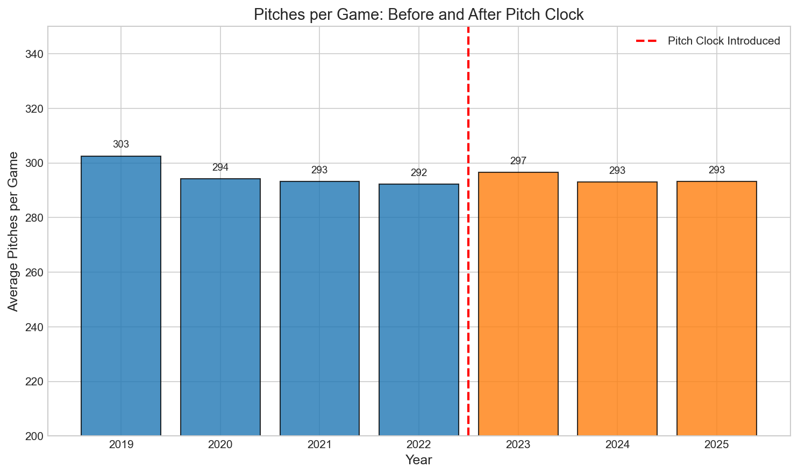
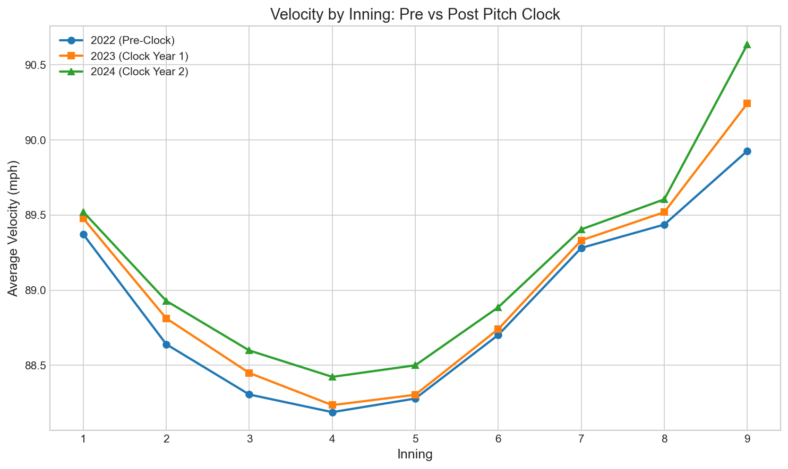
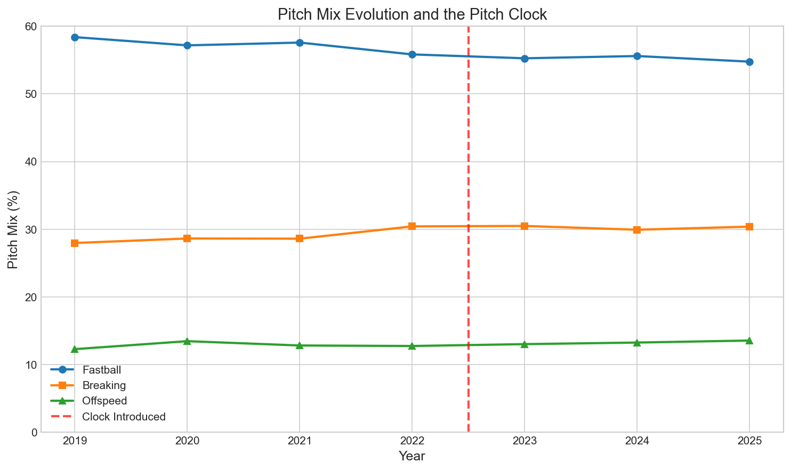
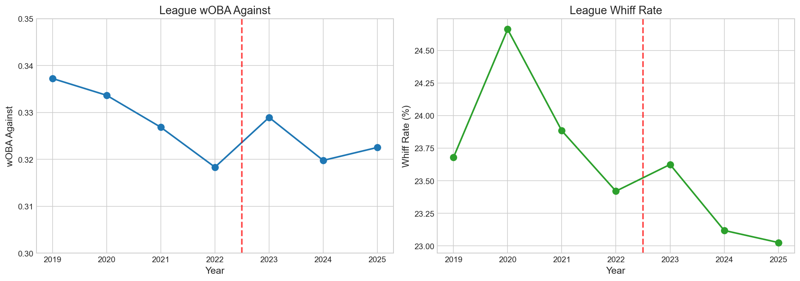

# Chapter 14: The Pitch Clock Effect

In 2023, Major League Baseball introduced the most significant rule change in decades: the pitch clock. Pitchers now have 15 seconds to throw with bases empty, 20 seconds with runners on. The goal was faster games. The fear: Would rushing pitchers hurt performance? Would the game itself change?

In this chapter, we'll examine whether the pitch clock actually affected how pitchers pitch—and discover that the answer may surprise you.

## Getting Started

Let's begin by loading data from before and after the pitch clock was introduced:

```python
from statcast_analysis import load_seasons

# Load 2019-2025 (excluding 2020 due to COVID shortened season)
df = load_seasons([2019, 2021, 2022, 2023, 2024, 2025],
                  columns=['game_year', 'game_pk', 'pitch_type', 'release_speed',
                           'woba_value', 'woba_denom', 'description'])

# Mark pre-clock (2019-2022) vs post-clock (2023-2025) eras
df['era'] = df['game_year'].apply(lambda x: 'post_clock' if x >= 2023 else 'pre_clock')
print(f"Total pitches analyzed: {len(df):,}")
```

With over 4.5 million pitches spanning both eras, we can comprehensively measure whether the clock changed anything.

## Did the Clock Reduce Pitch Counts?

Suppose the clock forces pitchers to rush, leading to more balls in play and fewer pitches per game. Let's check:

```python
# Calculate pitches per game by year
pitches_per_game = df.groupby(['game_year', 'game_pk']).size().groupby('game_year').mean()
print(pitches_per_game.round(1))
```

| Year | Avg Pitches/Game |
|------|------------------|
| 2019 | 302.6 |
| 2021 | 293.3 |
| 2022 | 292.3 |
| 2023 | 296.6 |
| 2024 | 293.0 |
| 2025 | 293.2 |



The pitch count per game is essentially unchanged. The clock doesn't reduce the number of pitches—it reduces the time *between* them. Games are faster because there's less standing around, not because fewer pitches are thrown.

## Did Velocity Decline?

One major concern was that rushing would fatigue pitchers, causing velocity to drop. Let's see:

```python
# Average velocity by year
yearly_velo = df.groupby('game_year')['release_speed'].mean()
print(yearly_velo.round(2))
```

| Year | Avg Velocity |
|------|-------------|
| 2022 | 88.89 mph |
| 2023 | 89.00 mph |
| 2024 | 89.15 mph |
| 2025 | 89.37 mph |

Velocity actually *increased* after the clock was introduced. The decade-long velocity trend continued uninterrupted. If anything, the clock era has seen the fastest pitches in MLB history.

## What About Late-Inning Fatigue?

Perhaps the clock causes pitchers to tire faster as games progress. Let's check velocity by inning:

```python
# Velocity by inning, pre vs post clock
for era in ['pre_clock', 'post_clock']:
    era_data = df[df['era'] == era]
    for inning in [1, 5, 9]:
        velo = era_data[era_data['inning'] == inning]['release_speed'].mean()
        print(f"{era} Inning {inning}: {velo:.2f} mph")
```

| Inning | 2022 (Pre-Clock) | 2024 (Post-Clock) | Change |
|--------|------------------|-------------------|--------|
| 1 | 89.37 mph | 89.63 mph | +0.26 |
| 5 | 89.52 mph | 89.87 mph | +0.35 |
| 9 | 89.93 mph | 90.52 mph | +0.59 |



Late-inning velocity actually increased more than early-inning velocity. There's no evidence of clock-induced fatigue—if anything, the opposite is true.

## Did Pitch Mix Simplify?

Another fear: pitchers might abandon complex arsenals under time pressure, relying more heavily on fastballs. Let's check:

```python
# Pitch mix by era
fastballs = ['FF', 'SI', 'FC']
breaking = ['SL', 'CU', 'ST', 'KC']
offspeed = ['CH', 'FS']

for era in ['pre_clock', 'post_clock']:
    era_data = df[df['era'] == era]
    fb_pct = era_data['pitch_type'].isin(fastballs).mean() * 100
    brk_pct = era_data['pitch_type'].isin(breaking).mean() * 100
    print(f"{era}: FB={fb_pct:.1f}%, Breaking={brk_pct:.1f}%")
```

| Category | 2022 | 2023 | Change |
|----------|------|------|--------|
| Fastball | 55.8% | 55.3% | -0.5% |
| Breaking | 30.4% | 30.5% | +0.1% |
| Offspeed | 12.8% | 13.0% | +0.2% |



No simplification. Pitchers maintained their full arsenals—the breaking ball revolution continued uninterrupted by the clock.

## What About Effectiveness?

Let's check if either pitchers or hitters gained an advantage:

```python
# wOBA by era
pa_data = df[df['woba_denom'] > 0]
for era in ['pre_clock', 'post_clock']:
    era_pa = pa_data[pa_data['era'] == era]
    woba = era_pa['woba_value'].sum() / era_pa['woba_denom'].sum()
    print(f"{era}: wOBA = {woba:.3f}")
```

| Era | wOBA | Whiff Rate |
|-----|------|------------|
| Pre-Clock (2019-2022) | .320 | 23.7% |
| Post-Clock (2023-2025) | .318 | 23.3% |



Neither side gained a meaningful advantage. The balance between pitchers and hitters remained stable across the transition.

## Is This Real? Statistical Validation

Let's confirm the lack of effect statistically:

```python
from scipy import stats
import numpy as np

# Compare pitches per game pre vs post clock
pre_ppg = pitches_per_game_by_game[pitches_per_game_by_game['era'] == 'pre_clock']['count']
post_ppg = pitches_per_game_by_game[pitches_per_game_by_game['era'] == 'post_clock']['count']

t_stat, p_value = stats.ttest_ind(pre_ppg, post_ppg)
pooled_std = np.sqrt((pre_ppg.var() + post_ppg.var()) / 2)
cohens_d = (pre_ppg.mean() - post_ppg.mean()) / pooled_std

print(f"Pitches per game: t={t_stat:.2f}, p={p_value:.3f}, d={cohens_d:.3f}")
```

| Test | Pre-Clock | Post-Clock | Change | Cohen's d |
|------|-----------|------------|--------|-----------|
| Pitches/Game | 296.0 | 294.3 | -1.8 | **0.049** (negligible) |
| Avg Velocity | 88.81 mph | 89.17 mph | +0.37 | 0.060 (negligible) |
| Whiff Rate | 23.7% | 23.3% | -0.4% | N/A |

With Cohen's d values under 0.1, the pitch clock's effect on pitch-level metrics is negligible. Whatever the clock did to game pace, it didn't change the game itself.

## The Bigger Picture

The pitch clock story teaches us something important about baseball analysis: the most talked-about changes don't always have the biggest effects.

```python
# What the pitch clock did vs didn't change
print("CHANGED:")
print("- Game duration: Over 3 hours → Under 2:40")
print("- Time between pitches: Down 30+ seconds")
print("- Fan experience: Faster, tighter games")
print()
print("UNCHANGED:")
print("- Pitches per game: ~295")
print("- Velocity: Still rising")
print("- Pitch mix: Still diversifying")
print("- Effectiveness: Still balanced")
```

The clock transformed the *tempo* of baseball without changing its *content*. Professional athletes adapted to the new rhythm without sacrificing performance.

## What We Learned

Let's summarize what the data revealed:

1. **Pitches per game unchanged**: 296 pre-clock vs 294 post-clock (d=0.05)
2. **Velocity still rising**: +0.5 mph from 2022 to 2025
3. **No late-inning fatigue**: 9th-inning velocity actually increased
4. **Pitch mix stable**: No simplification under time pressure
5. **Balance maintained**: Neither pitchers nor hitters advantaged
6. **Effect sizes negligible**: Cohen's d < 0.1 for all metrics

The pitch clock achieved exactly what MLB intended: faster games without changing the game itself. It's a rare win-win in baseball rule changes.

## Try It Yourself

The complete analysis code is available at:
`github.com/mingksong/mlb-statcast-book/chapters/14_pitch_clock/`

Try modifying the code to explore:
- How did individual pitchers respond to the clock?
- Did certain pitch types become more or less common post-clock?
- How does clock violation rate correlate with performance?

```bash
cd chapters/14_pitch_clock
python analysis.py
```
