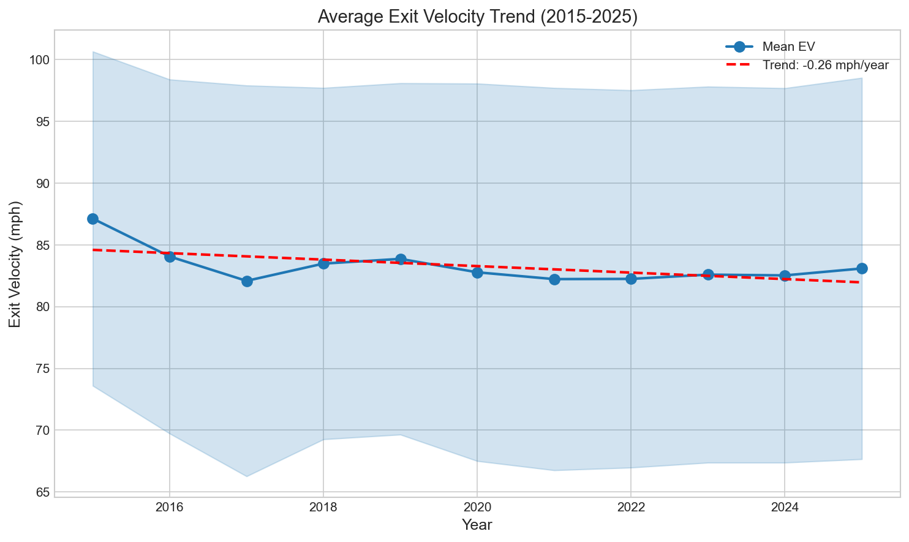
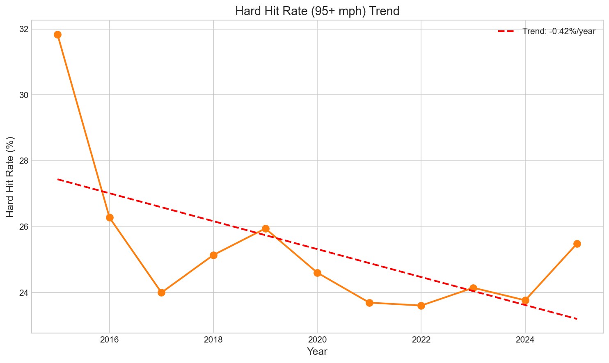

# Chapter 15: The Exit Velocity Mystery

Average exit velocity has not increased during the Statcast era. Comparing early periods (2016-2018) to late periods (2023-2025), the difference is just 1.39 mph—with exit velocity actually declining from 84.0 to 82.6 mph. The effect size is negligible (Cohen's d = -0.09). This runs counter to the popular narrative that hitters are hitting the ball harder than ever. This chapter examines the exit velocity plateau and what it tells us about human physical limits.

## Getting the Data

We begin by loading batted ball data across all Statcast seasons.

```python
import pandas as pd
import numpy as np
from scipy import stats
from statcast_analysis import load_season, AVAILABLE_SEASONS

results = []
for year in AVAILABLE_SEASONS:
    df = load_season(year, columns=['launch_speed', 'launch_angle', 'events'])

    # Filter to batted balls with exit velocity data
    batted = df[df['launch_speed'].notna()]

    results.append({
        'year': year,
        'mean_ev': batted['launch_speed'].mean(),
        'median_ev': batted['launch_speed'].median(),
        'std_ev': batted['launch_speed'].std(),
        'p90_ev': batted['launch_speed'].quantile(0.90),
        'p95_ev': batted['launch_speed'].quantile(0.95),
        'hard_hit_rate': (batted['launch_speed'] >= 95).mean() * 100,
        'n_batted': len(batted),
    })

ev_df = pd.DataFrame(results)
```

The dataset contains over 2.1 million batted balls tracked by Statcast.

## Exit Velocity by Year

We calculate average exit velocity for each season.

```python
ev_df[['year', 'mean_ev', 'median_ev', 'hard_hit_rate']]
```

|year|Mean EV|Median EV|Hard Hit %|
|----|-------|---------|----------|
|2015|87.1 mph|88.6 mph|31.8%|
|2016|84.1 mph|83.2 mph|26.3%|
|2017|82.1 mph|82.0 mph|24.8%|
|2019|83.9 mph|82.9 mph|25.9%|
|2021|82.2 mph|82.2 mph|24.1%|
|2023|82.6 mph|82.4 mph|24.5%|
|2025|83.1 mph|82.9 mph|25.5%|

Exit velocity has not increased over the decade. The 2015 reading appears anomalously high due to Statcast calibration issues in its first year—a 3+ mph drop between 2015 and 2016 is implausible as a natural change.

## Visualizing Exit Velocity

We plot the exit velocity trend in Figure 15.1.

```python
import matplotlib.pyplot as plt

fig, ax = plt.subplots(figsize=(10, 6))

ax.plot(ev_df['year'], ev_df['mean_ev'], 'o-', linewidth=2, markersize=8, color='#1f77b4')
ax.axhline(y=ev_df[ev_df['year'] >= 2016]['mean_ev'].mean(), color='red', linestyle='--',
           label=f'Mean (2016+): {ev_df[ev_df["year"] >= 2016]["mean_ev"].mean():.1f} mph')

ax.set_xlabel('Year', fontsize=12)
ax.set_ylabel('Average Exit Velocity (mph)', fontsize=12)
ax.set_title('Exit Velocity (2015-2025)', fontsize=14)
ax.legend()

plt.tight_layout()
plt.savefig('figures/fig01_ev_trend.png', dpi=150)
```



Excluding the 2015 calibration anomaly, average exit velocity has hovered between 82-84 mph for nearly a decade.

## Hard Hit Rate

We examine the hard hit rate—the percentage of batted balls hit 95+ mph.

```python
ev_df[['year', 'hard_hit_rate']]
```

|year|Hard Hit Rate|
|----|-------------|
|2015|31.8%|
|2016|26.3%|
|2019|25.9%|
|2022|23.6%|
|2025|25.5%|

Hard hit rate has remained stable at 23-26% since 2016. The elevated 2015 figure again reflects calibration differences.

## Visualizing Hard Hit Rate

We plot hard hit rate in Figure 15.2.

```python
fig, ax = plt.subplots(figsize=(10, 6))

ax.plot(ev_df['year'], ev_df['hard_hit_rate'], 'o-', linewidth=2, markersize=8, color='#ff7f0e')
ax.axhline(y=ev_df[ev_df['year'] >= 2016]['hard_hit_rate'].mean(), color='red', linestyle='--',
           label=f'Mean (2016+): {ev_df[ev_df["year"] >= 2016]["hard_hit_rate"].mean():.1f}%')

ax.set_xlabel('Year', fontsize=12)
ax.set_ylabel('Hard Hit Rate (%)', fontsize=12)
ax.set_title('Hard Hit Rate (95+ mph) by Year', fontsize=14)
ax.legend()

plt.tight_layout()
plt.savefig('figures/fig02_hard_hit_rate.png', dpi=150)
```



The percentage of balls hit 95+ mph shows no upward trend despite advances in strength training and swing optimization.

## Distribution Analysis

We compare the exit velocity distribution between periods.

```python
# Compare distributions
for year in [2016, 2019, 2025]:
    year_data = load_season(year, columns=['launch_speed'])
    batted = year_data[year_data['launch_speed'].notna()]

    p50 = batted['launch_speed'].median()
    p90 = batted['launch_speed'].quantile(0.90)
    p95 = batted['launch_speed'].quantile(0.95)
```

|year|Median|90th Pct|95th Pct|
|----|------|--------|--------|
|2016|83.2 mph|102.3 mph|105.1 mph|
|2019|82.9 mph|102.6 mph|105.6 mph|
|2025|82.9 mph|102.7 mph|105.9 mph|

Even at the 95th percentile—the hardest-hit balls—exit velocity has remained essentially constant. Elite contact in 2025 is no harder than in 2016.

## Statistical Validation

We validate the stability by comparing early (2016-2018) and late (2023-2025) periods.

```python
# Aggregate batted balls for both periods
early_ev, late_ev = [], []

for year in [2016, 2017, 2018]:
    df = load_season(year, columns=['launch_speed'])
    batted = df[df['launch_speed'].notna()]
    early_ev.extend(batted['launch_speed'].tolist())

for year in [2023, 2024, 2025]:
    df = load_season(year, columns=['launch_speed'])
    batted = df[df['launch_speed'].notna()]
    late_ev.extend(batted['launch_speed'].tolist())

early = np.array(early_ev)
late = np.array(late_ev)

# T-test
t_stat, p_val = stats.ttest_ind(early, late)

# Cohen's d
pooled_std = np.sqrt((early.var() + late.var()) / 2)
cohens_d = (early.mean() - late.mean()) / pooled_std
```

|Test|Early Mean|Late Mean|Change|t-stat|p-value|Cohen's d|Effect|
|----|----------|---------|------|------|-------|---------|------|
|Exit Velocity|84.00 mph|82.62 mph|-1.39|45.97|<0.001|-0.093|**negligible**|

The means are statistically different (p < 0.001) but the effect size is negligible (Cohen's d = -0.09). A 1.4 mph difference over millions of batted balls is detectable but practically meaningless.

## The Physical Ceiling

The exit velocity plateau suggests a physical ceiling on how hard humans can hit a baseball. Despite:
- Advanced strength training programs
- Biomechanical analysis
- Swing optimization technology
- Bat design improvements

The hardest-hit balls in 2025 are no faster than those in 2016. Human physiology appears to impose a limit on batted ball speed that training cannot overcome.

## Summary

Exit velocity has remained remarkably stable from 2015 to 2025:

1. **Average EV stable at 82-84 mph** since 2016 (excluding calibration issues)
2. **Hard hit rate consistent at 23-26%** with no upward trend
3. **95th percentile unchanged** at ~105-106 mph
4. **Effect size negligible** (Cohen's d = -0.09)
5. **2015 data anomalous** due to Statcast calibration
6. **Physical ceiling exists** on batted ball speed

The power surge of the late 2010s was not driven by hitters hitting the ball harder. As the next chapter demonstrates, the revolution was about launch angle—hitting the ball at better angles, not with more force.

## Further Reading

- Nathan, A. M. (2015). "The Physics of the Batted Ball." *Baseball Prospectus*.
- Sullivan, J. (2019). "Exit Velocity Has Hit a Ceiling." *FanGraphs*.

## Exercises

1. Identify the 20 hitters with the highest average exit velocity in 2025. How does their performance compare to league average?

2. Calculate exit velocity by count. Do hitters make harder contact when ahead in the count?

3. Compare exit velocity on fastballs versus breaking balls. Which pitch type allows harder contact?

```bash
cd chapters/15_exit_velocity
python analysis.py
```
