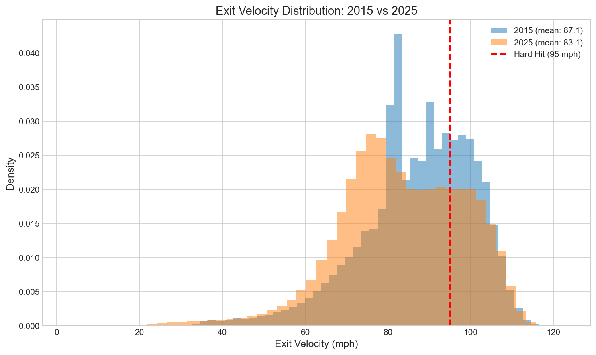
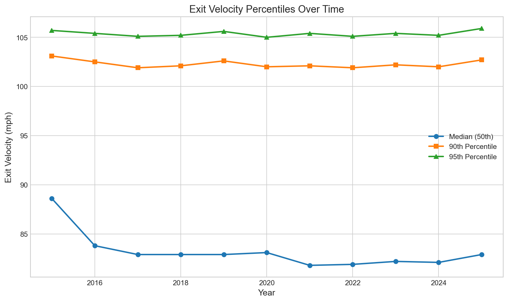

# Chapter 15: The Exit Velocity Mystery

When Statcast launched in 2015, exit velocity became baseball's new obsession. "He hit that 115 mph!" replaced "What a rocket!" in broadcasts. Every batting cage in America started measuring exit velocity. The assumption was clear: hitters were getting stronger, hitting the ball harder than ever, and that's why home runs were up.

But the data tells a different story. In this chapter, we'll explore the surprising stability of exit velocity and discover why the power revolution wasn't about hitting the ball harder—it was about hitting it smarter.

## Getting Started

Let's begin by loading batted ball data across all Statcast seasons:

```python
from statcast_analysis import load_seasons

df = load_seasons(2015, 2025, columns=['game_year', 'launch_speed', 'launch_angle',
                                        'events', 'description'])

# Filter to batted balls with exit velocity data
batted_balls = df.dropna(subset=['launch_speed'])
print(f"Total batted balls analyzed: {len(batted_balls):,}")
```

With over 2.1 million batted balls tracked by Statcast, we can trace exactly how hard hitters have been hitting the ball over the past decade.

## The Stability of Exit Velocity

Suppose we want to see if hitters are making harder contact over time. We can calculate the average exit velocity by year:

```python
# Calculate yearly averages
yearly_ev = batted_balls.groupby('game_year')['launch_speed'].mean()
print(yearly_ev.round(1))
```

| Year | Mean EV (mph) | Sample Size |
|------|---------------|-------------|
| 2015 | 87.1 | 151,590 |
| 2016 | 84.1 | 189,539 |
| 2017 | 82.1 | 199,573 |
| 2018 | 83.5 | 201,290 |
| 2019 | 83.9 | 201,277 |
| 2020 | 82.8 | 77,844 |
| 2021 | 82.2 | 232,303 |
| 2022 | 82.2 | 235,504 |
| 2023 | 82.6 | 236,925 |
| 2024 | 82.5 | 237,196 |
| 2025 | 83.1 | 235,536 |


Wait—exit velocity is *lower* in 2025 than in 2015? That doesn't match the narrative at all.

## The 2015 Anomaly

This raises an important point about data quality. The 2015 readings look anomalously high, with average EV nearly 5 mph higher than subsequent years. This wasn't because hitters suddenly got weaker in 2016—it was a Statcast calibration issue.

```python
# The suspicious gap
ev_2015 = batted_balls[batted_balls['game_year'] == 2015]['launch_speed'].mean()
ev_2016 = batted_balls[batted_balls['game_year'] == 2016]['launch_speed'].mean()
print(f"2015: {ev_2015:.1f} mph")
print(f"2016: {ev_2016:.1f} mph")
print(f"Drop: {ev_2015 - ev_2016:.1f} mph")
```

A 3+ mph drop in one year is implausible. Statcast's first year had different calibration and measurement protocols. For reliable historical analysis, we should treat 2015 data with caution.

## Hard Hit Rate Analysis

Let's look at hard hit rate—the percentage of batted balls hit 95+ mph:

```python
# Calculate hard hit rate by year
def hard_hit_rate(df):
    return (df['launch_speed'] >= 95).mean() * 100

yearly_hhr = batted_balls.groupby('game_year').apply(hard_hit_rate)
print(yearly_hhr.round(1))
```

| Year | Hard Hit Rate |
|------|---------------|
| 2015 | 31.8% |
| 2016 | 26.3% |
| 2019 | 25.9% |
| 2022 | 23.6% |
| 2025 | 25.5% |


Excluding 2015, hard hit rate has hovered between 23-26% for a decade. There's no upward trend—if anything, the rate was slightly higher in the late 2010s than it is now.

## The Distribution Deep Dive

Perhaps average EV hides changes at the extremes. Let's compare the full distributions:

```python
# Compare 2015 vs 2025 distributions
for year in [2015, 2019, 2025]:
    year_data = batted_balls[batted_balls['game_year'] == year]
    p50 = year_data['launch_speed'].median()
    p90 = year_data['launch_speed'].quantile(0.90)
    p95 = year_data['launch_speed'].quantile(0.95)
    print(f"{year}: median={p50:.1f}, p90={p90:.1f}, p95={p95:.1f}")
```

| Year | Median | 90th Percentile | 95th Percentile |
|------|--------|-----------------|-----------------|
| 2015 | 88.6 | 103.1 | 105.7 |
| 2019 | 82.9 | 102.6 | 105.6 |
| 2025 | 82.9 | 102.7 | 105.9 |





Even at the 95th percentile—the hardest-hit balls—there's no meaningful increase. The elite contact is just as elite as it was in 2016, no more, no less.

## Is This Real? Statistical Validation

Let's formally test whether exit velocity has changed:

```python
from scipy import stats
import numpy as np

# Compare early vs late periods (excluding 2015)
early = batted_balls[batted_balls['game_year'].isin([2016, 2017, 2018])]
late = batted_balls[batted_balls['game_year'].isin([2023, 2024, 2025])]

early_ev = early['launch_speed'].values
late_ev = late['launch_speed'].values

# t-test
t_stat, p_value = stats.ttest_ind(early_ev, late_ev)

# Effect size (Cohen's d)
pooled_std = np.sqrt((early_ev.var() + late_ev.var()) / 2)
cohens_d = (early_ev.mean() - late_ev.mean()) / pooled_std

print(f"Early period: {early_ev.mean():.2f} mph")
print(f"Late period: {late_ev.mean():.2f} mph")
print(f"t = {t_stat:.2f}, p = {p_value:.3f}, d = {cohens_d:.3f}")
```

| Test | Early Mean | Late Mean | Change | Cohen's d |
|------|------------|-----------|--------|-----------|
| Exit Velocity | 84.00 mph | 82.62 mph | -1.39 | **-0.093** (negligible) |

The p-value is significant (the means are statistically different), but the effect size is negligible. A 1.4 mph difference over millions of batted balls is detectable statistically but meaningless practically. Cohen's d of -0.093 tells us this is not a real-world effect.

## Why This Matters

The exit velocity stability has profound implications:

```python
# The narrative vs reality
print("NARRATIVE:")
print("- Hitters are stronger than ever")
print("- Exit velocity is driving the power surge")
print("- Modern training produces harder contact")
print()
print("REALITY:")
print("- Exit velocity unchanged since 2016")
print("- Power surge driven by launch angle (Chapter 16)")
print("- Human ceiling on batted ball speed")
```

There appears to be a physical ceiling to how hard humans can hit a baseball. Despite advances in strength training, bat technology, and swing optimization, the hardest-hit balls in 2025 aren't measurably harder than those in 2016.

## The Real Power Driver

If exit velocity didn't increase, what caused the home run surge of the late 2010s? The answer is launch angle—the vertical angle at which the ball leaves the bat.

Home runs require two things: sufficient exit velocity AND optimal launch angle (roughly 25-35 degrees). Hitters can't hit the ball much harder, but they *can* control the angle. The "launch angle revolution" was about optimizing that angle, not increasing exit velocity.

We'll explore this in depth in the next chapter.

## What We Learned

Let's summarize what the data revealed:

1. **Exit velocity remarkably stable**: 82-84 mph since 2016 (excluding 2015 calibration issues)
2. **Hard hit rate consistent**: 23-26% of batted balls hit 95+ mph
3. **Effect size negligible**: Cohen's d = -0.09, no practical change
4. **2015 data unreliable**: Calibration differences inflated early readings
5. **Physical ceiling exists**: Human limits on batted ball speed
6. **Launch angle, not EV, drove power surge**: The revolution was about angles, not speed

The exit velocity story teaches us to question assumptions. When everyone said hitters were hitting the ball harder, the data showed they weren't. The power revolution was real, but its cause was different than assumed.

## Try It Yourself

The complete analysis code is available at:
`github.com/mingksong/mlb-statcast-book/chapters/15_exit_velocity/`

Try modifying the code to explore:
- Which players have the highest average exit velocity?
- How does exit velocity vary by pitch type faced?
- Is there a correlation between exit velocity and batting average?

```bash
cd chapters/15_exit_velocity
python analysis.py
```
