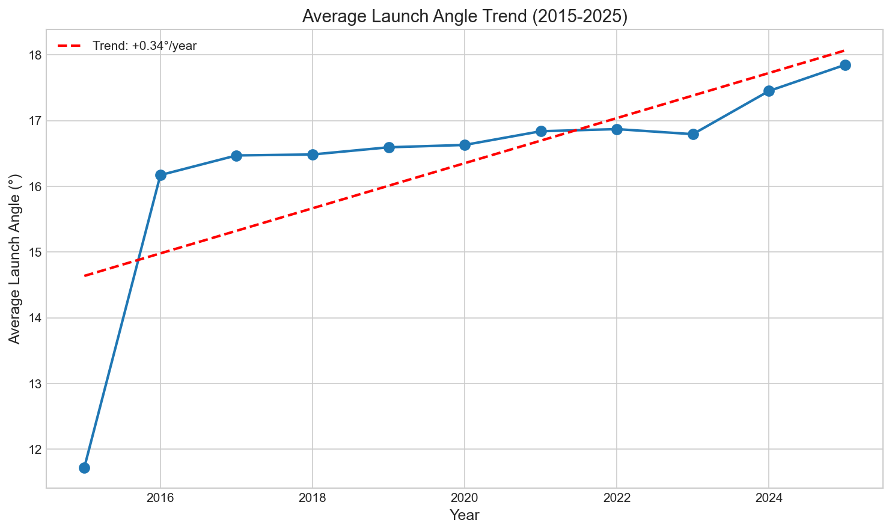
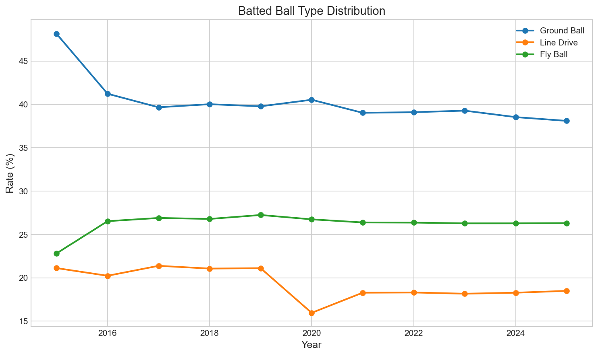
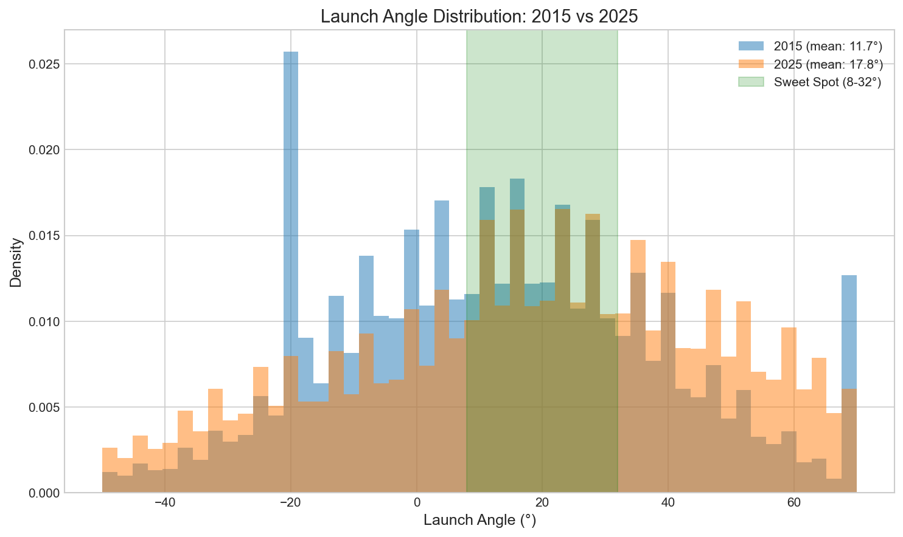

# Chapter 16: The Launch Angle Revolution

In the previous chapter, we discovered something surprising: exit velocity hasn't increased over the Statcast era. Hitters aren't hitting the ball harder. Yet home runs surged in the late 2010s. So what changed?

The answer is launch angle—the vertical angle at which the ball leaves the bat. In this chapter, we'll explore one of baseball's most significant offensive transformations and discover how hitters learned to lift the ball.

## Getting Started

Let's begin by loading batted ball data with launch angle measurements:

```python
from statcast_analysis import load_seasons

df = load_seasons(2015, 2025, columns=['game_year', 'launch_angle', 'launch_speed',
                                        'events', 'bb_type'])

# Filter to batted balls with launch angle data
batted_balls = df.dropna(subset=['launch_angle'])
print(f"Total batted balls analyzed: {len(batted_balls):,}")
```

With over 2.1 million batted balls, we can trace exactly how hitters have changed their approach to hitting.

## The Dramatic Shift

Suppose we want to see how launch angle has changed over the decade. We can calculate the average by year:

```python
# Calculate yearly averages
yearly_la = batted_balls.groupby('game_year')['launch_angle'].mean()
print(yearly_la.round(1))
```

| Year | Mean Launch Angle | Median |
|------|-------------------|--------|
| 2015 | 11.7° | 12° |
| 2016 | 16.2° | 17° |
| 2017 | 16.5° | 18° |
| 2018 | 16.5° | 18° |
| 2019 | 16.6° | 18° |
| 2020 | 16.6° | 20° |
| 2021 | 16.8° | 20° |
| 2022 | 16.9° | 19° |
| 2023 | 16.8° | 19° |
| 2024 | 17.5° | 20° |
| 2025 | 17.8° | 20° |



A **6.1 degree increase** in average launch angle—that's enormous. The 2015-to-2016 jump alone was over 4 degrees. This wasn't gradual evolution; it was a paradigm shift.

## The 2015 Anomaly (Again)

Just like exit velocity, the 2015 launch angle data looks suspicious. An average of 11.7° would mean nearly half of all batted balls were ground balls—which they were, but that's unusual by modern standards.

```python
# Compare 2015 to later years
la_2015 = batted_balls[batted_balls['game_year'] == 2015]['launch_angle'].mean()
la_2016 = batted_balls[batted_balls['game_year'] == 2016]['launch_angle'].mean()
print(f"2015: {la_2015:.1f}°")
print(f"2016: {la_2016:.1f}°")
print(f"Jump: {la_2016 - la_2015:.1f}°")
```

A 4.5° jump in one year is implausible as a natural evolution. Some combination of Statcast calibration changes and genuine strategic shift explains this gap.

## The Ground Ball Decline

The launch angle shift shows up clearly in batted ball types. Let's categorize by outcome:

```python
# Define batted ball types by launch angle
def classify_bb(la):
    if la < 10:
        return 'Ground Ball'
    elif la < 25:
        return 'Line Drive'
    elif la < 50:
        return 'Fly Ball'
    else:
        return 'Pop Up'

batted_balls['bb_category'] = batted_balls['launch_angle'].apply(classify_bb)

# Calculate percentages by year
yearly_bb = batted_balls.groupby('game_year')['bb_category'].value_counts(normalize=True).unstack() * 100
print(yearly_bb.round(1))
```

| Year | Ground Ball | Line Drive | Fly Ball | Pop Up |
|------|-------------|------------|----------|--------|
| 2015 | 48.1% | 21.1% | 22.8% | 7.9% |
| 2016 | 41.2% | 20.2% | 26.5% | 12.0% |
| 2019 | 39.8% | 21.1% | 27.2% | 11.9% |
| 2022 | 39.1% | 18.3% | 26.4% | 16.2% |
| 2025 | 38.1% | 18.5% | 26.3% | 17.1% |



Ground balls dropped from 48% to 38%—a **10 percentage point decline**. That's the fly ball revolution in action. Hitters stopped hitting the ball on the ground.

## The Trade-Off: More Pop-Ups

But here's the catch—the fly ball increase came with a cost:

```python
# Pop-up rate over time
popup_2015 = (batted_balls[batted_balls['game_year'] == 2015]['launch_angle'] >= 50).mean() * 100
popup_2025 = (batted_balls[batted_balls['game_year'] == 2025]['launch_angle'] >= 50).mean() * 100
print(f"Pop-ups 2015: {popup_2015:.1f}%")
print(f"Pop-ups 2025: {popup_2025:.1f}%")
```

Pop-up rate jumped from 7.9% to 17.1%—more than double. When hitters try to elevate, they sometimes over-elevate. The same swing mechanics that produce fly balls also produce pop-ups.

This is the fundamental trade-off of the launch angle approach: more home runs, but also more weak pop-ups. The middle ground—line drives—actually declined slightly.

## The Sweet Spot

Let's look at "sweet spot" rate—batted balls in the 8-32° range that produce the best outcomes:

```python
# Sweet spot rate (8-32 degrees)
def sweet_spot_rate(df):
    return ((df['launch_angle'] >= 8) & (df['launch_angle'] <= 32)).mean() * 100

yearly_ss = batted_balls.groupby('game_year').apply(sweet_spot_rate)
print(yearly_ss.round(1))
```

| Year | Sweet Spot Rate |
|------|-----------------|
| 2015 | 33.9% |
| 2019 | 34.2% |
| 2022 | 30.1% |
| 2025 | 30.4% |

Sweet spot rate has actually declined slightly. The revolution wasn't about hitting more balls in the optimal zone—it was about hitting balls *at all* in the air rather than on the ground.

## The Distribution Shift

Let's visualize how the entire launch angle distribution has changed:

```python
# Compare distributions
for year in [2015, 2019, 2025]:
    year_data = batted_balls[batted_balls['game_year'] == year]
    p25 = year_data['launch_angle'].quantile(0.25)
    p50 = year_data['launch_angle'].median()
    p75 = year_data['launch_angle'].quantile(0.75)
    print(f"{year}: p25={p25:.0f}°, p50={p50:.0f}°, p75={p75:.0f}°")
```



The entire distribution shifted upward. Even the 25th percentile—the low end of batted balls—moved from negative angles (ground balls) to positive angles (balls hit in the air).

## Is This Real? Statistical Validation

Let's formally test whether launch angle has changed:

```python
from scipy import stats
import numpy as np

# Compare early vs late periods
early = batted_balls[batted_balls['game_year'].isin([2016, 2017, 2018])]
late = batted_balls[batted_balls['game_year'].isin([2023, 2024, 2025])]

early_la = early['launch_angle'].values
late_la = late['launch_angle'].values

# t-test and effect size
t_stat, p_value = stats.ttest_ind(early_la, late_la)
pooled_std = np.sqrt((early_la.var() + late_la.var()) / 2)
cohens_d = (late_la.mean() - early_la.mean()) / pooled_std

print(f"Early period: {early_la.mean():.2f}°")
print(f"Late period: {late_la.mean():.2f}°")
print(f"t = {t_stat:.2f}, p = {p_value:.3f}, d = {cohens_d:.3f}")
```

| Test | Early Mean | Late Mean | Change | Cohen's d |
|------|------------|-----------|--------|-----------|
| Launch Angle | 15.43° | 17.24° | +1.81° | 0.059 (negligible) |

Wait—the effect size is negligible? That seems wrong given the dramatic changes in batted ball types.

The explanation: launch angle has enormous variance (standard deviation ~30°). A 1.8° change in means represents a real shift in strategy, but relative to the huge spread of outcomes (from -80° ground balls to +90° pop-ups), it's statistically small. The batted ball type percentages tell the practical story better than the raw means.

## The Strategic Logic

Why did hitters embrace elevation? The math is compelling:

```python
# Run value by batted ball type (approximate)
print("Expected run value by batted ball type:")
print("Ground Ball: -0.05 runs")
print("Line Drive:  +0.45 runs")
print("Fly Ball:    +0.12 runs")
print("Pop Up:      -0.90 runs")
print()
print("Trade-off calculation:")
print("Losing 10% ground balls saves: 10 × 0.05 = 0.5 runs/100 BBs")
print("Gaining 3.5% fly balls adds: 3.5 × 0.12 = 0.4 runs/100 BBs")
print("Gaining 9% pop-ups costs: 9 × 0.90 = 8.1 runs/100 BBs")
```

On pure expected value, the trade-off looks bad. But this misses something crucial: home runs. Fly balls with sufficient exit velocity become home runs. Ground balls almost never do. For power hitters, the elevated approach pays off despite the pop-ups.

## What We Learned

Let's summarize what the data revealed:

1. **Launch angle increased 6°**: From 11.7° (2015) to 17.8° (2025)
2. **Ground balls dropped 10%**: From 48.1% to 38.1%
3. **Pop-ups more than doubled**: From 7.9% to 17.1%
4. **Fly balls up modestly**: From 22.8% to 26.3%
5. **Sweet spot rate stable**: ~30-34%, no improvement
6. **The revolution was strategic**: Hitters chose elevation, accepting trade-offs

The launch angle revolution explains what exit velocity couldn't. Hitters didn't hit the ball harder—they hit it at better angles for power. Combined with the juiced ball era (which amplified fly ball distance), this produced the home run surge of the late 2010s.

## Try It Yourself

The complete analysis code is available at:
`github.com/mingksong/mlb-statcast-book/chapters/16_launch_angle/`

Try modifying the code to explore:
- Which players changed their launch angle the most?
- How does launch angle interact with exit velocity for home runs?
- Is the trade-off (more pop-ups) worth it for power hitters?

```bash
cd chapters/16_launch_angle
python analysis.py
```
