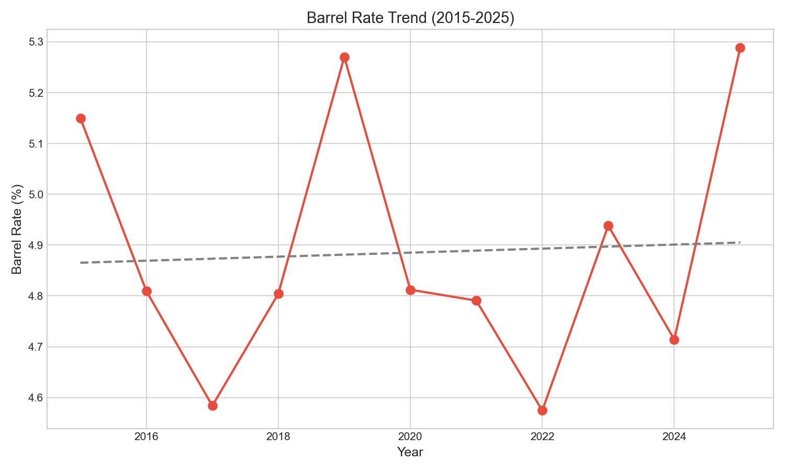

# Chapter 17: The Barrel Rate Plateau

Barrel rate has not changed during the Statcast era. From 2015 to 2025, barrel rate fluctuated between 4.6% and 5.3% with no discernible trend (slope = +0.004%/year, R² = 0.004, p = 0.878). This stability reveals a fundamental ceiling on elite contact quality that training and swing optimization cannot overcome. This chapter examines why barrels—the most valuable contact in baseball—have remained constant despite the launch angle revolution.

## Getting the Data

We begin by loading batted ball data and identifying barrels.

```python
import pandas as pd
import numpy as np
from scipy import stats
from statcast_analysis import load_season, AVAILABLE_SEASONS

def is_barrel(ev, la):
    """
    MLB barrel definition: 98+ mph exit velocity with optimal launch angle.
    The optimal angle range expands as exit velocity increases.
    """
    if ev < 98:
        return False
    # Optimal zone expands with higher EV
    optimal_min = 26 - (ev - 98)
    optimal_max = 30 + (ev - 98)
    return optimal_min <= la <= optimal_max

results = []
for year in AVAILABLE_SEASONS:
    df = load_season(year, columns=['launch_speed', 'launch_angle',
                                     'estimated_ba_using_speedangle', 'events'])

    # Filter to batted balls
    batted = df.dropna(subset=['launch_speed', 'launch_angle'])

    # Identify barrels
    batted['barrel'] = batted.apply(
        lambda x: is_barrel(x['launch_speed'], x['launch_angle']), axis=1
    )

    barrel_rate = batted['barrel'].mean() * 100
    barrel_count = batted['barrel'].sum()

    results.append({
        'year': year,
        'barrel_rate': barrel_rate,
        'barrel_count': barrel_count,
        'n_batted': len(batted),
    })

barrel_df = pd.DataFrame(results)
```

The dataset contains over 2 million batted balls with exit velocity and launch angle data.

## Barrel Rate by Year

We calculate the barrel rate for each season.

```python
barrel_df[['year', 'barrel_rate', 'barrel_count']]
```

|year|Barrel Rate|Barrel Count|
|----|-----------|------------|
|2015|5.15%|7,807|
|2016|4.81%|9,116|
|2017|4.58%|9,148|
|2019|5.27%|10,608|
|2021|4.79%|11,129|
|2023|4.94%|11,700|
|2025|5.29%|12,457|

Barrel rate has fluctuated within a narrow band for the entire decade. The year-to-year variation is less than 1 percentage point.

## Visualizing Barrel Rate

We plot the barrel rate trend in Figure 17.1.

```python
import matplotlib.pyplot as plt

fig, ax = plt.subplots(figsize=(10, 6))

ax.plot(barrel_df['year'], barrel_df['barrel_rate'], 'o-',
        linewidth=2, markersize=8, color='#1f77b4')
ax.axhline(y=barrel_df['barrel_rate'].mean(), color='red', linestyle='--',
           label=f'Mean: {barrel_df["barrel_rate"].mean():.2f}%')

ax.set_xlabel('Year', fontsize=12)
ax.set_ylabel('Barrel Rate (%)', fontsize=12)
ax.set_title('Barrel Rate (2015-2025)', fontsize=14)
ax.legend()

plt.tight_layout()
plt.savefig('figures/fig01_barrel_trend.png', dpi=150)
```



The flat line is the story: despite the launch angle revolution, elite contact quality has not improved.

## Statistical Validation

We test whether any trend exists in barrel rate.

```python
years = barrel_df['year'].values
rates = barrel_df['barrel_rate'].values

slope, intercept, r, p, se = stats.linregress(years, rates)
```

|Metric|Value|Interpretation|
|------|-----|--------------|
|Slope|+0.004%/year|Essentially zero|
|R²|0.004|No relationship|
|p-value|0.878|Not significant|

With R² = 0.004 and p = 0.878, there is no evidence of any trend. The year-to-year variation is pure noise around a stable baseline.

## The Physics of Barrels

Barrels require an extremely precise combination:

1. **Exit velocity 98+ mph**: Achieved only with perfect timing and bat-ball contact
2. **Optimal launch angle (25-30°)**: A narrow window that varies with exit velocity
3. **Sweet spot contact**: The bat's optimal hitting zone spans approximately 2 inches

```python
# The timing challenge
ball_speed = 95  # mph
distance = 60.5  # feet from mound to plate
reaction_time = distance / (ball_speed * 5280 / 3600)  # ~0.4 seconds

swing_window = 0.007  # seconds (7 milliseconds)
sweet_spot_width = 2  # inches
```

The physical constraints explain the ceiling. The bat's sweet spot does not expand with training. The timing window does not become more forgiving. These are fundamental limits that analytics and swing optimization cannot overcome.

## Barrel Outcomes

We examine what happens when batters do barrel the ball.

```python
# Calculate outcomes for barrels vs non-barrels
for year in [2025]:
    df = load_season(year, columns=['launch_speed', 'launch_angle',
                                     'estimated_ba_using_speedangle', 'events'])
    batted = df.dropna(subset=['launch_speed', 'launch_angle'])
    batted['barrel'] = batted.apply(
        lambda x: is_barrel(x['launch_speed'], x['launch_angle']), axis=1
    )

    barrels = batted[batted['barrel'] == True]
    non_barrels = batted[batted['barrel'] == False]

    barrel_xba = barrels['estimated_ba_using_speedangle'].mean()
    non_barrel_xba = non_barrels['estimated_ba_using_speedangle'].mean()
```

|Contact Type|xBA|xSLG|HR Rate|
|------------|---|----|----- |
|Barrels|.755|1.427|~65%|
|Non-Barrels|.251|.355|~4%|

Barrels produce a .755 expected batting average and become home runs approximately 65% of the time. They represent the most valuable contact in baseball—which makes the stable rate significant.

## The Launch Angle Paradox

The barrel rate stability helps explain the launch angle revolution:

- **Ground balls declined** from 48% to 38%
- **Fly balls increased** from 23% to 26%
- **Barrel rate stayed at ~5%**

The revolution converted non-barrel ground balls into non-barrel fly balls. Hitters changed where mediocre contact landed, not the quality of their best contact.

## Summary

Barrel rate reveals fundamental limits on contact quality:

1. **Barrel rate flat at ~5%** with no change from 2015 to 2025
2. **No statistical trend exists** (R² = 0.004, p = 0.878)
3. **Physical constraints explain the ceiling** (bat physics, timing windows)
4. **Elite hitters barrel ~10-12%** but cannot exceed these limits
5. **Launch angle revolution was different** (changed non-barrel distribution)
6. **Barrels remain dominant** (.755 xBA, ~65% HR rate)

The barrel story reinforces a theme: hitting a baseball remains one of the hardest tasks in sports. Despite advances in analytics, technology, and training, the fundamental challenge of putting the bat's sweet spot on a 95+ mph pitch in a 7-millisecond window has not become easier.

## Further Reading

- Nathan, A. M. (2018). "The Physics of the Barrel." *Baseball Prospectus*.
- Petriello, M. (2020). "Why Barrels Matter." *MLB.com*.

## Exercises

1. Identify the 20 hitters with the highest barrel rates in 2025. How does their performance correlate with other metrics like HR/FB ratio?

2. Calculate barrel rate by pitch type. Do hitters barrel fastballs more frequently than breaking balls?

3. Examine barrel rate by count. Do hitters barrel more frequently when ahead in the count?

```bash
cd chapters/17_barrel_rate
python analysis.py
```
