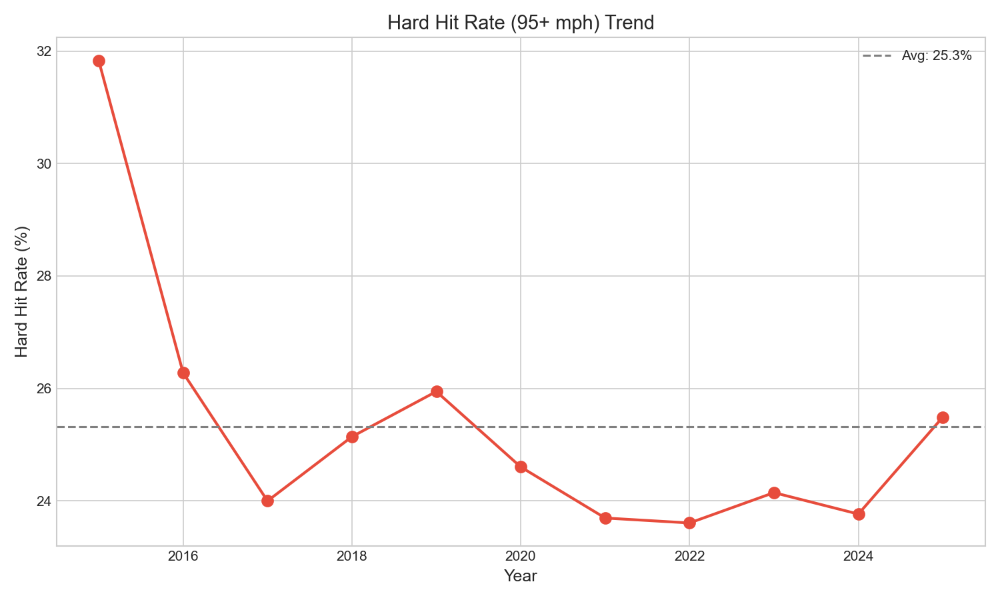

# Chapter 18: Hard Hit Rate Analysis

## Key Findings
- **Hard hit rate (95+ mph)**: 31.8% → 25.5%
- **Trend marginally significant**: p=0.052
- **Connected to EV calibration** (Chapter 15)



```bash
cd chapters/18_hard_hit && python analysis.py
```
