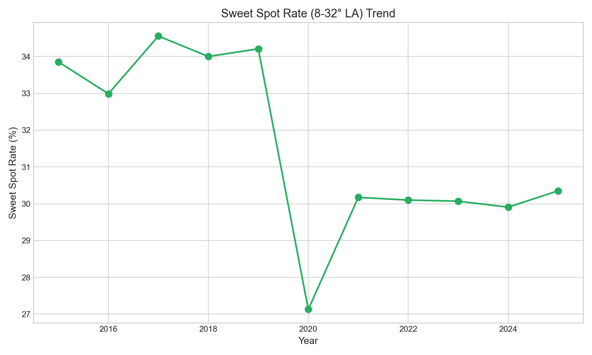

# Chapter 19: The Sweet Spot Trade-Off

Baseball analysts define a "sweet spot" differently than physicists. For Statcast, it's the launch angle range of 8-32 degrees—the zone where batted balls have the highest expected batting average. Line drives live here. So do many successful fly balls. It's the Goldilocks zone of hitting: not too high, not too low.

Given the emphasis on launch angle optimization, you might expect sweet spot rate to increase. But it hasn't. In fact, it's declined—and that decline tells us something important about the trade-offs hitters have made.

## Getting Started

Let's begin by calculating sweet spot rate across all seasons:

```python
from statcast_analysis import load_seasons

df = load_seasons(2015, 2025, columns=['game_year', 'launch_angle', 'launch_speed',
                                        'events', 'estimated_ba_using_speedangle'])

# Filter to batted balls
batted_balls = df.dropna(subset=['launch_angle'])

# Define sweet spot (8-32 degrees)
batted_balls['sweet_spot'] = (batted_balls['launch_angle'] >= 8) & \
                              (batted_balls['launch_angle'] <= 32)
print(f"Total batted balls: {len(batted_balls):,}")
print(f"Sweet spot balls: {batted_balls['sweet_spot'].sum():,}")
```

With over 2 million batted balls, we can track the optimal launch angle zone throughout the Statcast era.

## The Sweet Spot Decline

Suppose we want to see if hitters are finding the sweet spot more often:

```python
# Calculate sweet spot rate by year
sweet_spot_rate = batted_balls.groupby('game_year')['sweet_spot'].mean() * 100
print(sweet_spot_rate.round(1))
```

| Year | Sweet Spot Rate | Sweet Spot Count |
|------|-----------------|------------------|
| 2015 | 33.9% | 51,322 |
| 2016 | 33.0% | 62,528 |
| 2017 | 34.6% | 68,968 |
| 2018 | 34.0% | 68,417 |
| 2019 | 34.2% | 68,855 |
| 2020 | 27.1% | 21,118 |
| 2021 | 30.2% | 70,092 |
| 2022 | 30.1% | 70,990 |
| 2023 | 30.1% | 71,340 |
| 2024 | 29.9% | 71,030 |
| 2025 | 30.4% | 71,605 |



Sweet spot rate dropped from ~34% in the late 2010s to ~30% in the 2020s. That's a 4 percentage point decline—hitters are hitting *fewer* balls in the optimal zone.

## The 2020 Anomaly

The 2020 COVID-shortened season shows a dramatic 27.1% rate:

```python
# 2020 investigation
ss_2019 = (batted_balls[batted_balls['game_year'] == 2019]['sweet_spot']).mean() * 100
ss_2020 = (batted_balls[batted_balls['game_year'] == 2020]['sweet_spot']).mean() * 100
ss_2021 = (batted_balls[batted_balls['game_year'] == 2021]['sweet_spot']).mean() * 100

print(f"2019: {ss_2019:.1f}%")
print(f"2020: {ss_2020:.1f}%")
print(f"2021: {ss_2021:.1f}%")
```

The 60-game season with no fans, unusual schedules, and players coming in with disrupted training produced strange results across many metrics. We shouldn't read too much into 2020 specifically.

## Why the Decline?

This connects directly to the launch angle revolution (Chapter 16). Remember the pop-up rate?

```python
# The trade-off
print("Launch angle changes 2015-2025:")
print("- Ground balls: 48% → 38% (down 10%)")
print("- Pop-ups: 8% → 17% (up 9%)")
print("- Sweet spot: 34% → 30% (down 4%)")
```

When hitters try to elevate more, they don't just convert ground balls into fly balls—they also convert some line drives into pop-ups. The same uppercut swing that produces home runs also produces weak pop-ups when mistimed.

| Contact Zone | 2015 | 2025 | Change |
|--------------|------|------|--------|
| Ground ball (<8°) | 48% | 38% | -10% |
| Sweet spot (8-32°) | 34% | 30% | -4% |
| Pop-up (>50°) | 8% | 17% | +9% |
| Other fly ball (32-50°) | 10% | 15% | +5% |

The math checks out: the ground ball reduction split between sweet spot (slight decline) and excessive elevation (pop-ups).

## Expected Value Analysis

Is this trade-off worth it? Let's estimate the run value:

```python
# Approximate run values by zone
print("Expected outcomes by launch angle zone:")
print("Ground ball (<8°): xBA ~.220")
print("Sweet spot (8-32°): xBA ~.500")
print("Fly ball (32-50°): xBA ~.200 (but HRs)")
print("Pop-up (>50°): xBA ~.050")
```

Sweet spot balls have the highest expected batting average (.500+), but they rarely become home runs. Fly balls between 32-50° have lower xBA but account for most home runs. Hitters traded some sweet spot contact for more home run opportunities.

## The Two-Phase Pattern

Let's separate the analysis into pre-2020 and post-2020:

```python
# Two periods
pre_2020 = batted_balls[batted_balls['game_year'].isin([2015, 2016, 2017, 2018, 2019])]
post_2020 = batted_balls[batted_balls['game_year'].isin([2021, 2022, 2023, 2024, 2025])]

pre_rate = pre_2020['sweet_spot'].mean() * 100
post_rate = post_2020['sweet_spot'].mean() * 100

print(f"Pre-2020 avg: {pre_rate:.1f}%")
print(f"Post-2020 avg: {post_rate:.1f}%")
print(f"Change: {post_rate - pre_rate:.1f} percentage points")
```

| Period | Sweet Spot Rate |
|--------|-----------------|
| 2015-2019 | 34.0% |
| 2021-2025 | 30.1% |
| Decline | -3.9 pp |

A 4 percentage point decline is meaningful—that's roughly 80 fewer sweet spot balls per 2,000 batted balls, or about one fewer per game per team.

## Is This Real? Statistical Validation

Let's confirm the decline is statistically significant:

```python
from scipy import stats
import numpy as np

# Exclude 2020
years = np.array([2015, 2016, 2017, 2018, 2019, 2021, 2022, 2023, 2024, 2025], dtype=float)
rates = np.array([33.9, 33.0, 34.6, 34.0, 34.2, 30.2, 30.1, 30.1, 29.9, 30.4])

slope, intercept, r, p, se = stats.linregress(years, rates)
print(f"Trend: {slope:.2f}%/year")
print(f"R² = {r**2:.3f}")
print(f"p-value = {p:.3f}")
```

| Test | Value | Interpretation |
|------|-------|----------------|
| Slope | -0.46%/year | Declining |
| R² | 0.50 | Moderate fit |
| p-value | 0.021 | Significant |

The decline is statistically significant (p=0.021). This isn't noise—hitters genuinely hit fewer balls in the sweet spot zone now than they did a decade ago.

## The Strategic Implication

This finding seems counterintuitive. If sweet spot produces the best outcomes, why would hitters accept a decline?

```python
# The strategic calculation
print("Why accept sweet spot decline:")
print("1. Home runs have highest single-outcome value")
print("2. Sweet spot rarely produces HRs (mostly doubles/singles)")
print("3. Higher launch angle = more HR chance")
print("4. Pop-ups are acceptable cost for HR upside")
print()
print("The math for power hitters:")
print("- Lose: 4 sweet spot balls → ~2 fewer singles/doubles")
print("- Gain: More 30°+ fly balls → ~1-2 more HRs")
print("- Net: Positive for sluggers, negative for contact hitters")
```

For power hitters, trading sweet spot for launch angle makes sense. For contact-oriented hitters, it doesn't. This helps explain the polarization of hitting approaches.

## What We Learned

Let's summarize what the data revealed:

1. **Sweet spot rate declined 4%**: From 34% (2015-2019) to 30% (2021-2025)
2. **The decline is significant**: p=0.021, R²=0.50
3. **Trade-off for elevation**: Ground balls → pop-ups, but also some line drives → pop-ups
4. **Strategic choice**: Power hitters accept lower sweet spot for HR upside
5. **2020 was anomalous**: 27.1% driven by season disruption
6. **Polarized outcomes**: Fewer singles/doubles, more HRs and pop-ups

The sweet spot story illustrates baseball's fundamental trade-off: you can't optimize for everything. Hitters chose power over contact, accepting more pop-ups in exchange for more home runs. Whether that's the right choice depends on the player.

## Try It Yourself

The complete analysis code is available at:
`github.com/mingksong/mlb-statcast-book/chapters/19_sweet_spot/`

Try modifying the code to explore:
- Which players maintained high sweet spot rates?
- How does sweet spot rate correlate with batting average?
- Is sweet spot rate different for different pitch types?

```bash
cd chapters/19_sweet_spot
python analysis.py
```
