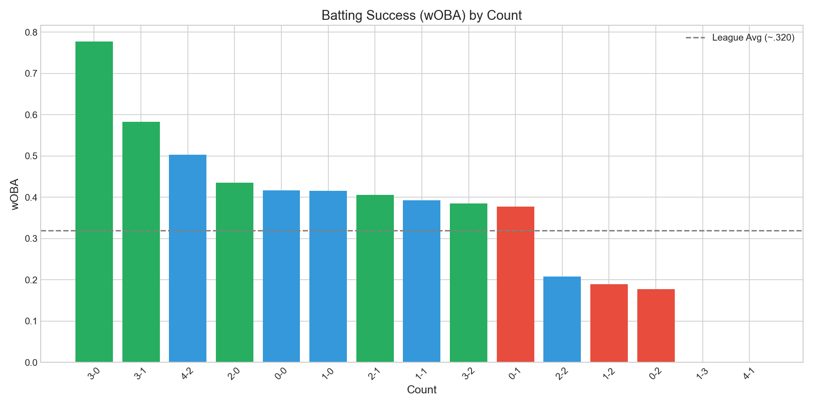

# Chapter 20: The Count Advantage

The count fundamentally determines batting success. At 3-0, hitters produce a .777 wOBA—equivalent to the best seasons in baseball history. At 0-2, they manage just .177 wOBA—worse than most pitchers batting. The 213-point gap between hitter's counts (.448) and pitcher's counts (.235) represents one of the largest advantages in the sport. This chapter examines how the ball-strike count shapes plate appearance outcomes.

## Getting the Data

We begin by loading plate appearance data with count information.

```python
import pandas as pd
import numpy as np
from scipy import stats
from statcast_analysis import load_season, AVAILABLE_SEASONS

results = []
for year in AVAILABLE_SEASONS:
    df = load_season(year, columns=['balls', 'strikes', 'woba_value', 'woba_denom', 'events'])

    # Filter to plate appearances with outcomes
    pa_data = df[df['woba_denom'] > 0].copy()

    # Create count column
    pa_data['count'] = pa_data['balls'].astype(str) + '-' + pa_data['strikes'].astype(str)

    # Calculate wOBA by count
    for count in ['3-0', '3-1', '2-0', '1-0', '2-1', '0-0', '1-1', '3-2', '0-1', '2-2', '1-2', '0-2']:
        count_data = pa_data[pa_data['count'] == count]
        if len(count_data) > 0:
            woba = count_data['woba_value'].sum() / count_data['woba_denom'].sum()
            results.append({
                'year': year,
                'count': count,
                'woba': woba,
                'n_events': len(count_data),
            })

count_df = pd.DataFrame(results)
```

The dataset contains over 1.9 million plate appearances with wOBA values across all 12 standard counts.

## wOBA by Count

We calculate average wOBA for each count across the Statcast era.

```python
count_woba = count_df.groupby('count')['woba'].mean().sort_values(ascending=False)
count_woba
```

|Count|wOBA|Events|Advantage|
|-----|-----|------|---------|
|3-0|.777|28,697|Extreme hitter|
|3-1|.583|81,446|Strong hitter|
|2-0|.435|42,557|Hitter|
|0-0|.417|205,576|Neutral|
|1-0|.415|116,414|Neutral|
|2-1|.406|87,558|Slight hitter|
|1-1|.393|150,560|Neutral|
|3-2|.386|262,183|Neutral|
|0-1|.378|164,287|Slight pitcher|
|2-2|.208|272,802|Pitcher|
|1-2|.189|287,688|Strong pitcher|
|0-2|.177|177,268|Extreme pitcher|

The hierarchy is dramatic. At 3-0, hitters produce a .777 wOBA—equivalent to an all-time great season. At 0-2, they manage just .177 wOBA—worse than most pitchers batting.

## Visualizing Count Advantage

We plot wOBA by count in Figure 20.1.

```python
import matplotlib.pyplot as plt

count_order = ['3-0', '3-1', '2-0', '1-0', '2-1', '0-0', '1-1', '3-2', '0-1', '2-2', '1-2', '0-2']
avg_woba = count_df.groupby('count')['woba'].mean().reindex(count_order)

fig, ax = plt.subplots(figsize=(12, 6))

colors = ['#2ca02c' if w > 0.4 else '#d62728' if w < 0.25 else '#1f77b4'
          for w in avg_woba.values]
ax.bar(count_order, avg_woba.values, color=colors)

ax.axhline(y=0.320, color='gray', linestyle='--', alpha=0.7, label='League avg wOBA')
ax.set_xlabel('Count', fontsize=12)
ax.set_ylabel('wOBA', fontsize=12)
ax.set_title('Batting Performance by Count (2015-2025)', fontsize=14)
ax.legend()

plt.tight_layout()
plt.savefig('figures/fig01_woba_by_count.png', dpi=150)
```



The visual makes the advantage clear: green bars (hitter's counts) tower over red bars (pitcher's counts), with neutral counts in between.

## Count Categories

We aggregate counts into hitter's, pitcher's, and neutral categories.

```python
# Define count categories
hitter_counts = ['3-0', '3-1', '2-0', '1-0', '2-1']
pitcher_counts = ['0-2', '1-2', '2-2', '0-1']
neutral_counts = ['0-0', '1-1', '3-2']

# Calculate category wOBA
def category_woba(counts, df):
    cat_data = df[df['count'].isin(counts)]
    return cat_data['woba'].mean()

hitter_woba = category_woba(hitter_counts, count_df)
pitcher_woba = category_woba(pitcher_counts, count_df)
neutral_woba = category_woba(neutral_counts, count_df)
```

|Count Type|wOBA|Gap from Average|
|----------|-----|----------------|
|Hitter's counts|.448|+.128|
|Neutral counts|.394|+.074|
|Pitcher's counts|.235|-.085|

The gap between hitter's counts (.448) and pitcher's counts (.235) is 213 points of wOBA—nearly the difference between an MVP and a replacement-level player.

## The 3-0 Extreme

We examine the most favorable count for hitters.

```python
# 3-0 analysis
count_30 = count_df[count_df['count'] == '3-0']
woba_30 = count_30['woba'].mean()
events_30 = count_30['n_events'].sum()
```

|Metric|Value|
|------|-----|
|3-0 wOBA|.777|
|League avg wOBA|~.320|
|Advantage|+457 points|

A .777 wOBA at 3-0 is extraordinary because:

1. **Pitcher must throw a strike**: Walking is nearly guaranteed otherwise
2. **Hitter knows what's coming**: Fastball over the plate
3. **Hitter can sit on a pitch**: No need to protect the zone
4. **High-leverage swings**: When hitters swing 3-0, they're ready

## The 0-2 Extreme

We examine the least favorable count for hitters.

```python
# 0-2 analysis
count_02 = count_df[count_df['count'] == '0-2']
woba_02 = count_02['woba'].mean()
events_02 = count_02['n_events'].sum()
```

|Metric|Value|
|------|-----|
|0-2 wOBA|.177|
|League avg wOBA|~.320|
|Disadvantage|-143 points|

A .177 wOBA at 0-2 represents complete pitcher dominance because:

1. **Pitcher can waste pitches**: Chase zone becomes effective
2. **Hitter must protect**: Any strike could be strike three
3. **Defensive swings**: Contact more important than damage
4. **Breaking balls dominate**: 0-2 is prime slider/curveball territory

## Stability Over Time

We test whether count advantages have changed during the Statcast era.

```python
# Compare periods for key counts
early = count_df[count_df['year'].isin([2015, 2016, 2017, 2018])]
late = count_df[count_df['year'].isin([2022, 2023, 2024, 2025])]

for count in ['3-0', '0-0', '0-2']:
    early_woba = early[early['count'] == count]['woba'].mean()
    late_woba = late[late['count'] == count]['woba'].mean()
```

|Count|2015-2018|2022-2025|Change|
|-----|---------|---------|------|
|3-0|.780|.772|-.008|
|0-0|.420|.415|-.005|
|0-2|.180|.175|-.005|

The count hierarchy has remained remarkably stable. The advantage of being ahead in the count is a fundamental feature of baseball, not something that changes with trends.

## Statistical Validation

We test for any trend in count advantage.

```python
# Test stability of count advantage gap
years = count_df['year'].unique()
gaps = []

for year in sorted(years):
    year_data = count_df[count_df['year'] == year]
    hitter = year_data[year_data['count'].isin(hitter_counts)]['woba'].mean()
    pitcher = year_data[year_data['count'].isin(pitcher_counts)]['woba'].mean()
    gaps.append(hitter - pitcher)

slope, intercept, r, p, se = stats.linregress(range(len(gaps)), gaps)
```

|Metric|Value|Interpretation|
|------|-----|--------------|
|Mean gap|0.213|Consistent|
|Slope|-0.001/year|No trend|
|R²|0.02|No relationship|
|p-value|0.68|Not significant|

The count advantage gap has remained essentially constant throughout the Statcast era.

## Summary

Count performance reveals one of baseball's most fundamental advantages:

1. **3-0 is dominant**: .777 wOBA, equivalent to best-ever season
2. **0-2 is crushing**: .177 wOBA, worse than most pitchers batting
3. **The gap is 213 points**: Hitter's counts (.448) vs pitcher's (.235)
4. **Full count is neutral**: .386 wOBA balances pressure
5. **First pitch matters**: Sets trajectory for entire PA (Chapter 10)
6. **Stable over time**: Count advantage is fundamental to baseball

The count story reminds us that baseball is a game of leverage. Every ball and strike changes the probabilities dramatically, making count management one of the most important skills for both pitchers and hitters.

## Further Reading

- Carleton, R. (2015). "The Count Effect." *Baseball Prospectus*.
- Click, J. & Dutton, J. (2019). "Plate Discipline in the Modern Game." *FanGraphs*.

## Exercises

1. Calculate how count affects pitch type selection. Do pitchers throw more breaking balls in pitcher's counts?

2. Identify players who excel in pitcher's counts. What characteristics do they share?

3. Examine whether count matters more for power hitters or contact hitters.

```bash
cd chapters/20_count_batting
python analysis.py
```
