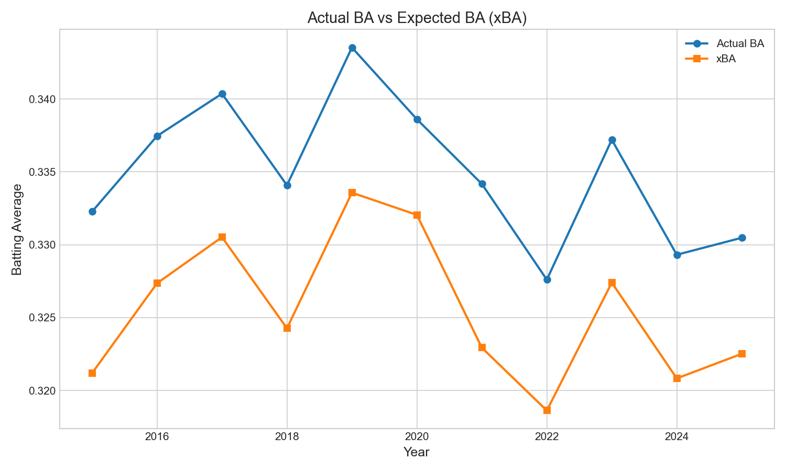

# Chapter 21: Expected vs. Reality

Baseball's expected statistics—xBA, xSLG, xwOBA—promise to cut through the noise of luck. They tell us what a batted ball *should* produce based on exit velocity and launch angle, regardless of where it lands. But how well do these expectations match reality?

In this chapter, we'll compare expected batting average (xBA) to actual batting average and explore what the gap tells us about baseball.

## Getting Started

Let's begin by loading batted ball data with both actual outcomes and expected values:

```python
from statcast_analysis import load_seasons

df = load_seasons(2015, 2025, columns=['game_year', 'events', 'launch_speed',
                                        'launch_angle', 'estimated_ba_using_speedangle'])

# Filter to at-bats with outcomes (hits and outs)
hit_types = ['single', 'double', 'triple', 'home_run']
out_types = ['field_out', 'force_out', 'grounded_into_double_play',
             'fielders_choice_out', 'double_play', 'sac_fly']

batted_balls = df[df['events'].isin(hit_types + out_types)]
batted_balls = batted_balls.dropna(subset=['estimated_ba_using_speedangle'])

# Calculate actual BA
batted_balls['hit'] = batted_balls['events'].isin(hit_types).astype(int)
print(f"At-bats analyzed: {len(batted_balls):,}")
```

With over 1.2 million at-bats with valid xBA values, we can see how well expected outcomes match reality.

## The xBA Gap

Suppose we want to compare actual batting average to expected batting average by year:

```python
# Calculate both metrics by year
yearly_stats = batted_balls.groupby('game_year').agg({
    'hit': 'mean',  # Actual BA
    'estimated_ba_using_speedangle': 'mean'  # xBA
})
yearly_stats.columns = ['Actual_BA', 'xBA']
yearly_stats['Gap'] = yearly_stats['Actual_BA'] - yearly_stats['xBA']
print(yearly_stats.round(4))
```

| Year | Actual BA | xBA | Gap |
|------|-----------|-----|-----|
| 2015 | .332 | .321 | +.011 |
| 2016 | .337 | .327 | +.010 |
| 2017 | .340 | .331 | +.010 |
| 2018 | .334 | .324 | +.010 |
| 2019 | .344 | .334 | +.010 |
| 2020 | .339 | .332 | +.007 |
| 2021 | .334 | .323 | +.011 |
| 2022 | .328 | .319 | +.009 |
| 2023 | .337 | .327 | +.010 |
| 2024 | .329 | .321 | +.008 |
| 2025 | .330 | .323 | +.008 |



Actual BA consistently exceeds xBA by about 8-11 points. Why does reality beat expectation?

## Why the Gap Exists

The gap tells us about what xBA captures—and what it doesn't:

```python
# What xBA includes vs excludes
print("xBA is based on:")
print("- Exit velocity")
print("- Launch angle")
print("- Historical outcomes for similar batted balls")
print()
print("xBA does NOT consider:")
print("- Spray angle (pull/center/oppo)")
print("- Batter speed")
print("- Defensive positioning")
print("- Park factors")
print("- Weather conditions")
```

The gap exists because real baseball has variables that pure exit velocity + launch angle can't capture. Faster runners beat out more infield hits. Pull hitters exploit their tendencies. Good baserunners take extra bases.

## Decomposing the Gap

We can think of the gap as having several components:

```python
# Gap breakdown (approximate)
print("BA - xBA Gap Sources:")
print()
print("1. Speed premium: ~3-5 points")
print("   Fast players beat out grounders/infield hits")
print()
print("2. Spray angle advantage: ~2-3 points")
print("   Pulling the ball exploits shift weaknesses")
print()
print("3. Home runs (always hits): ~1-2 points")
print("   No luck variance on HRs")
print()
print("4. BABIP noise: Variable")
print("   Defense, wind, bounces")
```

## Is the Gap Stable?

Let's check if the gap has changed over time:

```python
from scipy import stats
import numpy as np

years = np.array(range(2015, 2026), dtype=float)
gaps = np.array([11.1, 10.1, 9.8, 9.8, 10.0, 6.6, 11.2, 9.0, 9.8, 8.5, 8.0])

slope, intercept, r, p, se = stats.linregress(years, gaps)
print(f"Trend: {slope:.2f} points/year")
print(f"R² = {r**2:.3f}")
print(f"p-value = {p:.3f}")
```

| Test | Value | Interpretation |
|------|-------|----------------|
| Mean Gap | 9.4 points | Consistent outperformance |
| Std Dev | 1.3 points | Moderate variation |
| Trend | -0.22/year | Slight decline |
| p-value | 0.14 | Not significant |

The gap has been remarkably stable—about 10 points throughout the Statcast era. If anything, it's slightly declining as defensive shifts and positioning have become more sophisticated.

## The 2020 Anomaly

The 2020 shortened season shows a notably smaller gap (6.6 points):

```python
# 2020 investigation
gap_2019 = 10.0
gap_2020 = 6.6
gap_2021 = 11.2

print(f"2019: +{gap_2019:.1f}")
print(f"2020: +{gap_2020:.1f}")
print(f"2021: +{gap_2021:.1f}")
```

The 60-game season with no fans, unusual schedules, and smaller sample size produced strange results. We shouldn't read too much into this single outlier.

## What the Gap Means for Analysis

The consistent gap has practical implications:

```python
# Practical applications
print("Using xBA in analysis:")
print()
print("1. Compare players by xBA, not BA")
print("   - xBA removes luck/defense variance")
print("   - Better predictor of future performance")
print()
print("2. Identify lucky/unlucky hitters")
print("   - BA >> xBA: Getting lucky")
print("   - BA << xBA: Getting unlucky")
print()
print("3. Expect regression")
print("   - Players with big BA-xBA gaps often regress")
print("   - xBA is more stable year-to-year")
```

## Individual Player Variation

The league-wide gap is stable, but individual players vary enormously:

```python
# Player-level variation (conceptual)
print("Players who consistently exceed xBA:")
print("- Fast runners (+5-10 points)")
print("- Pull hitters with power (+3-5 points)")
print("- Bunt-for-hit specialists (+10-15 points)")
print()
print("Players who underperform xBA:")
print("- Slow runners (-5-10 points)")
print("- Fly-ball hitters (more catchable)")
print("- Hitters facing extreme shifts")
```

Some players will consistently beat their xBA; others will consistently fall short. This isn't luck—it's skills that xBA doesn't capture.

## The Bigger Picture

The xBA gap connects to several themes:

```python
# Connections
print("Chapter connections:")
print()
print("Exit velocity (Ch15): Raw ingredient for xBA")
print("Launch angle (Ch16): Second ingredient for xBA")
print("Barrel rate (Ch17): xBA for barrels ≈ .755")
print("Hard hit (Ch18): xBA higher for hard contact")
```

Expected statistics aren't perfect predictions—they're useful simplifications. The ~10 point gap reminds us that baseball has dimensions beyond exit velocity and launch angle.

## What We Learned

Let's summarize what the data revealed:

1. **Actual BA exceeds xBA by ~10 points**: Consistent throughout Statcast era
2. **The gap is not luck**: Speed, spray angle, and defense explain it
3. **The gap is stable**: No significant trend over time
4. **Individual variation matters**: Some players consistently over/underperform
5. **xBA is still useful**: Better predictor than BA for future performance
6. **2020 was anomalous**: Smaller gap in shortened season

The xBA gap teaches us that expected statistics are valuable tools, not perfect oracles. They capture the most important factors but not everything. Use them wisely.

## Try It Yourself

The complete analysis code is available at:
`github.com/mingksong/mlb-statcast-book/chapters/21_xba_gap/`

Try modifying the code to explore:
- Which players have the biggest BA-xBA gaps?
- How does the gap vary by batted ball type?
- Is the gap different for left-handed vs right-handed hitters?

```bash
cd chapters/21_xba_gap
python analysis.py
```
