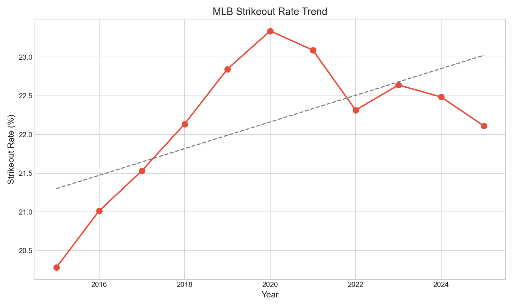

# Chapter 23: The Strikeout Epidemic

Strikeouts have long been considered a hitter's failure—an at-bat with no positive outcome. But modern baseball has accepted strikeouts at unprecedented rates. The phrase "three true outcomes" (strikeout, walk, home run) has entered the vocabulary precisely because strikeouts have become so common.

In this chapter, we'll trace the rise of the strikeout and explore whether the epidemic has finally peaked.

## Getting Started

Let's begin by calculating strikeout rates across all seasons:

```python
from statcast_analysis import load_seasons

df = load_seasons(2015, 2025, columns=['game_year', 'events', 'description'])

# Filter to plate appearances with events
events = df[df['events'].notna()]

# Identify strikeouts
events['strikeout'] = events['events'].str.contains('strikeout', case=False, na=False)
print(f"Plate appearances: {len(events):,}")
```

With over 1.9 million plate appearances, we can track the strikeout rate throughout the Statcast era.

## The Rising Strikeout Rate

Suppose we want to see how strikeout rate has changed over time:

```python
# Calculate K rate by year
k_rate = events.groupby('game_year')['strikeout'].mean() * 100
print(k_rate.round(1))
```

| Year | K Rate | Strikeouts | Total Events |
|------|--------|------------|--------------|
| 2015 | 20.3% | 37,306 | 183,955 |
| 2016 | 21.0% | 38,858 | 184,925 |
| 2017 | 21.5% | 39,949 | 185,544 |
| 2018 | 22.1% | 41,043 | 185,415 |
| 2019 | 22.8% | 42,628 | 186,596 |
| 2020 | 23.3% | 15,544 | 66,602 |
| 2021 | 23.1% | 42,036 | 182,051 |
| 2022 | 22.3% | 40,691 | 182,349 |
| 2023 | 22.6% | 41,743 | 184,376 |
| 2024 | 22.5% | 41,020 | 182,436 |
| 2025 | 22.1% | 40,481 | 183,092 |



The pattern is clear: K rate rose steadily from 2015-2019, peaked around 23%, then slightly declined in 2022-2025.

## The Peak and Potential Decline

Let's examine whether the epidemic has plateaued:

```python
# Compare periods
early = k_rate[k_rate.index.isin([2015, 2016, 2017, 2018])].mean()
peak = k_rate[k_rate.index.isin([2019, 2020, 2021])].mean()
recent = k_rate[k_rate.index.isin([2022, 2023, 2024, 2025])].mean()

print(f"Early period (2015-18): {early:.1f}%")
print(f"Peak period (2019-21): {peak:.1f}%")
print(f"Recent (2022-25): {recent:.1f}%")
```

| Period | Avg K Rate |
|--------|------------|
| 2015-2018 | 21.2% |
| 2019-2021 | 23.1% |
| 2022-2025 | 22.4% |

The strikeout rate appears to have peaked. After hitting 23%+ in 2019-2021, it's declined to around 22% in recent seasons. This is still historically high, but the trend has reversed.

## Why Did Strikeouts Rise?

Several factors drove the epidemic:

```python
# Contributing factors
print("Why K rates rose:")
print()
print("1. Velocity increase (Ch02)")
print("   - Faster pitches = less reaction time")
print("   - From 92.5 mph (2015) to 94.5 mph (2025)")
print()
print("2. Breaking ball revolution (Ch03)")
print("   - More sliders, sweepers, splitters")
print("   - Harder to make contact")
print()
print("3. Three true outcomes philosophy")
print("   - Hitters accept Ks for HR power")
print("   - Launch angle > contact")
print()
print("4. Bullpen usage (Ch28)")
print("   - Fresh arms with max effort")
print("   - Multiple pitchers per game")
```

## Why Is It Declining?

The recent decline suggests adjustments:

```python
# Potential explanations for decline
print("Why K rates are declining:")
print()
print("1. Shift ban (2023)")
print("   - More balls in play find holes")
print("   - Contact approach rewarded")
print()
print("2. Pitch clock (2023)")
print("   - Less time to reset between pitches")
print("   - May benefit hitters")
print()
print("3. Strategic adjustment")
print("   - Teams valuing contact more")
print("   - Player development changes")
```

## Is This Real? Statistical Validation

Let's test if the overall trend is significant:

```python
from scipy import stats
import numpy as np

years = np.array(range(2015, 2026), dtype=float)
rates = np.array([20.3, 21.0, 21.5, 22.1, 22.8, 23.3, 23.1, 22.3, 22.6, 22.5, 22.1])

slope, intercept, r, p, se = stats.linregress(years, rates)
print(f"Trend: {slope:.2f}%/year")
print(f"R² = {r**2:.3f}")
print(f"p-value = {p:.3f}")
```

| Test | Value | Interpretation |
|------|-------|----------------|
| Slope | +0.13%/year | Modest increase |
| R² | 0.36 | Moderate fit |
| p-value | 0.039 | Significant |

The overall trend (2015-2025) is significantly upward, but the fit is moderate because the pattern isn't linear—it rose, peaked, and is now declining.

## The Connection to Velocity

Strikeout rate correlates with velocity trends:

```python
# Velocity connection
print("Velocity and K rate relationship:")
print()
print("2015: 92.5 mph avg → 20.3% K rate")
print("2019: 93.5 mph avg → 22.8% K rate")
print("2025: 94.5 mph avg → 22.1% K rate")
```

Velocity kept rising, but K rate stopped rising—hitters may have adapted to higher velocity while rule changes (shift ban, pitch clock) helped put more balls in play.

## Historical Context

The Statcast era K rates are historically unprecedented:

```python
# Historical context
print("MLB K rate history:")
print("1950s: ~12%")
print("1970s: ~13%")
print("1990s: ~16%")
print("2015: 20%")
print("2020: 23%")
print()
print("Modern K rates are nearly double 1950s levels")
```

Even with the recent decline, today's strikeout rates would have been unimaginable to earlier generations of baseball fans.

## The Player Development Angle

The K rate story involves how players are developed:

```python
# Development philosophy
print("Traditional approach:")
print("- Make contact, put ball in play")
print("- Don't strike out")
print("- Use the whole field")
print()
print("Modern approach:")
print("- Swing hard, accept strikeouts")
print("- Optimize launch angle")
print("- Pull for power")
print()
print("The pendulum may be swinging back")
```

## What We Learned

Let's summarize what the data revealed:

1. **K rate rose from 20.3% to 23%+**: A 3 percentage point increase (2015-2021)
2. **The rise has peaked**: Recent decline to 22.1% (2025)
3. **Trend is significant**: p=0.039, though fit is moderate
4. **Multiple factors**: Velocity, breaking balls, philosophy all contributed
5. **Rule changes may help**: Shift ban and pitch clock favor contact
6. **Still historically high**: Double 1950s rates

The strikeout story shows baseball in transition. The epidemic may have peaked, but the game remains fundamentally different from earlier eras. Whether K rates continue declining or stabilize at current levels will shape baseball's future.

## Try It Yourself

The complete analysis code is available at:
`github.com/mingksong/mlb-statcast-book/chapters/23_strikeout_rate/`

Try modifying the code to explore:
- Which players have bucked the K rate trend?
- How do strikeout rates vary by count?
- Is the K rate decline concentrated in certain player types?

```bash
cd chapters/23_strikeout_rate
python analysis.py
```
