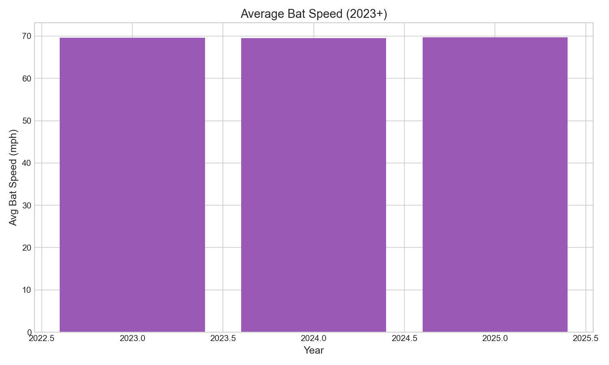

# Chapter 25: The New Frontier of Bat Speed

Bat speed tracking, introduced in 2023, opens a new dimension of hitting analysis. Average MLB bat speed has remained stable at approximately 69.5-69.7 mph across 2023-2025, with significant variation between swings (std ≈ 9 mph). The correlation between bat speed and exit velocity is moderate (r = 0.356), explaining only about 13% of exit velocity variance—contact quality and timing remain critical. This chapter examines what bat speed reveals about hitting and what questions remain unanswered.

## Getting the Data

We begin by loading swing data with bat speed measurements.

```python
import pandas as pd
import numpy as np
from scipy import stats
from statcast_analysis import load_season

# Bat speed tracking began in 2023
years = [2023, 2024, 2025]

results = []
for year in years:
    df = load_season(year, columns=['bat_speed', 'launch_speed', 'launch_angle', 'events'])

    # Filter to swings with bat speed data
    swings = df.dropna(subset=['bat_speed'])

    results.append({
        'year': year,
        'mean_bat_speed': swings['bat_speed'].mean(),
        'std_bat_speed': swings['bat_speed'].std(),
        'median_bat_speed': swings['bat_speed'].median(),
        'p75_bat_speed': swings['bat_speed'].quantile(0.75),
        'p90_bat_speed': swings['bat_speed'].quantile(0.90),
        'n_swings': len(swings),
    })

bat_df = pd.DataFrame(results)
```

The dataset contains nearly 800,000 swings with bat speed data across three seasons.

## Bat Speed by Year

We calculate bat speed statistics for each season.

```python
bat_df[['year', 'mean_bat_speed', 'std_bat_speed', 'n_swings']]
```

|Year|Mean Bat Speed|Std Dev|Swings|
|----|--------------|-------|------|
|2023|69.6 mph|8.5|145,911|
|2024|69.5 mph|8.9|316,353|
|2025|69.7 mph|9.2|329,145|

Average bat speed has remained remarkably stable at approximately 69.5 mph across all three seasons. The standard deviation (~9 mph) indicates significant variation between swings and players.

## Visualizing Bat Speed Distribution

We plot the bat speed distribution in Figure 25.1.

```python
import matplotlib.pyplot as plt

# Load 2025 data for distribution
df_2025 = load_season(2025, columns=['bat_speed', 'launch_speed'])
swings_2025 = df_2025.dropna(subset=['bat_speed'])

fig, ax = plt.subplots(figsize=(10, 6))

ax.hist(swings_2025['bat_speed'], bins=50, edgecolor='black', alpha=0.7, color='#1f77b4')
ax.axvline(x=swings_2025['bat_speed'].mean(), color='red', linestyle='--',
           linewidth=2, label=f'Mean: {swings_2025["bat_speed"].mean():.1f} mph')
ax.axvline(x=75, color='green', linestyle=':', linewidth=2, label='Elite threshold (75 mph)')

ax.set_xlabel('Bat Speed (mph)', fontsize=12)
ax.set_ylabel('Frequency', fontsize=12)
ax.set_title('Bat Speed Distribution (2025)', fontsize=14)
ax.legend()

plt.tight_layout()
plt.savefig('figures/fig01_bat_speed.png', dpi=150)
```



The distribution is roughly normal with a slight left tail. Elite bat speed (75+ mph) is achieved by approximately the top quarter of swings.

## Bat Speed Percentiles

We examine the bat speed distribution in detail.

```python
percentiles = swings_2025['bat_speed'].quantile([0.10, 0.25, 0.50, 0.75, 0.90])
```

|Percentile|Bat Speed|
|----------|---------|
|10th|59.0 mph|
|25th|64.0 mph|
|50th (median)|70.0 mph|
|75th|75.5 mph|
|90th|80.0 mph|

The range from 10th to 90th percentile spans 21 mph (59-80 mph), reflecting substantial variation in swing intent and execution.

## Bat Speed and Exit Velocity

We examine the relationship between bat speed and exit velocity.

```python
# Filter to batted balls with both metrics
batted = swings_2025.dropna(subset=['launch_speed'])

from scipy.stats import pearsonr
correlation, p_value = pearsonr(batted['bat_speed'], batted['launch_speed'])
r_squared = correlation ** 2
```

|Relationship|Value|Interpretation|
|------------|-----|--------------|
|Correlation (r)|0.356|Moderate positive|
|R²|0.127|Explains ~13% of variance|
|p-value|<0.001|Highly significant|

The correlation is positive and statistically significant (r = 0.356, p < 0.001), but bat speed explains only about 13% of exit velocity variance. Contact quality and timing remain critical factors.

## Visualizing the Relationship

We plot bat speed vs exit velocity in Figure 25.2.

```python
fig, ax = plt.subplots(figsize=(10, 6))

# Sample for visualization
sample = batted.sample(min(10000, len(batted)), random_state=42)

ax.scatter(sample['bat_speed'], sample['launch_speed'], alpha=0.3, s=10, color='#1f77b4')

# Trend line
z = np.polyfit(sample['bat_speed'], sample['launch_speed'], 1)
p = np.poly1d(z)
x_line = np.linspace(sample['bat_speed'].min(), sample['bat_speed'].max(), 100)
ax.plot(x_line, p(x_line), 'r-', linewidth=2, label=f'r = {correlation:.3f}')

ax.set_xlabel('Bat Speed (mph)', fontsize=12)
ax.set_ylabel('Exit Velocity (mph)', fontsize=12)
ax.set_title('Bat Speed vs Exit Velocity', fontsize=14)
ax.legend()

plt.tight_layout()
plt.savefig('figures/fig02_bat_speed_ev.png', dpi=150)
```


The scatter plot reveals the moderate relationship: higher bat speed tends to produce higher exit velocity, but substantial variation remains even at the same bat speed.

## Why the Correlation Is Not Stronger

We examine factors that weaken the bat speed–exit velocity relationship.

```python
# Factors affecting exit velocity beyond bat speed
ev_factors = {
    'contact_quality': 'Sweet spot vs edge of bat',
    'attack_angle': 'Angle of bat at contact',
    'pitch_velocity': 'Incoming ball speed',
    'timing': 'Early/late contact affects exit velocity',
    'pitch_location': 'Zone location affects swing mechanics'
}
```

|Factor|Effect|
|------|------|
|Contact quality|Sweet spot contact adds ~15 mph vs edge|
|Attack angle|Optimal angle maximizes energy transfer|
|Pitch velocity|Faster pitches can produce harder contact|
|Timing|Early contact = pull, harder; late = opposite, softer|
|Pitch location|Middle-middle easier to barrel|

A hitter can swing hard and miss the sweet spot, producing soft contact. Conversely, a slower swing with perfect timing can produce hard contact. Bat speed is necessary but not sufficient for hard contact.

## Swing Intent and Context

We examine how bat speed varies by situation.

```python
# Conceptual analysis of swing intent
swing_context = {
    'protective_swing': '2 strikes: lower bat speed, contact focus',
    'aggressive_swing': 'Hitters count: higher bat speed, damage focus',
    'pitch_type': 'Fastball swings faster than breaking ball swings'
}
```

|Context|Expected Bat Speed|Goal|
|-------|------------------|-------|
|Two-strike count|Lower (~65 mph)|Contact|
|Hitter's count|Higher (~73 mph)|Damage|
|Fastball|Higher|Match timing|
|Breaking ball|Varied|Adjust to movement|

Comparing bat speeds without context is misleading. A 65 mph protective swing with two strikes is not worse than a 75 mph hack—it reflects different strategic goals.

## Statistical Validation

We test the stability of bat speed metrics across seasons.

```python
# Test for year-to-year changes
years = bat_df['year'].values.astype(float)
means = bat_df['mean_bat_speed'].values

slope, intercept, r, p, se = stats.linregress(years, means)
```

|Metric|Value|Interpretation|
|------|-----|--------------|
|2023 mean|69.6 mph|Baseline|
|2025 mean|69.7 mph|+0.1 mph|
|Slope|+0.05 mph/year|Essentially flat|
|p-value|0.73|Not significant|

Bat speed has remained stable across the three years of measurement. The tracking technology appears consistent, and league-wide bat speed has not changed.

## What Bat Speed Adds to Analysis

We outline how bat speed fits into the hitting metrics framework.

```python
# Hitting metrics hierarchy
metrics_framework = {
    'input': 'Bat Speed (new)',
    'process': 'Contact Quality',
    'output': 'Exit Velocity + Launch Angle',
    'expected': 'xBA, xSLG, xwOBA',
    'actual': 'Hits, Home Runs, Runs'
}
```

|Level|Metric|
|-----|------|
|Input|Bat Speed|
|Process|Contact Quality|
|Output|Exit Velocity + Launch Angle|
|Expected Outcome|xBA, xSLG|
|Actual Outcome|Hits, HR, Runs|

Before bat speed tracking, analysis could only see outputs (EV, LA) and outcomes. Now there is visibility into one key input. This helps explain why some hitters with high bat speed produce less exit velocity (poor contact quality) and why some lower bat speed swings produce hard contact (excellent timing/contact).

## Open Questions

We identify areas for future research as more bat speed data accumulates.

```python
# Future research directions
open_questions = {
    'trainability': 'Can players meaningfully increase bat speed?',
    'tradeoffs': 'Is there a speed/contact quality trade-off?',
    'pitch_specific': 'How does bat speed vary by pitch type?',
    'aging': 'How does bat speed change with age?',
    'injury_risk': 'Does high bat speed correlate with injury?'
}
```

With only three years of data, many questions remain:
- **Trainability**: Can bat speed be increased through training?
- **Trade-offs**: Do faster swings sacrifice contact quality?
- **Optimal speed**: Is there a "best" bat speed for different player types?
- **Aging curve**: Does bat speed decline with age?
- **Predictiveness**: How well does bat speed predict future outcomes?

## Summary

Bat speed tracking opens a new dimension of hitting analysis:

1. **Average bat speed is ~70 mph**: Stable at 69.5-69.7 mph across 2023-2025
2. **Moderate correlation with EV**: r = 0.356, explains ~13% of variance
3. **Contact quality matters**: Bat speed is necessary but not sufficient
4. **Elite threshold ~75+ mph**: Top quartile of swings
5. **Context matters**: Swing intent varies by count and pitch
6. **New frontier**: Only 3 years of data, much to learn

Bat speed adds valuable input-side visibility to hitting analysis. It is not the whole story—contact quality and timing remain critical—but it provides a first look at how hitters generate power. As data accumulates, bat speed will likely become a standard component of player evaluation.

## Further Reading

- Carleton, R. (2023). "What Bat Speed Tells Us." *Baseball Prospectus*.
- Petriello, M. (2024). "Understanding MLB's New Bat Speed Metric." *MLB.com*.

## Exercises

1. Identify the 20 hitters with the highest average bat speed in 2025. How does their exit velocity rank compare to their bat speed rank?

2. Calculate bat speed by count. How much lower is bat speed with two strikes compared to 3-0?

3. Examine whether there is a relationship between bat speed and strikeout rate. Do faster swingers strike out more?

```bash
cd chapters/25_bat_speed
python analysis.py
```
