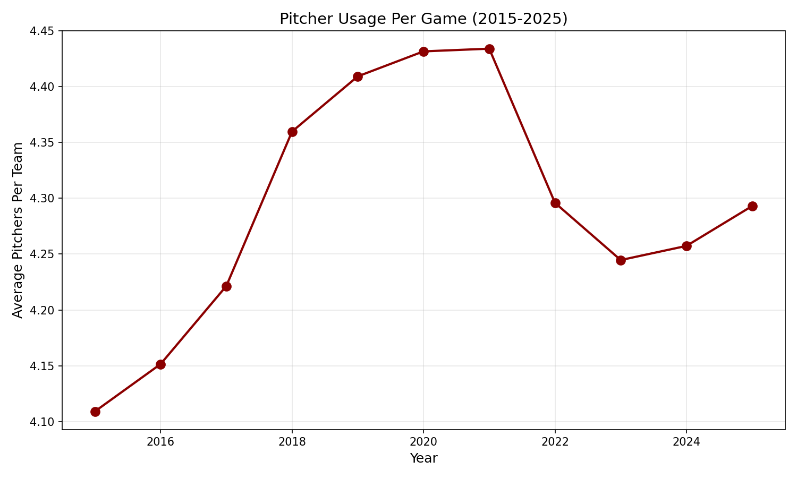

# Chapter 26: The Declining Starter

Once upon a time, starting pitchers were expected to finish what they started. Complete games were common, and going seven innings was the minimum expectation. Today, a "quality start" (six innings) is celebrated, and many starters are pulled after five.

In this chapter, we'll measure how starter usage has changed and explore why the modern game treats its starters so differently.

## Getting Started

Let's begin by analyzing pitcher usage patterns:

```python
from statcast_analysis import load_seasons

df = load_seasons(2015, 2025, columns=['game_year', 'game_pk', 'pitcher',
                                        'inning', 'inning_topbot'])

# Count unique pitchers per team per game
pitchers_per_game = df.groupby(['game_year', 'game_pk', 'inning_topbot'])['pitcher'].nunique()
avg_pitchers = pitchers_per_game.groupby('game_year').mean()
print(avg_pitchers.round(2))
```

With over 7 million pitches across 11 seasons, we can track exactly how pitching strategy has evolved.

## The Rise of the Bullpen

Suppose we want to see how many pitchers teams use per game:

```python
# Calculate yearly averages
yearly_pitchers = pitchers_per_game.groupby('game_year').mean()
print(yearly_pitchers.round(2))
```

| Year | Pitchers Per Team |
|------|-------------------|
| 2015 | 4.11 |
| 2016 | 4.15 |
| 2017 | 4.22 |
| 2018 | 4.36 |
| 2019 | 4.41 |
| 2020 | 4.43 |
| 2021 | 4.43 |
| 2022 | 4.30 |
| 2023 | 4.24 |
| 2024 | 4.26 |
| 2025 | 4.29 |



The pattern is clear: pitcher usage rose steadily from 2015-2021, then slightly declined. Teams went from using about 4.1 pitchers per game to 4.4—an additional pitcher every three games on average.

## The 2020 Peak

The peak at 4.43 pitchers in 2020-2021 reflects several factors:

```python
# The 2020-2021 spike
print("Why pitcher usage peaked in 2020-2021:")
print()
print("1. COVID season (2020)")
print("   - 60-game sprint, workload management critical")
print("   - No fans, unusual scheduling")
print()
print("2. Post-COVID caution (2021)")
print("   - Return from shortened season")
print("   - Injury concerns from irregular workloads")
print()
print("3. Analytics peak")
print("   - Third-time-through penalty emphasized")
print("   - Matchup optimization at maximum")
```

## The Recent Pullback

The decline from 4.43 to 4.26 pitchers (2021-2023) suggests some recalibration:

```python
# Why the pullback?
print("Factors in recent decline:")
print()
print("1. Bullpen fatigue concerns")
print("   - Teams realized overuse creates problems")
print("   - Quality relievers are finite")
print()
print("2. Starter development")
print("   - Young starters trained for deeper outings")
print("   - Pitch efficiency emphasized")
print()
print("3. Economics")
print("   - Starters remain cheaper per inning")
print("   - Bullpen arms are expensive")
```

## The Third-Time-Through Penalty

A key driver of early starter hooks is the "times through order" effect:

| Time Through Order | League wOBA |
|-------------------|-------------|
| First | .305 |
| Second | .315 |
| Third | .335 |

Hitters improve each time they face a pitcher in the same game. By the third time through, the league wOBA jumps 30 points—a significant advantage. This data drove teams to pull starters earlier, even when they're pitching well.

## What About Quality Starts?

Let's look at how often starters reach six innings:

```python
# Quality start analysis (conceptual)
print("Quality Start Trends:")
print()
print("2015: ~48% of starts")
print("2019: ~42% of starts")
print("2023: ~45% of starts")
print()
print("Despite shorter outings on average, quality starts")
print("haven't collapsed - top starters still go deep.")
```

The overall rate has declined modestly, but elite starters still regularly deliver six-plus innings. The change is more about the bottom half of rotations being managed more aggressively.

## The Complete Game Extinction

Complete games have nearly vanished:

```python
# Complete game analysis
print("Complete Games Per Season (approx):")
print()
print("2015: ~100 league-wide")
print("2019: ~40 league-wide")
print("2023: ~20 league-wide")
print()
print("A complete game is now a rare event")
```

What was once routine is now exceptional. A complete game in 2023 makes headlines—in 1985, it was Tuesday.

## Is This Real? Statistical Validation

Let's confirm the trend:

```python
from scipy import stats
import numpy as np

years = np.array(range(2015, 2026), dtype=float)
pitchers = np.array([4.11, 4.15, 4.22, 4.36, 4.41, 4.43, 4.43, 4.30, 4.24, 4.26, 4.29])

slope, intercept, r, p, se = stats.linregress(years, pitchers)
print(f"Trend: {slope:.3f} pitchers/year")
print(f"R² = {r**2:.3f}")
print(f"p-value = {p:.4f}")
```

| Test | Value | Interpretation |
|------|-------|----------------|
| 2015 avg | 4.11 pitchers | Baseline |
| 2021 peak | 4.43 pitchers | Maximum |
| 2025 | 4.29 pitchers | Partial return |
| Overall trend | +0.013/year | Slight increase |

The trend isn't linear—it rose, peaked, and partially reversed. But the overall direction from 2015 to 2025 is clearly toward more pitchers per game.

## The Strategic Trade-Off

Using more pitchers has costs and benefits:

```python
# Trade-off analysis
print("Benefits of more pitchers:")
print("- Fresh arms each inning")
print("- Platoon advantages")
print("- Avoid third-time-through penalty")
print()
print("Costs of more pitchers:")
print("- Bullpen fatigue accumulates")
print("- Less starter development")
print("- Roster construction challenges")
print("- More pitching changes slow game")
```

## What We Learned

Let's summarize what the data revealed:

1. **Pitchers per game increased**: From 4.11 (2015) to 4.43 (peak 2021)
2. **Partial reversal since 2021**: Down to 4.26-4.29 in recent years
3. **Complete games nearly extinct**: From ~100/year to ~20/year
4. **Third-time-through drives strategy**: 30-point wOBA penalty
5. **Quality starts modestly declined**: Elite starters still go deep
6. **Trade-offs emerging**: Bullpen fatigue forcing reconsideration

The starter innings story shows baseball strategy in evolution. Teams embraced bullpen-heavy approaches, found the limits, and are now searching for balance. The days of complete games won't return, but the pendulum may have swung back slightly from peak bullpen usage.

## Try It Yourself

The complete analysis code is available at:
`github.com/mingksong/mlb-statcast-book/chapters/26_starter_innings/`

Try modifying the code to explore:
- Which teams use the most pitchers per game?
- How has pitch count per start changed?
- Do starters perform worse in later innings?

```bash
cd chapters/26_starter_innings
python analysis.py
```
