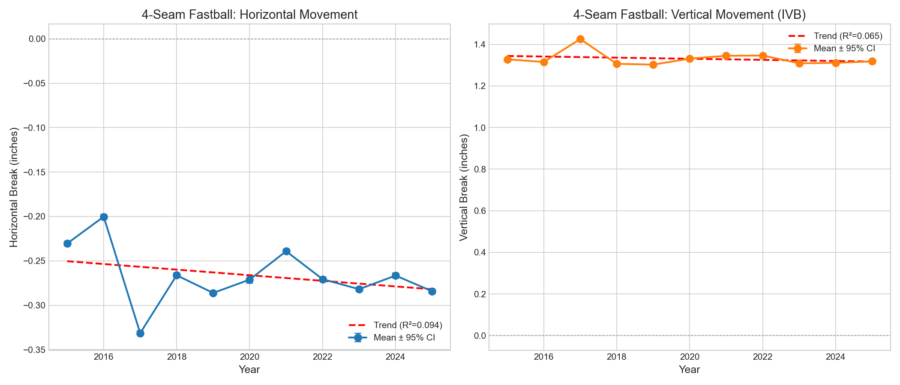
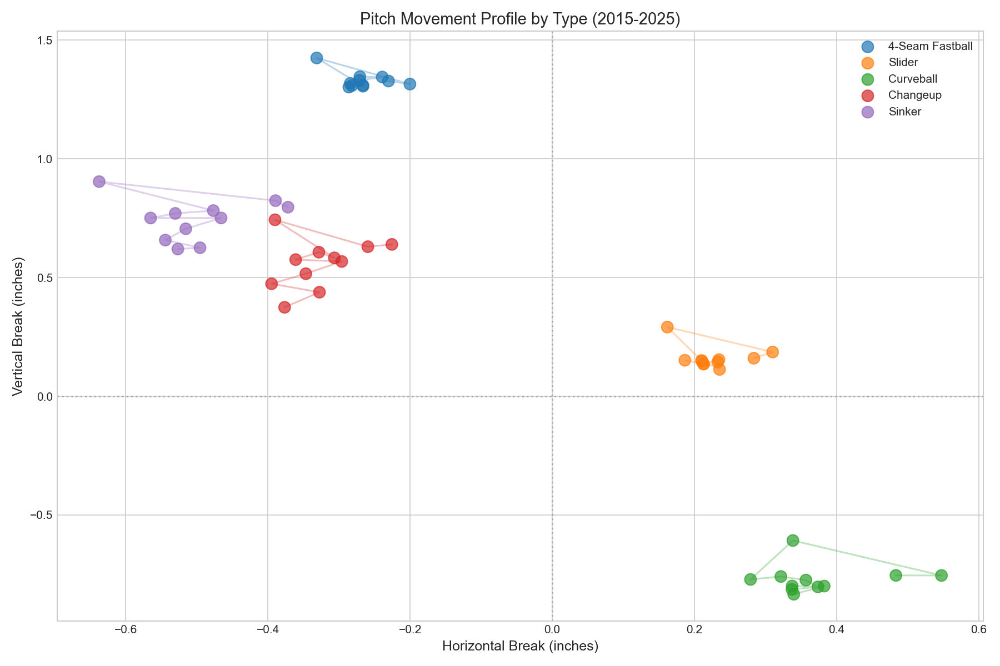
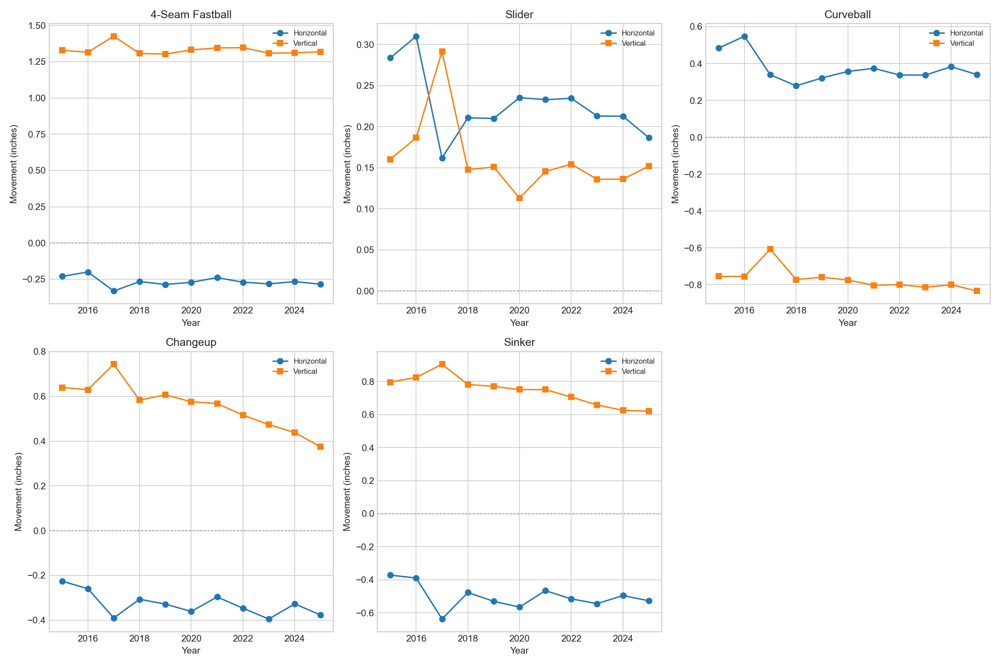
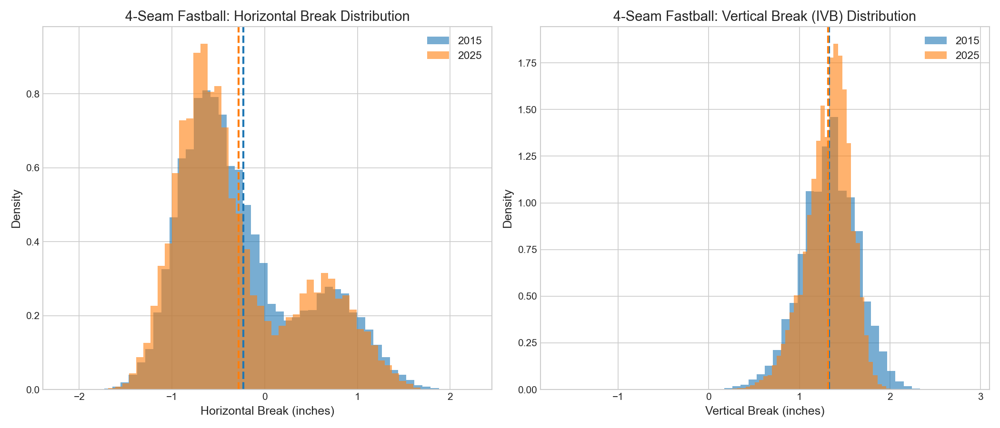

# Chapter 5: Movement Analysis (2015-2025)

## Research Question

**How has pitch movement (horizontal and vertical break) evolved across MLB from 2015 to 2025?**

### Hypotheses
- **H0**: No significant change in average pitch movement over time (slope = 0)
- **H1**: Significant change in movement patterns over time (slope ≠ 0)

---

## Key Findings

### 1. Pitch Movement is Remarkably Stable

Unlike velocity (which increased ~2 mph over the decade), pitch movement has remained essentially unchanged:

| Metric (4-Seam Fastball) | 2015 | 2025 | Change |
|--------------------------|------|------|--------|
| Horizontal Break | -0.23 in | -0.28 in | -0.05 in |
| Vertical Break (IVB) | +1.33 in | +1.32 in | -0.01 in |

### 2. Statistical Validation

**Trend Analysis (Linear Regression):**

| Metric | Slope | R² | p-value | Interpretation |
|--------|-------|-----|---------|----------------|
| Horizontal Break | -0.0032 in/yr | 0.094 | 0.358 | Not significant |
| Vertical Break | -0.0027 in/yr | 0.065 | 0.450 | Not significant |

**Period Comparison (2015-2017 vs 2023-2025):**

| Metric | Early Mean | Late Mean | Cohen's d | Effect |
|--------|------------|-----------|-----------|--------|
| Horizontal Break | -0.25 in | -0.28 in | -0.036 | Negligible |
| Vertical Break | +1.36 in | +1.31 in | -0.153 | Negligible |

### 3. Key Insight

**Pitchers are throwing harder without changing movement characteristics.**

While the "velocity arms race" has resulted in significant velocity increases (see Chapter 2), the fundamental movement profile of pitches has remained stable. This suggests:
- Pitch design focuses on velocity optimization
- Movement mechanics are biomechanically constrained
- "Stuff+" gains come primarily from velocity, not movement changes

---

## Methodology

### Data
- **Source**: MLB Statcast (2015-2025)
- **Sample Size**: 7,396,581 pitches with movement data
- **Key Columns**: `pfx_x` (horizontal), `pfx_z` (vertical)

### Movement Definitions
- **pfx_x** (Horizontal Movement): Arm-side (+) to glove-side (-) break in inches
- **pfx_z** (Vertical Movement): Induced vertical break (IVB) above gravity in inches

### Statistical Tests
1. **Descriptive Statistics**: Mean, SD, median by year and pitch type
2. **Trend Analysis**: Linear regression with R² and p-value
3. **Period Comparison**: Two-sample t-test
4. **Effect Size**: Cohen's d with interpretation

---

## Visualizations

### Figure 1: 4-Seam Fastball Movement Trend


Dual-panel showing horizontal and vertical break trends with 95% CI and regression lines.

### Figure 2: Pitch Movement Profile


Movement fingerprint for all pitch types showing horizontal vs. vertical break.

### Figure 3: Movement by Pitch Type


Individual trend lines for 4-Seam, Slider, Curveball, Changeup, and Sinker.

### Figure 4: Distribution Comparison (2015 vs 2025)


Histogram overlay showing movement distribution shift for 4-seam fastballs.

---

## Files

```
chapters/05_movement/
├── README.md                           # This file
├── analysis.py                         # Main analysis script
├── figures/
│   ├── fig01_fastball_movement_trend.png
│   ├── fig02_pitch_movement_profile.png
│   ├── fig03_movement_by_pitch_type.png
│   └── fig04_distribution_comparison.png
└── results/
    ├── movement_by_year.csv            # Yearly stats by pitch type
    ├── statistical_tests.csv           # All statistical test results
    └── summary.csv                     # Key findings summary
```

---

## Reproducibility

```bash
# Run the analysis
python chapters/05_movement/analysis.py

# Verify outputs
ls chapters/05_movement/figures/
ls chapters/05_movement/results/
```

---

## Statistical Interpretation

| Metric | Threshold | Finding | Interpretation |
|--------|-----------|---------|----------------|
| R² | <0.1 = weak | 0.094 (H), 0.065 (V) | No clear trend |
| p-value | <0.05 = significant | 0.358 (H), 0.450 (V) | Not significant |
| Cohen's d | <0.2 = negligible | -0.036 (H), -0.153 (V) | No practical difference |

**Conclusion**: Pitch movement has remained statistically and practically stable from 2015 to 2025, contrasting sharply with the significant velocity increases documented in Chapter 2.

---

*Analysis completed: 2025-01-12*
*Total pitches analyzed: 7,396,581*
