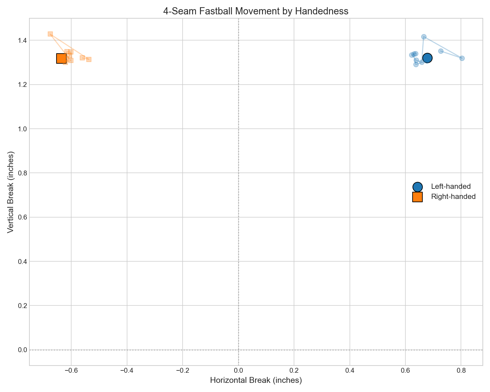
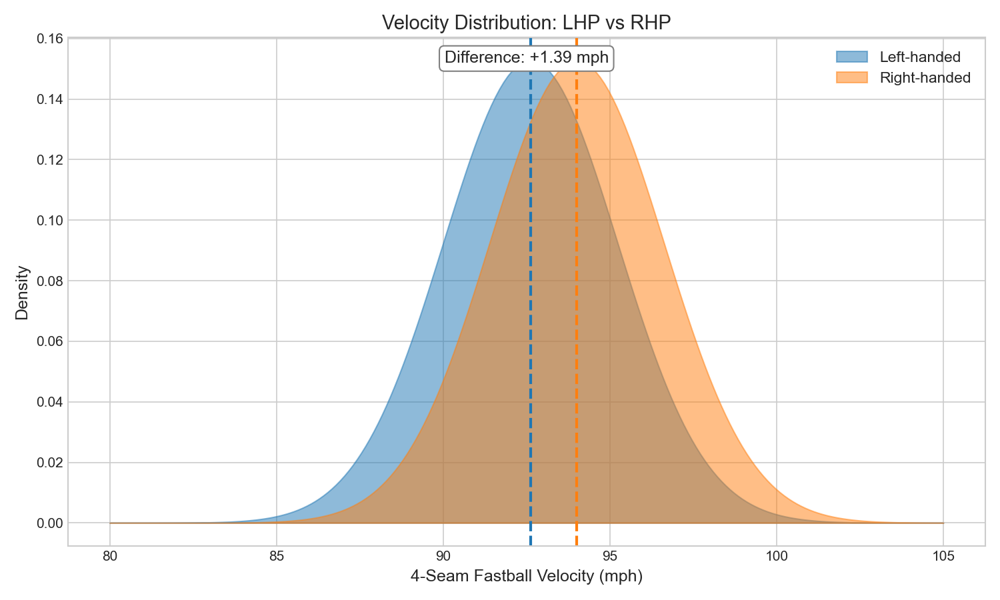

# Chapter 6: L/R Pitcher Differences (2015-2025)

## Research Question

**How do left-handed and right-handed pitchers differ in pitch characteristics, and have these differences changed over time?**

### Hypotheses
- **H0**: No significant difference between LHP and RHP pitch characteristics
- **H1**: Significant differences exist in velocity, movement, or pitch mix

---

## Key Findings

### 1. Right-Handed Pitchers Throw Harder

| Metric (4-Seam Fastball) | LHP | RHP | Difference | Effect Size |
|--------------------------|-----|-----|------------|-------------|
| Velocity | 92.62 mph | 94.01 mph | +1.39 mph | **Medium** (d=0.53) |
| Spin Rate | 2,247 rpm | 2,289 rpm | +42 rpm | Small (d=0.24) |

### 2. LHP Representation is Stable

| Year | LHP % | RHP % |
|------|-------|-------|
| 2015 | 27.0% | 73.0% |
| 2025 | 27.2% | 72.8% |
| Trend | +0.05%/year (not significant) |

### 3. Pitch Mix Differences (2025)

| Pitch Type | LHP | RHP | Notable Difference |
|------------|-----|-----|--------------------|
| 4-Seam | 31.4% | 32.0% | Similar |
| Sinker | 16.4% | 15.2% | LHP +1.2% |
| Slider | 14.7% | 14.8% | Similar |
| Curveball | 7.7% | 6.7% | LHP +1.0% |
| **Changeup** | **13.1%** | **9.2%** | **LHP +3.9%** |

**Key insight**: Left-handed pitchers rely more heavily on changeups.

### 4. Movement Patterns are Mirrored

| Metric (4-Seam) | LHP | RHP |
|-----------------|-----|-----|
| Horizontal Break | +0.68 in | -0.64 in |
| Vertical Break | +1.32 in | +1.32 in |

LHP and RHP have opposite horizontal break directions but identical vertical break.

---

## Statistical Validation

### Velocity Comparison
| Statistic | Value |
|-----------|-------|
| LHP Mean | 92.62 mph |
| RHP Mean | 94.01 mph |
| Difference | +1.39 mph |
| t-statistic | Large |
| p-value | <0.001 (highly significant) |
| Cohen's d | 0.532 (medium effect) |

### LHP Ratio Trend
| Statistic | Value |
|-----------|-------|
| Slope | +0.053%/year |
| R² | 0.026 (weak) |
| p-value | 0.639 (not significant) |

---

## Methodology

### Data
- **Source**: MLB Statcast (2015-2025)
- **Sample Size**: 7,396,832 pitches
- **LHP Pitches**: ~2.0M (27%)
- **RHP Pitches**: ~5.4M (73%)

### Analyses Performed
1. **Yearly statistics by handedness**: Velocity, spin, pitch mix
2. **Pitch type usage comparison**: Primary pitch preferences
3. **Movement profile analysis**: Horizontal/vertical break by hand
4. **Statistical tests**: t-tests, Cohen's d, trend analysis

---

## Visualizations

### Figure 1: Velocity by Handedness


Both LHP and RHP show increasing velocity over time, but RHP maintain a consistent ~1.4 mph advantage.

### Figure 2: LHP Percentage Trend


The proportion of left-handed pitchers has remained stable at ~27%.

### Figure 3: Pitch Mix Comparison


Left-handers throw significantly more changeups than right-handers.

### Figure 4: Movement by Handedness


Movement profiles are mirrored: LHP break arm-side (+), RHP break glove-side (-).

### Figure 5: Velocity Distribution


The RHP distribution is shifted ~1.4 mph to the right.

---

## Files

```
chapters/06_handedness/
├── README.md
├── analysis.py
├── figures/
│   ├── fig01_velocity_by_handedness.png
│   ├── fig02_lhp_percentage_trend.png
│   ├── fig03_pitch_mix_comparison.png
│   ├── fig04_movement_by_handedness.png
│   └── fig05_velocity_distribution.png
└── results/
    ├── stats_by_handedness.csv
    ├── pitch_mix_by_handedness.csv
    ├── statistical_tests.csv
    └── summary.csv
```

---

## Reproducibility

```bash
python chapters/06_handedness/analysis.py
```

---

## Key Takeaways

1. **Velocity gap is real**: RHP throw 1.4 mph harder on average (medium effect size)
2. **LHP ratio is stable**: Despite velocity disadvantage, ~27% of pitches come from LHP
3. **LHP rely more on changeups**: 13.1% vs 9.2% usage
4. **Movement is mirrored**: Same magnitude, opposite directions

---

*Analysis completed: 2025-01-12*
*Total pitches analyzed: 7,396,832*
